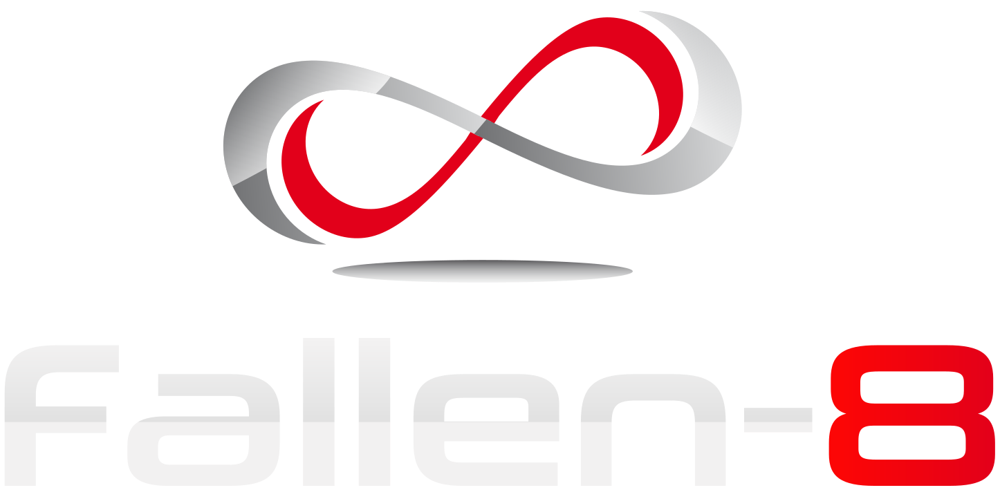
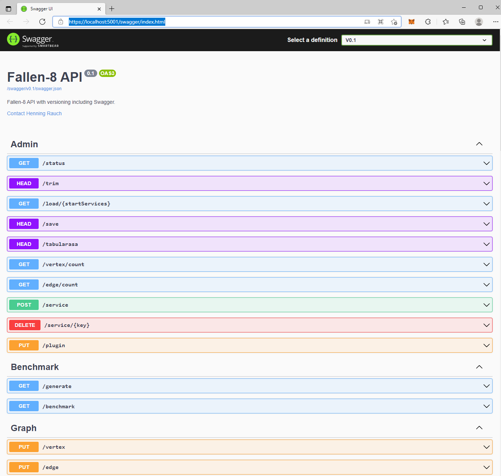

[](https://github.com/cosh/fallen-8-core/actions/workflows/buildAndTest.yml)

## Welcome to Fallen-8.



Fallen-8 is an in-memory [graph database](http://en.wikipedia.org/wiki/Graph_database) implemented in C#. Its focus is to provide raw speed for heavy graph algorithms.

This is the .NET Core version of the original [fallen-8](https://github.com/cosh/fallen-8). The core of fallen-8 stays unchanged but the webservices have been upgraded with a proper swagger interface.

### Key featues
* **Properties** on vertices and edges 
* **Indexes** on vertices and edges
* **Plugins** for indexes, algorithms and services
* Checkpoint **persistency**

### Sweet spots
* **Enterprise Search** (Semantic adhoc queries on multi-dimensional graphs)
* **Lawful Interception** (Mass analysis)
* **E-Commerce** (Bid- and portfolio-management)

## Samples
Start the fallen-8-core-apiApp and have fun.

Docs can be found by opening the [swagger](https://localhost:5001/swagger/index.html) page.



### Create a sample graph

HTTP example
```http
PUT /unittest HTTP/1.1
Host: localhost:5001
```

cURL example
```bash
curl -L -X PUT 'https://localhost:5001/unittest'
```

### Scan for Trent and Mallory

HTTP example (Trent)
```http
POST /scan/graph/property/0 HTTP/1.1
Host: localhost:5001
Content-Type: application/json
Content-Length: 148

{
    "operator": 0,
    "literal": {
        "value": "Trent",
        "fullQualifiedTypeName": "System.String"
    },
    "resultType": 0
}
```

Powershell example (Trent)
```powershell
$headers = New-Object "System.Collections.Generic.Dictionary[[String],[String]]"
$headers.Add("Content-Type", "application/json")

$body = "{
`n    `"operator`": 0,
`n    `"literal`": {
`n        `"value`": `"Trent`",
`n        `"fullQualifiedTypeName`": `"System.String`"
`n    },
`n    `"resultType`": 0
`n}"

$response = Invoke-RestMethod 'https://localhost:5001/scan/graph/property/0' -Method 'POST' -Headers $headers -Body $body
$response | ConvertTo-Json
```

cURL example (Mallory)
```bash
curl -L -X POST 'https://localhost:5001/scan/graph/property/0' -H 'Content-Type: application/json' --data-raw '{
    "operator": 0,
    "literal": {
        "value": "Mallory",
        "fullQualifiedTypeName": "System.String"
    },
    "resultType": 0
}'
```

Response
```json
[
    4
]
```

### Calculate the paths between Trent and Mallory

Trent = 4

Mallory = 3

HTTP example
```http
POST /path/4/to/3 HTTP/1.1
Host: localhost:5001
Content-Type: application/json
Content-Length: 2

{}
```

Powershell example
```powershell
$headers = New-Object "System.Collections.Generic.Dictionary[[String],[String]]"
$headers.Add("Content-Type", "application/json")

$body = "{}"

$response = Invoke-RestMethod 'https://localhost:5001/path/4/to/3' -Method 'POST' -Headers $headers -Body $body
$response | ConvertTo-Json
```

cURL example
```bash
curl -L -X POST 'https://localhost:5001/path/4/to/3' -H 'Content-Type: application/json' --data-raw '{}'
```

Response
```json
[
    {
        "pathElements": [
            {
                "sourceVertexId": 4,
                "targetVertexId": 0,
                "edgeId": 7,
                "edgePropertyId": 11,
                "direction": 0,
                "weight": 0
            },
            {
                "sourceVertexId": 0,
                "targetVertexId": 3,
                "edgeId": 10,
                "edgePropertyId": 12,
                "direction": 0,
                "weight": 0
            }
        ],
        "totalWeight": 0
    },
    {
        "pathElements": [
            {
                "sourceVertexId": 4,
                "targetVertexId": 1,
                "edgeId": 8,
                "edgePropertyId": 11,
                "direction": 0,
                "weight": 0
            },
            {
                "sourceVertexId": 1,
                "targetVertexId": 3,
                "edgeId": 11,
                "edgePropertyId": 12,
                "direction": 0,
                "weight": 0
            }
        ],
        "totalWeight": 0
    }
]
```

## Additional information

[Graph databases - Henning Rauch](http://www.slideshare.net/HenningRauch/graphdatabases)

[Graphendatenbanken - Henning Rauch (visiting lecture)](http://www.slideshare.net/HenningRauch/vorlesung-graphendatenbanken-an-der-universitt-hof)

[Issues on GitHub](https://github.com/cosh/fallen-8/issues)

[Wiki on GitHub](https://github.com/cosh/fallen-8/wiki)

[Google Group](https://groups.google.com/d/forum/fallen-8)

## MIT-License
Copyright (c) 2021 Henning Rauch

Permission is hereby granted, free of charge, to any person obtaining a copy of this software and associated documentation files (the "Software"), to deal in the Software without restriction, including without limitation the rights to use, copy, modify, merge, publish, distribute, sublicense, and/or sell copies of the Software, and to permit persons to whom the Software is furnished to do so, subject to the following conditions:

The above copyright notice and this permission notice shall be included in all copies or substantial portions of the Software.

THE SOFTWARE IS PROVIDED "AS IS", WITHOUT WARRANTY OF ANY KIND, EXPRESS OR IMPLIED, INCLUDING BUT NOT LIMITED TO THE WARRANTIES OF MERCHANTABILITY,

FITNESS FOR A PARTICULAR PURPOSE AND NONINFRINGEMENT. IN NO EVENT SHALL THE AUTHORS OR COPYRIGHT HOLDERS BE LIABLE FOR ANY CLAIM, DAMAGES OR OTHER LIABILITY, WHETHER IN AN ACTION OF CONTRACT, TORT OR OTHERWISE, ARISING FROM, OUT OF OR IN CONNECTION WITH THE SOFTWARE OR THE USE OR OTHER DEALINGS IN THE SOFTWARE.
