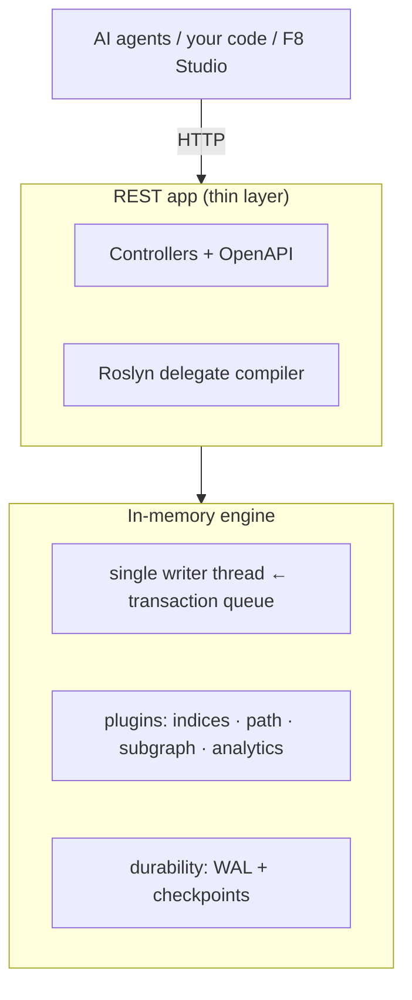

[](https://github.com/cosh/fallen-8-core/actions/workflows/buildAndTest.yml)

## Welcome to Fallen-8


Fallen-8 is an in-memory [graph database](http://en.wikipedia.org/wiki/Graph_database)
written in C# (.NET 10), built for raw speed on heavy graph algorithms.

It has **no query language** — no Cypher, no Gremlin, and none is planned. Queries are C#:
small [delegate fragments](docs/delegates.md) compiled at runtime, or precompiled stored
queries. That is a deliberate choice for the era of code-generating agents — an agent emits a
C# fragment, the engine compiles and runs it in-process at full speed, with no query-language
layer in between. This is the .NET Core evolution of the original
[fallen-8](https://github.com/cosh/fallen-8).

### Key features

Each feature has a deep-dive doc — follow the link.

- **[Graph model](docs/graph-model.md)** — a directed property graph; typed properties on
  vertices and edges, all mutation through a serialized transaction queue.
- **[Delegates, not a query language](docs/delegates.md)** — filters and cost functions are
  runtime-compiled C# fragments; the defining design decision.
- **[Path finding](docs/path-finding.md)** — shortest/weighted paths with delegate filter and
  cost functions (BLS, Dijkstra).
- **[Subgraphs](docs/subgraphs.md)** — extract a pattern-matched subset as a standalone graph,
  recalculate it when the source changes, nest and persist it.
- **[Graph analytics](docs/graph-analytics.md)** — PageRank, connected components,
  communities, degree centrality, triangle counting, with optional property write-back.
- **[Stored queries](docs/stored-queries.md)** — register a vetted, compiled query once and
  invoke it by name — no dynamic code at call time.
- **[Indexes](docs/indexes.md)** — dictionary, range, fulltext, spatial R-Tree, and vector kNN,
  all as plugins.
- **[Vector search](docs/vector-search.md)** — exact k-nearest-neighbour over `float[]`
  embeddings (cosine, dot product, L2).
- **[Semantic traversal](docs/semantic-traversal.md)** — embeddings as element state; a
  code-free `semantic` block steers paths and subgraphs by similarity.
- **[Bulk import/export](docs/bulk-import-export.md)** — stream whole graphs as newline-delimited
  JSON that round-trips exactly.
- **[Live change feed](docs/change-feed.md)** — committed mutations as Server-Sent Events, in
  commit order, with in-band resync.
- **[Save games](docs/save-games.md)** — checkpoints tracked by a registry that drives startup,
  on top of a write-ahead log.
- **[Namespaces](docs/namespaces.md)** — many isolated graphs in one Fallen-8, addressable under
  `/ns/{name}/…`.
- **[Observability](docs/observability.md)** — opt-in Prometheus/OTLP metrics and traces, a
  graph-shape snapshot, health probes.
- **[REST API](docs/rest-api.md)** — a versioned HTTP surface with an OpenAPI document and an
  interactive Scalar reference.
- **[Plugins](docs/plugins.md)** — indices, algorithms, and services are all discovered plugins.
- **[F8 Studio](docs/studio.md)** — a browser UI to browse, query, visualize, and author the C#
  delegates, with an optional local natural-language assist.
- **[Security](docs/security.md)** — optional all-or-nothing API key; dynamic code execution is a
  separate switch, off by default.

## Architecture

An in-memory engine with a thin REST app around it. The engine (`fallen-8-core`) holds the
graph in RAM, serializes every write through one writer thread, and runs the algorithms; the
app (`fallen-8-core-apiApp`) exposes it over HTTP and serves F8 Studio. Everything ships as
one Docker unit alongside a model sidecar.


```mermaid
flowchart TB
    clients["AI agents / your code / F8 Studio"] -->|HTTP| app
    subgraph app["REST app (thin layer)"]
        rest["Controllers + OpenAPI"]
        roslyn["Roslyn delegate compiler"]
    end
    app --> engine
    subgraph engine["In-memory engine"]
        writer["single writer thread ← transaction queue"]
        plugins["plugins: indices · path · subgraph · analytics"]
        durab["durability: WAL + checkpoints"]
    end
```

Full details — the writer thread, plugin system, durability, and the model sidecar — are in
[docs/architecture.md](docs/architecture.md).

## Running it

One command brings up everything — engine, REST API, F8 Studio, and the model sidecar — with
every feature on and no authentication in the way:

```bash
npm run env:up
```

```powershell
npm run env:up
```

Then open **F8 Studio at http://localhost:8080** and load a sample graph from the dashboard.

Every other way to run it — a bare `dotnet run`, the configuration keys, the security
switches, GPU acceleration, offline model pre-seeding — is in
[docs/running.md](docs/running.md).

## Samples

F8 Studio ships a one-click **sample gallery**: curated graphs (a karate club, an
Active-Directory attack surface, a movie-recommendation graph, world air routes, Fallen-8's
own dependency graph) that load in a click and come styled, indexed, and ready to explore.
Each one is a guided tour of a different feature — analytics, weighted paths, semantic search,
canvas visualization. See the gallery walkthrough, with screenshots and example queries, in
[docs/samples.md](docs/samples.md).

## Troubleshooting

Common snags — first-start model pulls, the embedding provider, dynamic-code 403s, GPU
detection — and their fixes are in [docs/troubleshooting.md](docs/troubleshooting.md).

## Documentation

The full documentation set lives in **[docs/](docs/README.md)**.

## Additional information

- [Graph databases — Henning Rauch](http://www.slideshare.net/HenningRauch/graphdatabases)
- [Graphendatenbanken — Henning Rauch (visiting lecture)](http://www.slideshare.net/HenningRauch/vorlesung-graphendatenbanken-an-der-universitt-hof)

## MIT-License

Copyright (c) 2025 Henning Rauch

Permission is hereby granted, free of charge, to any person obtaining a copy of this software and associated documentation files (the "Software"), to deal in the Software without restriction, including without limitation the rights to use, copy, modify, merge, publish, distribute, sublicense, and/or sell copies of the Software, and to permit persons to whom the Software is furnished to do so, subject to the following conditions:

The above copyright notice and this permission notice shall be included in all copies or substantial portions of the Software.

THE SOFTWARE IS PROVIDED "AS IS", WITHOUT WARRANTY OF ANY KIND, EXPRESS OR IMPLIED, INCLUDING BUT NOT LIMITED TO THE WARRANTIES OF MERCHANTABILITY,

FITNESS FOR A PARTICULAR PURPOSE AND NONINFRINGEMENT. IN NO EVENT SHALL THE AUTHORS OR COPYRIGHT HOLDERS BE LIABLE FOR ANY CLAIM, DAMAGES OR OTHER LIABILITY, WHETHER IN AN ACTION OF CONTRACT, TORT OR OTHERWISE, ARISING FROM, OUT OF OR IN CONNECTION WITH THE SOFTWARE OR THE USE OR OTHER DEALINGS IN THE SOFTWARE.
