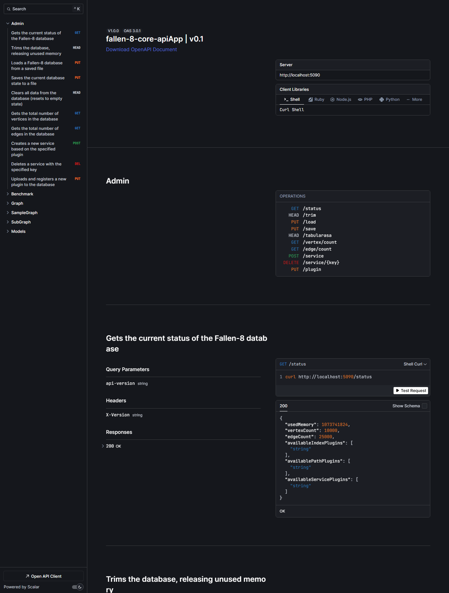
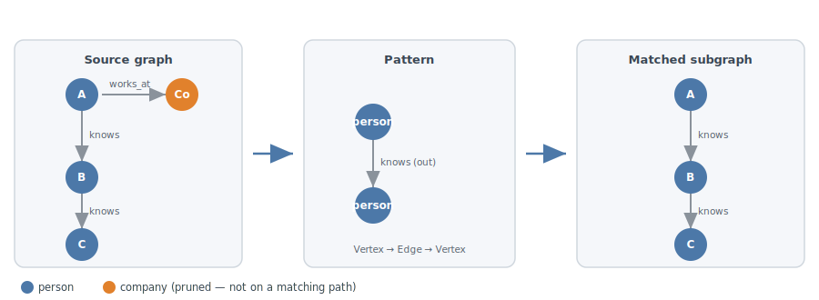

[](https://github.com/cosh/fallen-8-core/actions/workflows/buildAndTest.yml)

## Welcome to Fallen-8


Fallen-8 is an in-memory [graph database](http://en.wikipedia.org/wiki/Graph_database) implemented in C# (.NET 10). Its focus is to provide raw speed for heavy graph algorithms.

This is the .NET Core version of the original [fallen-8](https://github.com/cosh/fallen-8). The core of fallen-8 stays unchanged, and the web services expose a modern OpenAPI description rendered with the [Scalar](https://github.com/scalar/scalar) API reference.

### Key features

- **Properties** on vertices and edges
- **Indexes** on vertices and edges (dictionary, range, fulltext, spatial R-Tree, vector kNN)
- **Path finding** with runtime-compiled filter and cost functions
- **Subgraphs** — extract a pattern-matched subset of the graph as a standalone graph, recalculate it when the source changes, and persist it (see [Subgraphs](#subgraphs))
- **Plugins** for indexes, algorithms and services
- Checkpoint **persistency**, with a **save-game registry** that records every checkpoint and drives startup (see [Save games](#save-games-checkpoints))
- **F8 Studio** — a browser UI for browsing, querying, visualizing, and authoring the C# delegate fragments, with an optional local **natural-language assist**
- Ships as **one Docker unit** (engine + API + UI) via `docker compose`

### Sweet spots

- **Enterprise Search** (semantic ad-hoc queries on multi-dimensional graphs)
- **Lawful Interception** (mass analysis)
- **E-Commerce** (bid- and portfolio-management)

## Architecture

The REST API app (`fallen-8-core-apiApp`) is a thin layer over the in-memory engine
(`fallen-8-core`). All mutation flows through transactions; indices, algorithms and services
are plugins; and the engine checkpoints its state to disk. The API also serves **F8 Studio**
(`fallen-8-web-ui`, a React SPA) as static files and exposes `POST /delegates/validate` so
the delegate editor can compile-check fragments; the natural-language assist calls a
**user-run model backend** (Ollama / llama.cpp) directly from the browser. A **save-game
registry** (`metadata/savegames.json`) records every checkpoint and is the authority for
what loads on startup. The whole stack ships as **one Docker unit** managed via
`docker compose`.


## Running it

```bash
dotnet run --project fallen-8-core-apiApp
```

With the F8 Studio web UI (built into the apiApp's wwwroot):

```bash
npm run install:ui && npm run build:apiapp
dotnet run --project fallen-8-core-apiApp
# open http://localhost:5000
```

To debug the whole stack (engine + API + UI) in VS Code, see [DEBUGGING.md](./DEBUGGING.md).

Or the complete environment in Docker - engine, REST API, F8 Studio, and the NL-assist
model backend (Ollama + the MIT default model, pulled on first start). The environment is
managed **as one unit** via compose - do not start/stop individual containers:

```bash
npm run env:up      # = docker compose up -d --build   (start everything)
npm run env:down    # = docker compose down            (stop everything; data volumes persist)
npm run env:logs    # follow all logs
npm run env:status  # health of the whole environment
# F8 Studio:        http://localhost:8080
# NL-assist model:  http://localhost:11434 (configure in the delegate editor)
```

Graph data and the save-game registry live on the `f8-data` volume, model weights on
`f8-ollama-models` - both survive `env:down`/`env:up` cycles.

The delegate editor's compile validation and NL assist run C# fragments through the
server. That surface is gated by a single capability flag that is **off by default**;
turn it on to use the editor:

```bash
F8_ENABLE_DYNAMIC_CODE=true docker compose up --build
```

Authentication is independent and all-or-nothing: set `F8_API_KEY` and the *entire*
service requires that key (register the instance in Studio with it); leave it unset and
the whole service — reads, mutations, and the code endpoints alike — is open, for a
trusted network. The dynamic-code flag gates code execution either way.

```bash
F8_API_KEY=change-me F8_ENABLE_DYNAMIC_CODE=true docker compose up --build   # secured + editor on
```

### Save games (checkpoints)

Every `PUT /save` (and the clean-shutdown save) is recorded in a persistent registry at
`<deployment>/metadata/savegames.json` with KPIs and file facts; the "Save games" screen
in F8 Studio lists, loads, and deletes them. **Startup is registry-driven:** on boot the
engine loads the newest registered save game; when the registry is empty it does not load
any checkpoint (a file sitting in the storage directory is no longer auto-loaded just
because it is there) — it keeps whatever the write-ahead log replayed at construction,
which for a fresh deployment is an empty graph. To adopt a pre-existing checkpoint after upgrading, load it once via
`PUT /load` (or the Save games screen); it is then registered permanently. See
[features/save-games/spec.md](features/done/save-games/spec.md).

In the Development environment the API description and interactive reference are available at:

- **OpenAPI document:** `https://localhost:5001/openapi/v0.1.json`
- **Scalar API reference:** `https://localhost:5001/scalar/v0.1`



## Samples

Start `fallen-8-core-apiApp` and have fun. The following walkthrough uses the built-in
sample graph.

### Create a sample graph

HTTP example

```http
PUT /unittest HTTP/1.1
Host: localhost:5001
```

cURL example

```bash
curl -L -X PUT 'https://localhost:5001/unittest'
```

### Scan for Trent and Mallory

HTTP example (Trent)

```http
POST /scan/graph/property/0 HTTP/1.1
Host: localhost:5001
Content-Type: application/json
Content-Length: 148

{
    "operator": 0,
    "literal": {
        "value": "Trent",
        "fullQualifiedTypeName": "System.String"
    },
    "resultType": 0
}
```

Powershell example (Trent)

```powershell
$headers = New-Object "System.Collections.Generic.Dictionary[[String],[String]]"
$headers.Add("Content-Type", "application/json")

$body = "{
`n    `"operator`": 0,
`n    `"literal`": {
`n        `"value`": `"Trent`",
`n        `"fullQualifiedTypeName`": `"System.String`"
`n    },
`n    `"resultType`": 0
`n}"

$response = Invoke-RestMethod 'https://localhost:5001/scan/graph/property/0' -Method 'POST' -Headers $headers -Body $body
$response | ConvertTo-Json
```

cURL example (Mallory)

```bash
curl -L -X POST 'https://localhost:5001/scan/graph/property/0' -H 'Content-Type: application/json' --data-raw '{
    "operator": 0,
    "literal": {
        "value": "Mallory",
        "fullQualifiedTypeName": "System.String"
    },
    "resultType": 0
}'
```

Response

```json
[4]
```

### Calculate the paths between Trent and Mallory

Trent = 4

Mallory = 3

HTTP example

```http
POST /path/4/to/3 HTTP/1.1
Host: localhost:5001
Content-Type: application/json
Content-Length: 2

{}
```

Powershell example

```powershell
$headers = New-Object "System.Collections.Generic.Dictionary[[String],[String]]"
$headers.Add("Content-Type", "application/json")

$body = "{}"

$response = Invoke-RestMethod 'https://localhost:5001/path/4/to/3' -Method 'POST' -Headers $headers -Body $body
$response | ConvertTo-Json
```

cURL example

```bash
curl -L -X POST 'https://localhost:5001/path/4/to/3' -H 'Content-Type: application/json' --data-raw '{}'
```

Response

```json
[
  {
    "pathElements": [
      {
        "sourceVertexId": 4,
        "targetVertexId": 0,
        "edgeId": 7,
        "edgePropertyId": 11,
        "direction": 0,
        "weight": 0
      },
      {
        "sourceVertexId": 0,
        "targetVertexId": 3,
        "edgeId": 10,
        "edgePropertyId": 12,
        "direction": 0,
        "weight": 0
      }
    ],
    "totalWeight": 0
  },
  {
    "pathElements": [
      {
        "sourceVertexId": 4,
        "targetVertexId": 1,
        "edgeId": 8,
        "edgePropertyId": 11,
        "direction": 0,
        "weight": 0
      },
      {
        "sourceVertexId": 1,
        "targetVertexId": 3,
        "edgeId": 11,
        "edgePropertyId": 12,
        "direction": 0,
        "weight": 0
      }
    ],
    "totalWeight": 0
  }
]
```

## Subgraphs

A **subgraph** is a pattern-matched subset of the graph, extracted into a new, standalone
Fallen-8 instance. You give it optional vertex/edge pre-filters and an ordered pattern
(alternating vertex/edge), and the engine keeps only the elements that lie on a matching
path. The example below matches `person -knows-> person` and prunes everything else (the
company vertex and its `works_at` edge):



Over REST, filters are C# code fragments compiled at runtime (just like the path API):

```jsonc
PUT /subgraph
{
  "name": "people-who-know-people",
  "patterns": [
    { "type": "Vertex", "patternName": "p1", "graphElementFilter": "return (ge) => ge.Label == \"person\";" },
    { "type": "Edge",   "patternName": "knows", "direction": "OutgoingEdge", "edgePropertyFilter": "return (p) => p == \"knows\";" },
    { "type": "Vertex", "patternName": "p2", "graphElementFilter": "return (ge) => ge.Label == \"person\";" }
  ]
}
```

Subgraphs can be listed, read, recalculated against their (possibly changed) source, deleted,
and nested (a subgraph of a subgraph). See [features/subgraph/](features/done/subgraph/) for the
full specification and REST reference.

## Stored queries

Instead of shipping C# fragments on every request, you can register a **stored query** once —
compiled and validated at registration — and reference it by name from the path and subgraph
endpoints afterwards:

```jsonc
POST /storedquery
{
  "name": "adults-shortest",
  "kind": "Path",
  "path": { "filter": { "vertexFilter": "return (v) => v.TryGetProperty(out int age, \"age\") && age > 30;" } }
}

POST /path/1/to/5
{ "storedQuery": "adults-shortest", "maxDepth": 5 }
```

The security payoff: **registration requires the dynamic-code switch, invocation does not.**
Register a vetted set while `Fallen8:Security:EnableDynamicCodeExecution=true` (a provisioning
window), then run day-to-day with the switch off — inline fragments are rejected while stored
queries keep working, so the code surface shrinks from "arbitrary C# per request" to a closed,
operator-approved set. (Honesty note: a stored query still runs in-process with full trust;
this narrows who can *introduce* code, it is not a sandbox.) Stored queries survive save/load
and crash-recovery via the write-ahead log. See
[features/stored-query-library/](features/done/stored-query-library/) for the full
specification.

## Bulk export/import (JSONL)

Move whole graphs as plain, `grep`-able data — `GET /bulk/export` streams the graph as
newline-delimited JSON (typed property values, so everything round-trips exactly), and
`POST /bulk/import` streams it back into an empty instance with fresh ids:

```bash
curl -sf http://localhost:5000/bulk/export -o graph.jsonl
curl -sf -X POST http://localhost:5000/bulk/import -H "Content-Type: application/x-ndjson" --data-binary @graph.jsonl
```

See [features/bulk-import-export/](features/done/bulk-import-export/) for the line schema,
consistency contract, and error semantics.

## Live change feed

`GET /changefeed` streams committed mutations as **Server-Sent Events** — in commit order,
with declarative server-side filters (no code fragments, works with the dynamic-code switch
off) and an in-memory catch-up buffer:

```bash
curl -N "http://localhost:5000/changefeed?kinds=vertexCreated,vertexRemoved&labels=person"
```

Events carry ids, labels and property keys — never property values. Whenever continuity is
lost (slow consumer, restart, trim/load), the stream says so in-band with a `resync` event;
the client recipe is always "fetch, then stream; on resync, re-fetch". See
[features/change-feed/](features/done/change-feed/) for the event schema, filter grammar,
and measured write-throughput non-regression.

## Vector search (kNN over embeddings)

A `VectorIndex` gives exact k-nearest-neighbour search over `float[]` embeddings — cosine,
dot product, or L2, SIMD brute-force, deterministic ordering. Create it through the normal
index surface, add vectors (explicitly or from a `float[]` element property), then query:

```bash
curl -sf -X POST http://localhost:5000/scan/index/vector \
     -H "Content-Type: application/json" \
     -d '{ "indexId": "embeddings", "query": [0.1, 0.2, 0.3], "k": 10, "label": "person" }'
```

Hits are graph elements, so the traversal surface takes over from there — the GraphRAG
recipe (kNN → paths/subgraphs/properties), memory math, and measured latency live in
[features/vector-index/](features/done/vector-index/).

## Additional information

[Graph databases - Henning Rauch](http://www.slideshare.net/HenningRauch/graphdatabases)

[Graphendatenbanken - Henning Rauch (visiting lecture)](http://www.slideshare.net/HenningRauch/vorlesung-graphendatenbanken-an-der-universitt-hof)

[Issues on GitHub](https://github.com/cosh/fallen-8/issues)

[Wiki on GitHub](https://github.com/cosh/fallen-8/wiki)

[Google Group](https://groups.google.com/d/forum/fallen-8)

## MIT-License

Copyright (c) 2025 Henning Rauch

Permission is hereby granted, free of charge, to any person obtaining a copy of this software and associated documentation files (the "Software"), to deal in the Software without restriction, including without limitation the rights to use, copy, modify, merge, publish, distribute, sublicense, and/or sell copies of the Software, and to permit persons to whom the Software is furnished to do so, subject to the following conditions:

The above copyright notice and this permission notice shall be included in all copies or substantial portions of the Software.

THE SOFTWARE IS PROVIDED "AS IS", WITHOUT WARRANTY OF ANY KIND, EXPRESS OR IMPLIED, INCLUDING BUT NOT LIMITED TO THE WARRANTIES OF MERCHANTABILITY,

FITNESS FOR A PARTICULAR PURPOSE AND NONINFRINGEMENT. IN NO EVENT SHALL THE AUTHORS OR COPYRIGHT HOLDERS BE LIABLE FOR ANY CLAIM, DAMAGES OR OTHER LIABILITY, WHETHER IN AN ACTION OF CONTRACT, TORT OR OTHERWISE, ARISING FROM, OUT OF OR IN CONNECTION WITH THE SOFTWARE OR THE USE OR OTHER DEALINGS IN THE SOFTWARE.
