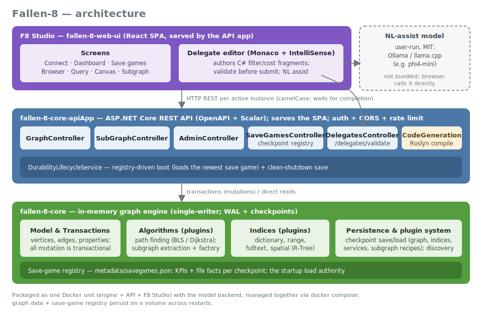

[](https://github.com/cosh/fallen-8-core/actions/workflows/buildAndTest.yml)

## Welcome to Fallen-8


Fallen-8 is an in-memory [graph database](http://en.wikipedia.org/wiki/Graph_database) implemented in C# (.NET 10). Its focus is to provide raw speed for heavy graph algorithms.

This is the .NET Core version of the original [fallen-8](https://github.com/cosh/fallen-8). The core of fallen-8 stays unchanged, and the web services expose a modern OpenAPI description rendered with the [Scalar](https://github.com/scalar/scalar) API reference.

### Key features

- **Properties** on vertices and edges
- **Indexes** on vertices and edges (dictionary, range, fulltext, spatial R-Tree)
- **Path finding** with runtime-compiled filter and cost functions
- **Subgraphs** — extract a pattern-matched subset of the graph as a standalone graph, recalculate it when the source changes, and persist it (see [Subgraphs](#subgraphs))
- **Plugins** for indexes, algorithms and services
- Checkpoint **persistency**

### Sweet spots

- **Enterprise Search** (semantic ad-hoc queries on multi-dimensional graphs)
- **Lawful Interception** (mass analysis)
- **E-Commerce** (bid- and portfolio-management)

## Architecture

The REST API app (`fallen-8-core-apiApp`) is a thin layer over the in-memory engine
(`fallen-8-core`). All mutation flows through transactions; indices, algorithms and services
are plugins; and the engine can checkpoint its state to disk.



## Running it

```bash
dotnet run --project fallen-8-core-apiApp
```

With the F8 Studio web UI (built into the apiApp's wwwroot):

```bash
npm run install:ui && npm run build:apiapp
dotnet run --project fallen-8-core-apiApp
# open http://localhost:5000
```

Or the complete environment in Docker - engine, REST API, F8 Studio, and the NL-assist
model backend (Ollama + the MIT default model, pulled on first start):

```bash
docker compose up --build
# F8 Studio:        http://localhost:8080
# NL-assist model:  http://localhost:11434 (configure in the delegate editor)
```

In the Development environment the API description and interactive reference are available at:

- **OpenAPI document:** `https://localhost:5001/openapi/v0.1.json`
- **Scalar API reference:** `https://localhost:5001/scalar/v0.1`


## Samples

Start `fallen-8-core-apiApp` and have fun. The following walkthrough uses the built-in
sample graph.

### Create a sample graph

HTTP example

```http
PUT /unittest HTTP/1.1
Host: localhost:5001
```

cURL example

```bash
curl -L -X PUT 'https://localhost:5001/unittest'
```

### Scan for Trent and Mallory

HTTP example (Trent)

```http
POST /scan/graph/property/0 HTTP/1.1
Host: localhost:5001
Content-Type: application/json
Content-Length: 148

{
    "operator": 0,
    "literal": {
        "value": "Trent",
        "fullQualifiedTypeName": "System.String"
    },
    "resultType": 0
}
```

Powershell example (Trent)

```powershell
$headers = New-Object "System.Collections.Generic.Dictionary[[String],[String]]"
$headers.Add("Content-Type", "application/json")

$body = "{
`n    `"operator`": 0,
`n    `"literal`": {
`n        `"value`": `"Trent`",
`n        `"fullQualifiedTypeName`": `"System.String`"
`n    },
`n    `"resultType`": 0
`n}"

$response = Invoke-RestMethod 'https://localhost:5001/scan/graph/property/0' -Method 'POST' -Headers $headers -Body $body
$response | ConvertTo-Json
```

cURL example (Mallory)

```bash
curl -L -X POST 'https://localhost:5001/scan/graph/property/0' -H 'Content-Type: application/json' --data-raw '{
    "operator": 0,
    "literal": {
        "value": "Mallory",
        "fullQualifiedTypeName": "System.String"
    },
    "resultType": 0
}'
```

Response

```json
[4]
```

### Calculate the paths between Trent and Mallory

Trent = 4

Mallory = 3

HTTP example

```http
POST /path/4/to/3 HTTP/1.1
Host: localhost:5001
Content-Type: application/json
Content-Length: 2

{}
```

Powershell example

```powershell
$headers = New-Object "System.Collections.Generic.Dictionary[[String],[String]]"
$headers.Add("Content-Type", "application/json")

$body = "{}"

$response = Invoke-RestMethod 'https://localhost:5001/path/4/to/3' -Method 'POST' -Headers $headers -Body $body
$response | ConvertTo-Json
```

cURL example

```bash
curl -L -X POST 'https://localhost:5001/path/4/to/3' -H 'Content-Type: application/json' --data-raw '{}'
```

Response

```json
[
  {
    "pathElements": [
      {
        "sourceVertexId": 4,
        "targetVertexId": 0,
        "edgeId": 7,
        "edgePropertyId": 11,
        "direction": 0,
        "weight": 0
      },
      {
        "sourceVertexId": 0,
        "targetVertexId": 3,
        "edgeId": 10,
        "edgePropertyId": 12,
        "direction": 0,
        "weight": 0
      }
    ],
    "totalWeight": 0
  },
  {
    "pathElements": [
      {
        "sourceVertexId": 4,
        "targetVertexId": 1,
        "edgeId": 8,
        "edgePropertyId": 11,
        "direction": 0,
        "weight": 0
      },
      {
        "sourceVertexId": 1,
        "targetVertexId": 3,
        "edgeId": 11,
        "edgePropertyId": 12,
        "direction": 0,
        "weight": 0
      }
    ],
    "totalWeight": 0
  }
]
```

## Subgraphs

A **subgraph** is a pattern-matched subset of the graph, extracted into a new, standalone
Fallen-8 instance. You give it optional vertex/edge pre-filters and an ordered pattern
(alternating vertex/edge), and the engine keeps only the elements that lie on a matching
path. The example below matches `person -knows-> person` and prunes everything else (the
company vertex and its `works_at` edge):


Over REST, filters are C# code fragments compiled at runtime (just like the path API):

```jsonc
PUT /subgraph
{
  "name": "people-who-know-people",
  "patterns": [
    { "type": "Vertex", "patternName": "p1", "graphElementFilter": "return (ge) => ge.Label == \"person\";" },
    { "type": "Edge",   "patternName": "knows", "direction": "OutgoingEdge", "edgePropertyFilter": "return (p) => p == \"knows\";" },
    { "type": "Vertex", "patternName": "p2", "graphElementFilter": "return (ge) => ge.Label == \"person\";" }
  ]
}
```

Subgraphs can be listed, read, recalculated against their (possibly changed) source, deleted,
and nested (a subgraph of a subgraph). See [features/subgraph/](features/subgraph/) for the
full specification and REST reference.

## Additional information

[Graph databases - Henning Rauch](http://www.slideshare.net/HenningRauch/graphdatabases)

[Graphendatenbanken - Henning Rauch (visiting lecture)](http://www.slideshare.net/HenningRauch/vorlesung-graphendatenbanken-an-der-universitt-hof)

[Issues on GitHub](https://github.com/cosh/fallen-8/issues)

[Wiki on GitHub](https://github.com/cosh/fallen-8/wiki)

[Google Group](https://groups.google.com/d/forum/fallen-8)

## MIT-License

Copyright (c) 2025 Henning Rauch

Permission is hereby granted, free of charge, to any person obtaining a copy of this software and associated documentation files (the "Software"), to deal in the Software without restriction, including without limitation the rights to use, copy, modify, merge, publish, distribute, sublicense, and/or sell copies of the Software, and to permit persons to whom the Software is furnished to do so, subject to the following conditions:

The above copyright notice and this permission notice shall be included in all copies or substantial portions of the Software.

THE SOFTWARE IS PROVIDED "AS IS", WITHOUT WARRANTY OF ANY KIND, EXPRESS OR IMPLIED, INCLUDING BUT NOT LIMITED TO THE WARRANTIES OF MERCHANTABILITY,

FITNESS FOR A PARTICULAR PURPOSE AND NONINFRINGEMENT. IN NO EVENT SHALL THE AUTHORS OR COPYRIGHT HOLDERS BE LIABLE FOR ANY CLAIM, DAMAGES OR OTHER LIABILITY, WHETHER IN AN ACTION OF CONTRACT, TORT OR OTHERWISE, ARISING FROM, OUT OF OR IN CONNECTION WITH THE SOFTWARE OR THE USE OR OTHER DEALINGS IN THE SOFTWARE.
