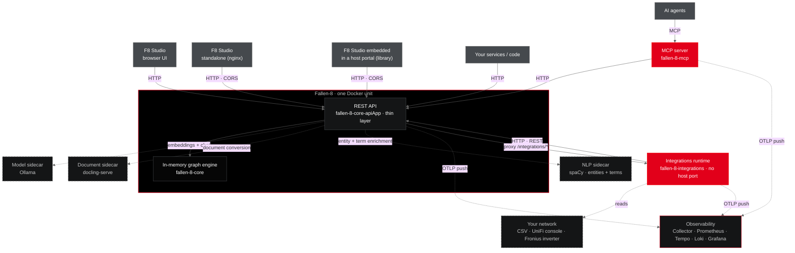

[](https://github.com/cosh/fallen-8-core/actions/workflows/buildAndTest.yml)
[](https://www.nuget.org/packages/Fallen-8)
[](https://github.com/cosh/fallen-8-core/pkgs/container/fallen-8-core)

## Welcome to Fallen-8


Fallen-8 is an in-memory [graph database](http://en.wikipedia.org/wiki/Graph_database)
written in C# (.NET 10), built for raw speed on heavy graph algorithms.

It has **no query language** — no Cypher, no Gremlin, and none is planned. Queries are C#:
small [delegate fragments](https://docs.fallen-8.com/delegates/) compiled at runtime, or precompiled stored
queries. That is a deliberate choice for the era of code-generating agents — an agent emits a
C# fragment, the engine compiles and runs it in-process at full speed, with no query-language
layer in between. This is the .NET Core evolution of the original
[fallen-8](https://github.com/cosh/fallen-8).

> 📚 **Full documentation: <https://docs.fallen-8.com/>** — a fast, searchable site
> with a deep dive per feature and the interactive API reference.

### Key features

Each feature has a deep-dive doc — follow the link.

- **[Graph model](https://docs.fallen-8.com/graph-model/)** — a directed property graph; typed properties on
  vertices and edges, all mutation through a serialized transaction queue.
- **[Delegates, not a query language](https://docs.fallen-8.com/delegates/)** — filters and cost functions are
  runtime-compiled C# fragments; the defining design decision.
- **[Path finding](https://docs.fallen-8.com/path-finding/)** — shortest/weighted paths with delegate filter and
  cost functions (BLS, Dijkstra).
- **[Subgraphs](https://docs.fallen-8.com/subgraphs/)** — extract a pattern-matched subset as a standalone graph,
  recalculate it when the source changes, nest and persist it.
- **[Graph analytics](https://docs.fallen-8.com/graph-analytics/)** — PageRank, connected components,
  communities, degree centrality, triangle counting, with optional property write-back.
- **[Stored queries](https://docs.fallen-8.com/stored-queries/)** — register a vetted, compiled query once and
  invoke it by name — no dynamic code at call time.
- **[Indexes](https://docs.fallen-8.com/indexes/)** — dictionary, range, fulltext, spatial R-Tree, and vector kNN,
  all as plugins.
- **[Vector search](https://docs.fallen-8.com/vector-search/)** — exact k-nearest-neighbour over `float[]`
  embeddings (cosine, dot product, L2).
- **[Semantic traversal](https://docs.fallen-8.com/semantic-traversal/)** — embeddings as element state; a
  code-free `semantic` block steers paths and subgraphs by similarity.
- **[Semantic layer](https://docs.fallen-8.com/unstructured-ingestion/)**: documents in, graph out:
  PDFs/Office/markdown become Document, Chunk and deduplicated Entity vertices with embedded
  text, enriched with named entities and key terms, found again by fused semantic + exact-token
  search and traversable like everything else.
- **[Bulk import/export](https://docs.fallen-8.com/bulk-import-export/)** — stream whole graphs as newline-delimited
  JSON that round-trips exactly.
- **[Integrations](https://docs.fallen-8.com/integrations/)**: a sidecar that reads a system on
  your own network (a CSV inventory, a UniFi console, a Fronius inverter) and writes what it saw into a
  namespace, with credentials that are held for one run and never stored, and exact-match identity.
- **[Live change feed](https://docs.fallen-8.com/change-feed/)** — committed mutations as Server-Sent Events, in
  commit order, with in-band resync.
- **[Save games](https://docs.fallen-8.com/save-games/)** — checkpoints tracked by a registry that drives startup,
  on top of a write-ahead log.
- **[Namespaces](https://docs.fallen-8.com/namespaces/)** — many isolated graphs in one Fallen-8, addressable under
  `/ns/{name}/…`, each choosing whether a boot loads it (a skipped one stays cataloged, answers `503`,
  and is never written to) and loadable into a running process on demand.
- **[Configuration](https://docs.fallen-8.com/configuration/)**: an instance shows every setting it binds with
  the layer each value came from, and lets an operator change the writable ones; most take effect at the
  next boot and say so, roughly half are never writable and say why.
- **[Observability](https://docs.fallen-8.com/observability/)**: opt-in Prometheus/OTLP metrics and traces, a
  graph-shape snapshot, and health probes for one instance, plus a multi-tenant consumer stack
  (Collector, Prometheus, Tempo, Loki, Grafana) that collects what many instances push into one
  Grafana pane, keyed by tenant/instance/namespace; on by default with `npm run env:up`.
- **[REST API](https://docs.fallen-8.com/rest-api/)** — a versioned HTTP surface with an OpenAPI document and an
  interactive Scalar reference.
- **[Plugins](https://docs.fallen-8.com/plugins/)** — indices, algorithms, and services are all discovered plugins.
- **[Plugin registration](https://docs.fallen-8.com/plugin-registration/)** — add runtime algorithm and graph-function
  plugins by authoring C# source (compiled, contract-validated, namespace-scoped) instead of
  uploading a DLL.
- **[F8 Studio](https://docs.fallen-8.com/studio/)** — a browser UI to browse, query, visualize, and author the C#
  delegates, with a natural-language assist that runs through your instance by default (or a
  browser-direct custom model backend).
- **[Standalone F8 Studio](https://docs.fallen-8.com/standalone-ui/)** — deploy the browser UI as its own
  container, decoupled from the data plane and pointed at any Fallen-8 REST endpoint at container start.
- **[Embed F8 Studio](https://docs.fallen-8.com/embed-studio/)**: the `@fallen-8/studio` package mounts
  the whole Studio, or `@fallen-8/studio/canvas` the graph alone, inside a host application's own
  shell - one config object carries the instances, credentials (bearer tokens included), namespace pin,
  theme tokens and storage namespace. The canvas sizes to any viewport: every visual magnitude (node
  radius, edge width, label px) is a host-settable knob, and a camera handle fits, reads and sets the
  zoom, so the same graph reads well in a 390 px card and on a 4K wall.
- **[Embed scenarios](https://docs.fallen-8.com/embed-scenarios/)**: the staged path for building Fallen-8
  into your own product - a WASM graph running entirely in the page, the canvas component rendering it, and
  the full embedded Studio against a hosted instance, with the boundary between them stated plainly.
- **[Benchmark](https://docs.fallen-8.com/benchmark/)**: measure raw edge-traversal throughput over the
  loaded graph (generated, a sample, or your own data) in the Studio Benchmark screen - per namespace,
  and generation reports what it created and where.
- **[MCP server](https://docs.fallen-8.com/mcp-server/)** — a Model Context Protocol surface so AI agents call
  Fallen-8 as typed tools; small and token-frugal, read-only by default, with tiered opt-in
  writes and three auth modes up to OAuth 2.1.
- **[NL assist and fine-tuning](https://docs.fallen-8.com/nl-assist/)**: draft C# fragments from a
  sentence, and an offline pipeline (compile-gated dataset, QLoRA training, held-out eval,
  feedback loop) to train, evaluate and publish your own model.
- **[Use as a library](https://docs.fallen-8.com/library/)**: reference the engine in-process via the
  `Fallen-8` NuGet package, with no HTTP and no server to operate - including on a single-threaded host
  such as browser WebAssembly, where transactions are applied inline on the calling thread. The package is
  trim-compatible, so a fully trimmed client keeps only what it uses, and a host that registers its plugin
  types gets name-based lookup, index creation and vector search even where assembly scanning finds nothing.
- **[Capacity and performance](https://docs.fallen-8.com/capacity-and-performance/)**: measured bytes per
  vertex and edge, write throughput, what a save game costs the writer, and what booting a namespace costs.
- **[Security](https://docs.fallen-8.com/security/)** — optional all-or-nothing API key; dynamic code execution is
  always on (queries are C#), so set a key before exposing the service off-box.

## Architecture

An in-memory engine with a thin REST app around it. **AI agents** reach it through the
[MCP server](https://docs.fallen-8.com/mcp-server/); **F8 Studio** (the browser UI) and **your own services** call
the [REST API](https://docs.fallen-8.com/rest-api/) directly. Under the hood the engine (`fallen-8-core`) holds the
graph in RAM, serializes every write through one writer thread, and runs the algorithms, while
the app (`fallen-8-core-apiApp`) is the thin HTTP layer that can serve F8 Studio itself. The
all-in-one image (engine + API + UI) still ships and runs with a bare `docker compose up`, but the
default `npm run env:up` now runs F8 Studio as its own
[standalone](https://docs.fallen-8.com/standalone-ui/) nginx container talking to the REST API cross-origin, so
the UI and the data plane deploy apart, alongside a model sidecar. F8 Studio also ships as a published package,
[`@fallen-8/studio`](https://docs.fallen-8.com/embed-studio/), a host portal can mount inside its own shell,
calling the same REST API. A third deployable, the
[integrations runtime](https://docs.fallen-8.com/integrations/), reads systems on your own network and
writes what it saw in through the same REST API.


```mermaid
%%{init: {'theme':'base','themeVariables':{'fontFamily':'ui-monospace, SFMono-Regular, Menlo, Consolas, monospace','lineColor':'#666666'}}}%%
flowchart TB
    agents["AI agents"]:::client
    studio["F8 Studio<br/>browser UI"]:::client
    uistandalone["F8 Studio<br/>standalone (nginx)"]:::client
    hostembed["F8 Studio embedded<br/>in a host portal (library)"]:::client
    services["Your services / code"]:::client

    mcp["MCP server<br/>fallen-8-mcp"]:::mcp
    integrations["Integrations runtime<br/>fallen-8-integrations · no host port"]:::mcp

    subgraph unit["Fallen-8 · one Docker unit"]
        direction TB
        rest["REST API<br/>fallen-8-core-apiApp · thin layer"]:::api
        engine["In-memory graph engine<br/>fallen-8-core"]:::engine
        rest --> engine
    end

    sidecar["Model sidecar<br/>Ollama"]:::ext
    docling["Document sidecar<br/>docling-serve"]:::ext
    nlp["NLP sidecar<br/>spaCy · entities + terms"]:::ext
    sources["Your network<br/>CSV · UniFi console · Fronius inverter"]:::ext
    obs["Observability<br/>Collector · Prometheus · Tempo · Loki · Grafana"]:::obs

    agents -->|MCP| mcp
    mcp -->|HTTP| rest
    studio -->|HTTP| rest
    uistandalone -->|HTTP · CORS| rest
    hostembed -->|HTTP · CORS| rest
    services -->|HTTP| rest
    rest -.->|embeddings + chat| sidecar
    rest -.->|document conversion| docling
    rest -.->|entity + term enrichment| nlp
    rest -.->|OTLP push| obs
    mcp -.->|OTLP push| obs
    rest -->|proxy /integrations/*| integrations
    integrations -->|HTTP · REST| rest
    integrations -.->|reads| sources
    integrations -.->|OTLP push| obs

    classDef client fill:#45494D,stroke:#666666,color:#FEFEFE
    classDef mcp fill:#E2001A,stroke:#FC0606,color:#FEFEFE
    classDef api fill:#141516,stroke:#45494D,color:#FEFEFE
    classDef engine fill:#060606,stroke:#45494D,color:#FEFEFE
    classDef ext fill:#141516,stroke:#666666,color:#C6C7C8,stroke-dasharray:5 4
    classDef obs fill:#141516,stroke:#E2001A,color:#C6C7C8
    style unit fill:#000000,stroke:#E2001A,stroke-width:1.5px,color:#C6C7C8
```

Full details, the writer thread, plugin system, durability, the model sidecar and the
integrations runtime, are in
[docs/architecture.md](https://docs.fallen-8.com/architecture/).

## Running it

One command brings up the whole environment from the published images of the
[latest release](https://github.com/cosh/fallen-8-core/releases/latest): engine, REST API,
F8 Studio, the MCP server for agents, the integrations runtime, the model sidecar, and the
observability stack, with
every feature on, no authentication in the way, and nothing to build. An NVIDIA GPU is
detected and used automatically; without one everything runs on the CPU (same on macOS,
Linux, and Windows PowerShell):

```bash
git clone https://github.com/cosh/fallen-8-core.git && cd fallen-8-core
npm run env:up:published
```

Then open **F8 Studio at http://localhost:8081** (its own container) — the **REST API is at
http://localhost:8080** — and load a sample graph from the Samples screen. The **MCP server is on
http://localhost:8090** for AI-agent clients (read-only by default).

`latest` and the newest NuGet version always correspond to the newest release tag. For a
reproducible deployment pin the version, which mirrors the git tag:

```bash
F8_IMAGE_TAG=0.0.28 npm run env:up:published
```

And for just Fallen-8 itself (engine + REST API + F8 Studio in one container, no sidecars),
plain Docker is enough:

```bash
docker run -d --name fallen8 -p 8080:8080 -v f8-data:/data ghcr.io/cosh/fallen-8-core:latest
```

### Building from source

The same environment, built locally from the working tree instead of pulled:

```bash
npm run env:up
```

This is the developer path: it builds the first-party images from source, and on an NVIDIA
host it also upgrades the NLP sidecar to its transformer tier, a build-only variant that the
published images deliberately leave out. Every other way to run it (a bare `dotnet run`, the
configuration keys, the security switches, GPU acceleration, offline model pre-seeding) is
in [docs/running.md](https://docs.fallen-8.com/running/).

### Use the engine as a library

The engine ships as the [`Fallen-8`](https://www.nuget.org/packages/Fallen-8) package on
nuget.org. Stable versions are published only from release tags, so installing without a
version always gets the newest release; pin `--version X.Y.Z` for reproducible builds.

```bash
dotnet add package Fallen-8
```

The in-process guide is in [docs/library.md](https://docs.fallen-8.com/library/).

## Samples

F8 Studio ships a one-click **sample gallery**: curated graphs (a karate club, an
Active-Directory attack surface, a movie-recommendation graph, world air routes, Fallen-8's
own dependency graph) that load in a click and come styled, indexed, and ready to explore.
Each one is a guided tour of a different feature — analytics, weighted paths, semantic search,
canvas visualization. See the gallery walkthrough, with screenshots and example queries, in
[docs/samples.md](https://docs.fallen-8.com/samples/).

**Wind Farm Fleet Integrity** goes a step further: it imports an offshore asset graph and then
ingests three synthetic documents (a PDF root-cause analysis with a figure, an XLSX maintenance
register, a markdown engineering standard) through the live
[semantic layer](https://docs.fallen-8.com/unstructured-ingestion/). Ask *why did the
bearing fail*, land on the paragraph that explains it, and follow that chunk into the fleet to
find the turbines at risk that no document names.

## Use Fallen-8 from AI agents

Agents reach Fallen-8 through the **MCP server** — a separate deployable that exposes the graph
as [Model Context Protocol](https://modelcontextprotocol.io) tools any MCP client (Claude Code,
Claude Desktop, IDE agents) can call. It is a small, token-frugal tool surface, read-only by
default, with opt-in write/admin tiers and three auth modes (anonymous-loopback, static bearer,
OAuth 2.1). It comes up with `npm run env:up` on **http://localhost:8090** — anonymous and
read-only, matching the local dev environment's no-auth posture. Point a client at it:

```bash
claude mcp add --transport http fallen8 http://localhost:8090
```

For a real (off-box) deployment, set a token and enable the tiers you need — full guide in
[docs/mcp-server.md](https://docs.fallen-8.com/mcp-server/).

## Troubleshooting

Common snags — first-start model pulls, the embedding provider, missing-key 401s, GPU
detection — and their fixes are in [docs/troubleshooting.md](https://docs.fallen-8.com/troubleshooting/).

## Documentation

The full documentation set is the searchable site at
**<https://docs.fallen-8.com/>**. Its sources live in `docs/` (a Starlight site) and
deploy on every push to `main`.

## Additional information

- [Graph databases — Henning Rauch](http://www.slideshare.net/HenningRauch/graphdatabases)
- [Graphendatenbanken — Henning Rauch (visiting lecture)](http://www.slideshare.net/HenningRauch/vorlesung-graphendatenbanken-an-der-universitt-hof)

## MIT-License

Copyright (c) 2011-2026 Henning Rauch

Permission is hereby granted, free of charge, to any person obtaining a copy of this software and associated documentation files (the "Software"), to deal in the Software without restriction, including without limitation the rights to use, copy, modify, merge, publish, distribute, sublicense, and/or sell copies of the Software, and to permit persons to whom the Software is furnished to do so, subject to the following conditions:

The above copyright notice and this permission notice shall be included in all copies or substantial portions of the Software.

THE SOFTWARE IS PROVIDED "AS IS", WITHOUT WARRANTY OF ANY KIND, EXPRESS OR IMPLIED, INCLUDING BUT NOT LIMITED TO THE WARRANTIES OF MERCHANTABILITY,

FITNESS FOR A PARTICULAR PURPOSE AND NONINFRINGEMENT. IN NO EVENT SHALL THE AUTHORS OR COPYRIGHT HOLDERS BE LIABLE FOR ANY CLAIM, DAMAGES OR OTHER LIABILITY, WHETHER IN AN ACTION OF CONTRACT, TORT OR OTHERWISE, ARISING FROM, OUT OF OR IN CONNECTION WITH THE SOFTWARE OR THE USE OR OTHER DEALINGS IN THE SOFTWARE.
