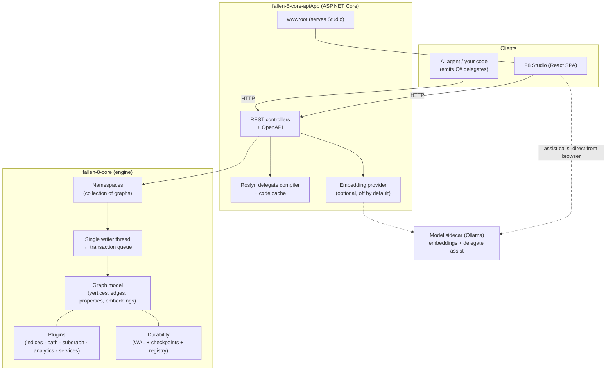

# Architecture

Fallen-8 is an in-memory graph engine with a thin REST app wrapped around it. The engine
holds the graph in RAM and runs the algorithms; the app exposes it over HTTP and serves the
browser UI. This doc is the map of how the pieces fit; each piece's contract lives in its own
doc, linked below.

## The engine (`fallen-8-core`)

Everything the database *is* lives here; it has no dependency on ASP.NET and can be embedded
as a library (see the `Try*` API in [Graph model](graph-model.md)).

- **A Fallen-8 is a collection of [namespaces](namespaces.md).** Each namespace is one
  isolated graph backed by its own engine instance, with its own vertices, edges, indices,
  subgraphs, and stored queries. The reserved `default` namespace is what bare routes address.
- **The [graph model](graph-model.md)** is a directed property graph: vertices and edges are
  both first-class elements carrying typed properties and, optionally, named
  [embeddings](semantic-traversal.md).
- **Mutation goes through a transaction queue.** Callers enqueue a transaction; a **single
  writer thread** applies them one at a time, so writes are serialized and readers never lock.
  This is why the REST mutation calls take `waitForCompletion` — it waits for the writer to
  finish the enqueued transaction. Reads go straight to the in-memory structures.
- **Algorithms and indices are [plugins](plugins.md).** Path traversers, subgraph algorithms,
  whole-graph analytics, index types, and services are discovered by a plugin factory and
  addressed by name. The built-ins are just the plugins that ship in the box.
- **Durability** is a write-ahead log plus full-graph checkpoints, tracked by a registry that
  decides what loads on startup. The whole story — including volatile mode — is in
  [Save games](save-games.md).

## The REST app (`fallen-8-core-apiApp`)

A thin ASP.NET Core layer. It owns three things the engine deliberately does not:

- **The HTTP surface** — versioned controllers, an OpenAPI document, and the Scalar reference
  ([REST API](rest-api.md)), plus the [security](security.md) boundary (API key and the
  dynamic-code switch).
- **Runtime delegate compilation.** Fallen-8 has [no query language](delegates.md): path and
  subgraph filters arrive as C# fragments, and the app compiles them with Roslyn into typed
  delegates and caches the result. This is the app's job, not the engine's, and it is gated
  by a capability switch that is off by default.
- **The optional [embedding provider](semantic-traversal.md).** Text-in embedding lives only
  in the app so the engine stays model-free; a bare run has it off, and the compose
  environment wires it to the model sidecar.

The app also serves [F8 Studio](studio.md) as static files from its `wwwroot`.

## F8 Studio and the model sidecar

[F8 Studio](studio.md) is a React single-page app. It talks to the REST API like any other
client — it has no privileged channel. Its natural-language assist is the one exception to
the "everything through the API" rule: the browser calls a **user-run model backend**
(Ollama / llama.cpp) **directly**, so no model traffic passes through the engine. In the
compose environment that backend is the Ollama sidecar, which also serves the embedding model
the app's provider calls. F8 itself bundles no model weights or runtime.

## One deployable unit

The [compose environment](running.md) builds the SPA, publishes the app, and ships them in
one container (the app serves the UI from `wwwroot`), alongside the Ollama sidecar. Managed as
a whole, it is the "just works" default. The container is durable by default — checkpoints and
the WAL live on a mounted volume.

## See also

- [Running](running.md) — how to launch each of these
- [Graph model](graph-model.md) — the data model and the transaction/read contract
- [Delegates](delegates.md) — why there is no query language and how fragments compile
- [Plugins](plugins.md) — the extension model for indices and algorithms
- [Save games](save-games.md) — the durability subsystem
- [Namespaces](namespaces.md) — the graph-collection model
- [Security](security.md) — the API-app boundary
