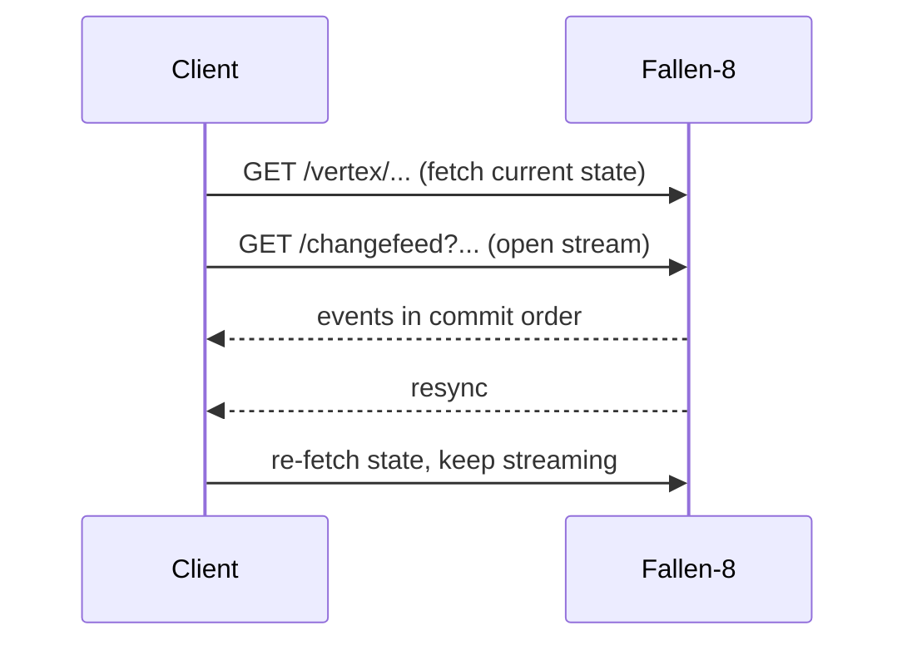

# Change feed

`GET /changefeed` streams every committed graph mutation as [Server-Sent Events](https://developer.mozilla.org/docs/Web/API/Server-sent_events), in commit order, over one long-lived `text/event-stream` connection. Each event is metadata about one mutation — ids, labels, and property *keys*, never property values — with declarative server-side filtering and a bounded in-memory catch-up buffer. The whole client contract is: **fetch the state you display, then stream; on any `resync` event, re-fetch.**

## Endpoint

| | |
|---|---|
| Route | `GET /changefeed` (default namespace) · `GET /ns/{ns}/changefeed` (named namespace) |
| Content type | `text/event-stream`; the stream stays open until the client disconnects |
| Auth | Same fallback policy as every route — open on loopback, an API key when one is configured (see [security](security.md)) |
| `200` | The SSE stream |
| `400` | Unknown `kinds`/`elements` value or a malformed `since` |
| `401` | A credential is required and none was supplied |
| `503` | Feed disabled (`Fallen8:ChangeFeed:Enabled=false`) or the per-namespace subscriber limit is reached |

Each namespace owns an independent feed — its own epoch, catch-up buffer, and subscriber limit; see [namespaces](namespaces.md). Filters are plain query parameters, never compiled code, so the feed is fully functional with dynamic code execution off (see [security](security.md)).

## Filter grammar

All parameters are optional (unset = wildcard), repeatable and/or comma-separated (union within a dimension), and matched exactly and case-sensitively. Dimensions combine with AND.

| Parameter | Values | Notes |
|---|---|---|
| `kinds` | `vertexCreated` `vertexRemoved` `edgeCreated` `edgeRemoved` `propertySet` `propertyRemoved` | `resync` is accepted but always delivered regardless |
| `elements` | `vertex` `edge` | |
| `labels` | exact labels | an unlabeled element never matches a labels filter |
| `keys` | exact property keys | only property events carry a key, so setting this excludes create/remove events — subscribe twice to see both |
| `since` | `<epoch>:<seq>` or a bare sequence number | catch-up position; see below |

An unknown `kinds`/`elements` value or a malformed `since` is a `400` problem+json, never a silently empty stream.

## Event schema

One JSON object per `data:` line. Fields are **absent** (not null) when they do not apply to the kind. Payloads never contain property values — re-fetch the element when you need a value (see [graph model](graph-model.md)).

| Field | Type | Present for |
|---|---|---|
| `seq` | int64 | every event — monotonic, commit order, gap-free per epoch |
| `ts` | ISO-8601 UTC | every event — commit timestamp, shared by a transaction's events |
| `kind` | string | every event — one of the kinds above, or `resync` |
| `element` | `vertex`/`edge` | element events |
| `id` | int32 | element events |
| `label` | string | element events with a label |
| `key` | string | `propertySet` / `propertyRemoved` |
| `source`, `target` | int32 | `edgeCreated` |
| `reason` | string | `resync` |

```jsonc
{"seq":4712,"ts":"2026-07-15T12:34:56.789Z","kind":"propertySet","element":"vertex","id":42,"label":"person","key":"name"}
```

On the wire each event is one SSE frame; a `: keepalive` comment is sent every `KeepAliveSeconds` while idle so proxies do not time the stream out:

```
id: 0b1e4c2e-8f3a-4d1b-9c2e-1a2b3c4d5e6f:4712
event: propertySet
data: {"seq":4712,"ts":"2026-07-15T12:34:56.789Z","kind":"propertySet","element":"vertex","id":42,"label":"person","key":"name"}
```

The `id:` line is `<epoch>:<seq>`: `epoch` is a per-process GUID (so a post-restart `seq` is never mistaken for a pre-restart one), `seq` is the sequence number. Pass a whole `id` value back as `since` to catch up.

## Catch-up and resync

Missed events are served from a bounded in-memory ring buffer (`BufferSize`, default 8192 events). Reconnect with `since` set to the last `id` you saw (or a bare `seq`); buffered events replay first, then the stream continues live and gap-free. Native `EventSource` reconnects send `Last-Event-ID`, which the server honours as `since` when the query parameter is unset.

When continuity **cannot** be preserved, the stream says so in-band with a `resync` event instead of silently dropping mutations. `resync` bypasses every filter — a suppressed one would corrupt the client's view. On any `resync`, re-fetch the state you display; for `trim`/`tabulaRasa`/`load`, also treat every element id you hold as invalid (they may be renumbered or gone).

| `reason` | Trigger | Also invalidate held ids |
|---|---|---|
| `overflow` | Consumer too slow, or the writer→dispatcher inbox dropped | no |
| `seekOutOfRange` | `since` is outside the buffered window, or from a different epoch | no |
| `trim` | Tombstone compaction renumbered elements | yes |
| `tabulaRasa` | The graph was cleared | yes |
| `load` | The graph was loaded/restored from disk | yes |
| `delegateWrite` | An opaque plugin (delegate) write the feed cannot express as element deltas | no |



## Configuration

Bound from the `Fallen8:ChangeFeed` section (enabled by default in the hosted API):

```jsonc
"Fallen8": {
  "ChangeFeed": {
    "Enabled": true,             // false => endpoint answers 503
    "BufferSize": 8192,          // catch-up ring capacity (events)
    "SubscriberQueueSize": 1024, // per-subscriber bounded queue (events)
    "MaxSubscribers": 32,        // per namespace; beyond it => 503
    "KeepAliveSeconds": 15       // idle SSE comment heartbeat
  }
}
```

## Worked example

Subscribe to person-vertex creations and removals, then create and remove a `person`:

```bash
curl -N "http://localhost:8080/changefeed?kinds=vertexCreated,vertexRemoved&labels=person"
```

```powershell
# Use curl.exe (the bare `curl` alias is Invoke-WebRequest, which buffers instead of streaming).
curl.exe -N "http://localhost:8080/changefeed?kinds=vertexCreated,vertexRemoved&labels=person"
```

As the vertex (id 42) is created then removed, two frames arrive; `: keepalive` comments appear between them while idle:

```
id: 0b1e4c2e-8f3a-4d1b-9c2e-1a2b3c4d5e6f:4712
event: vertexCreated
data: {"seq":4712,"ts":"2026-07-15T12:34:56.789Z","kind":"vertexCreated","element":"vertex","id":42,"label":"person"}

id: 0b1e4c2e-8f3a-4d1b-9c2e-1a2b3c4d5e6f:4713
event: vertexRemoved
data: {"seq":4713,"ts":"2026-07-15T12:35:01.114Z","kind":"vertexRemoved","element":"vertex","id":42,"label":"person"}
```

An `EventSource` in the browser cannot set headers, so consume the same wire format with `fetch` + a stream reader when an API key is configured — the key must never go into a query string.

## See also

- [Graph model](graph-model.md) — the elements, properties, and transactions whose commits the feed reports
- [Namespaces](namespaces.md) — the per-namespace feed and `/ns/{ns}/…` routing
- [Security](security.md) — the API key and why the feed needs no dynamic code
- [REST API](rest-api.md) — REST conventions, problem+json, and the OpenAPI document
