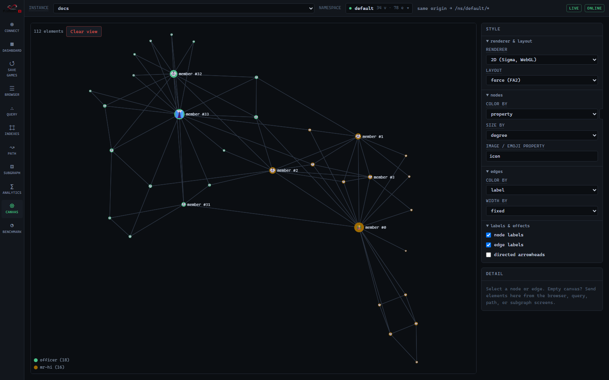
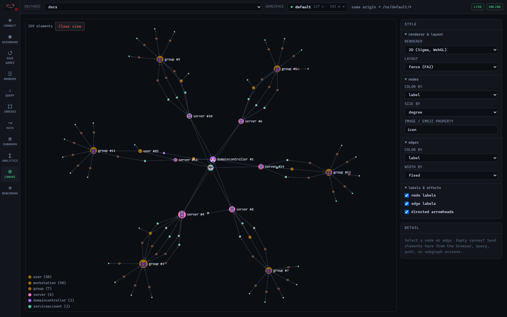
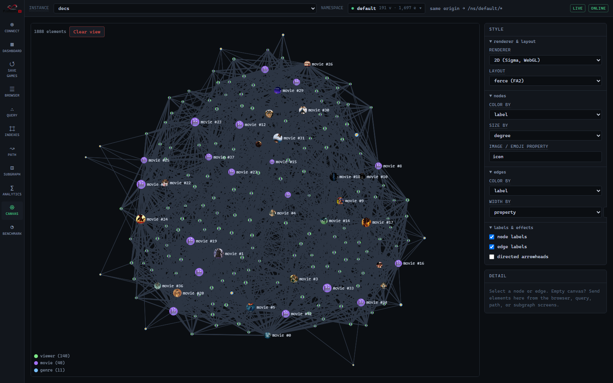
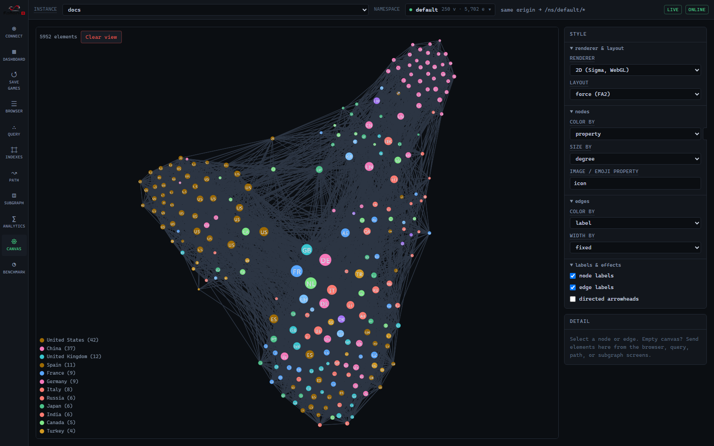
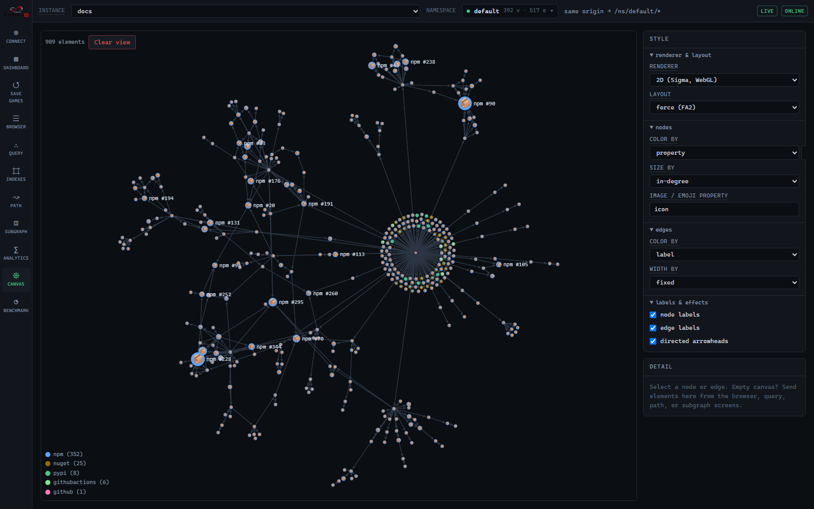
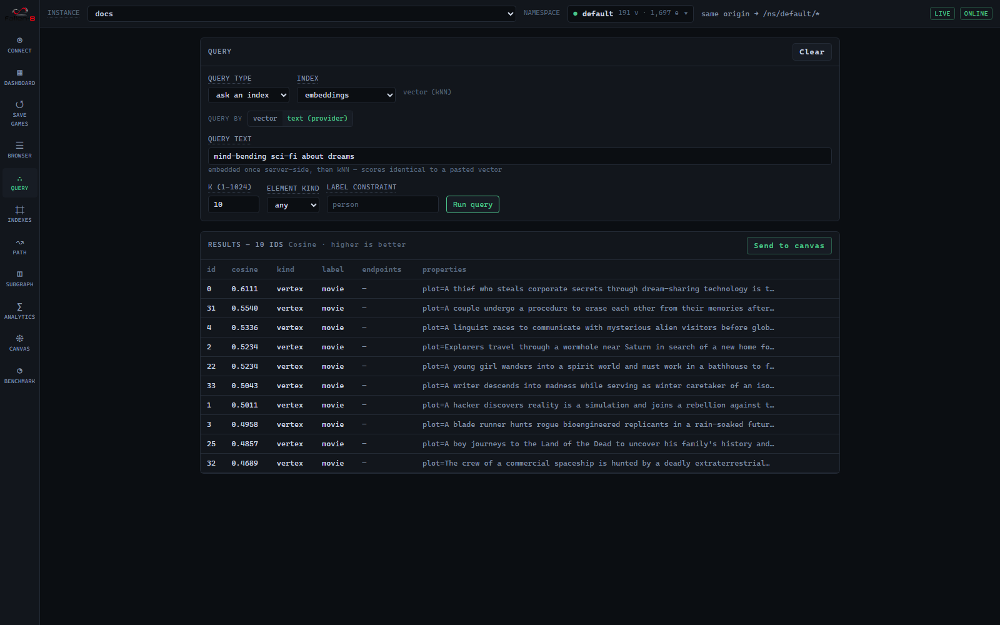
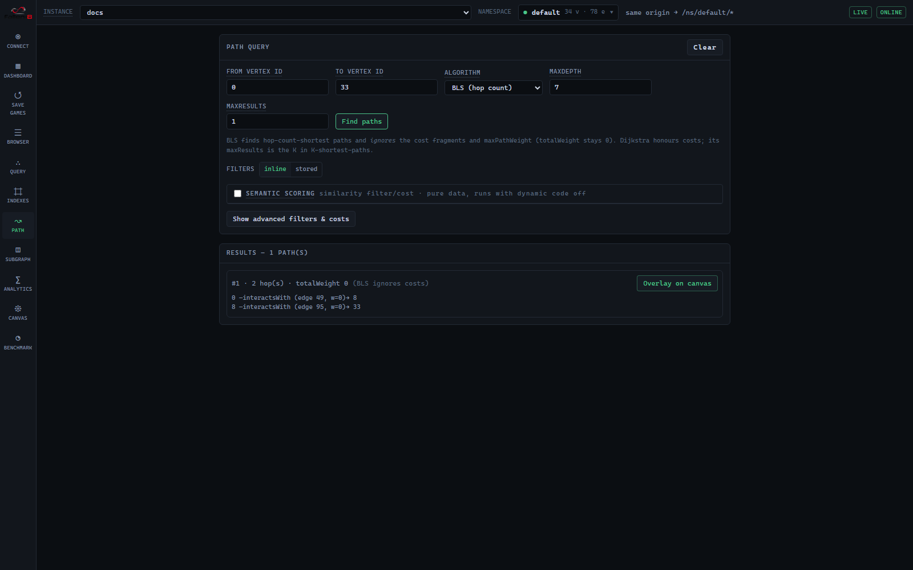
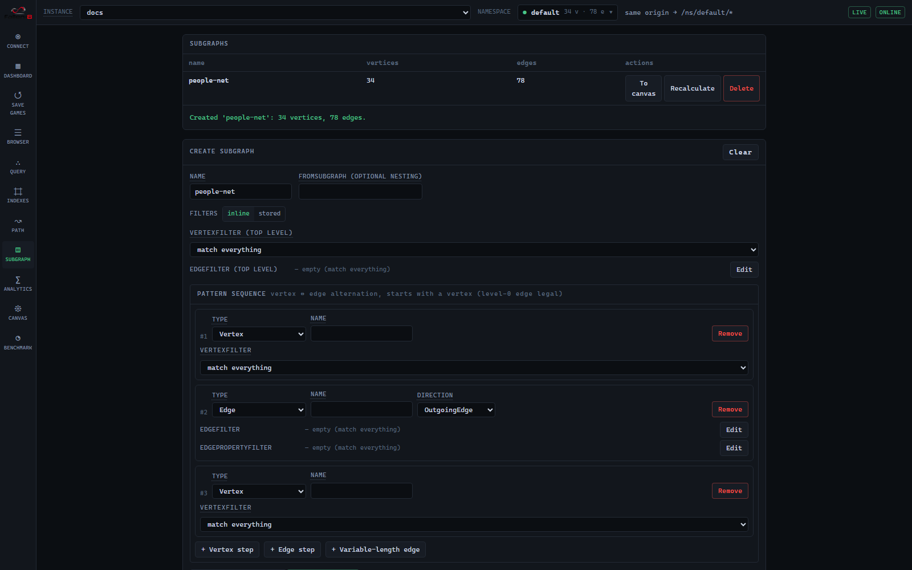

# Sample gallery

[F8 Studio](studio.md)'s dashboard ships a gallery of curated graphs that load in one click.
Each comes styled for the canvas, indexed where it helps, and paired with example queries, so
every card is a short guided tour of a different Fallen-8 capability — analytics, weighted
paths, semantic search, visualization. This doc walks through each one, with screenshots and
queries you can run yourself.

## How loading works

Clicking **Load** fetches the dataset from a public URL, imports it, builds the sample's
indices, and re-reads the elements onto the canvas with the sample's style — no embedding
work happens at load time, because the vectors are baked into the file.

- **Import needs an empty graph** (ids must not clash). Loading into a non-empty instance is
  gated behind a typed-name confirm that erases first — save a checkpoint
  ([save games](save-games.md)) if you need the current data, or switch to a fresh
  [namespace](namespaces.md).
- **The datasets are `fallen8-jsonl`** — the same format [bulk import/export](bulk-import-export.md)
  uses, fetched and streamed through `POST /bulk/import`.
- **Bring-your-own-vector always works.** The embedded samples carry their vectors in the
  file, so vector scans work even with no embedding provider. The **text-in** features
  (semantic search by typed text) additionally need a provider whose model identity matches
  the baked vectors — each card tells you whether that works on the current instance. See
  [semantic traversal](semantic-traversal.md).

## The samples

### 🥋 Zachary's Karate Club — 34 vertices, 78 edges

The most famous graph in community detection: club members, friendships, and the real 1977
split. Nodes are colored by `faction` and sized by degree, so the two camps and their leaders
(member #0 and #33) are obvious at a glance.

Try it:

- **[Analytics](graph-analytics.md) → `LABELPROPAGATION`** with write-back, then color the
  canvas by the computed community — it reproduces the club's real split (compare with color
  by `faction`).
- **`TRIANGLECOUNT`** and **`WCC`** on the textbook graph.
- **[Path](path-finding.md)** from Mr. Hi to the Officer (look their ids up on the Browser
  screen).

### 🛡️ AD Attack Surface — 117 vertices, 142 edges

A synthetic Active-Directory estate: users, workstations, servers, and groups. The scenario
is a red-team classic — phish an intern, then find the cheapest path to Domain Admins. Ships
with a bound [vector index](vector-search.md) for semantic search.

Try it:

- **[Path](path-finding.md) → Dijkstra** from the phished `finance.intern` workstation to the
  `DOMAIN ADMINS` group, using cost property `exploitCost` — the result is the cheapest attack
  chain.
- **[Semantic search](semantic-traversal.md):** "where do the financial documents live"
  surfaces the Finance file server.
- **[Analytics](graph-analytics.md) → `DEGREE` / `PAGERANK`** to spot lateral-movement
  choke points.

### 🎬 Movie Night — 191 vertices, 1,697 edges

Films, genres, and viewers with real taste communities — poster-image nodes, plot embeddings,
and rating-weighted edges. The richest sample for semantic and recommendation work.

Try it:

- **[Semantic search](semantic-traversal.md):** "mind-bending sci-fi about dreams" surfaces
  Inception; "a haunted hotel" finds The Shining (see the [worked example](#semantic-search)
  below).
- **[Path](path-finding.md):** a 2-hop viewer → movie → viewer → movie chain is a
  recommendation.
- **[Analytics](graph-analytics.md) → `PAGERANK`** ranks the canon; **`LABELPROPAGATION`**
  recovers the taste communities.

### ✈️ World Air Routes — 250 vertices, 5,702 edges

The 250 busiest airports and the flights between them (OpenFlights), colored by country and
sized by degree so the mega-hubs (US, GB, DE, FR…) pop. Each node carries its country flag as
its `icon`; where the browser has no flag-emoji font it falls back to the two-letter country
code, as in the shot above.

Try it:

- **[Path](path-finding.md) → Dijkstra** on cost property `km` between two airports — a real
  minimum-distance itinerary.
- **[Semantic search](semantic-traversal.md):** "major airports in Japan" or "busiest hubs in
  the Middle East".
- **[Analytics](graph-analytics.md) → `PAGERANK` / `DEGREE`** to rank the global hubs.

### 📦 Fallen-8 Dependencies — 392 vertices, 517 edges

Fallen-8's own supply chain across every ecosystem (npm, NuGet, PyPI, GitHub Actions), colored
by ecosystem and sized by in-degree. The static twin of the live GitHub card.

Try it:

- **[Analytics](graph-analytics.md) → `PAGERANK`** for the most-depended-on packages;
  **`WCC`** to see each ecosystem fall out as its own component.
- **Canvas** → color by `license` or `ecosystem`.

### 📈 Scale: 100k × 1M and 🐙 Any GitHub repo

Two more cards round out the gallery:

- **Scale: 100k × 1M** — a 100,000-vertex, ~1M-edge graph generated server-side on the
  **Benchmark** tab (not fetched); use it to feel ingest speed, memory footprint, and
  analytics at scale. See [Studio → Benchmark](studio.md).
- **Any GitHub repo** — paste `owner/repo` to fetch any public repository's dependency graph
  from GitHub just-in-time and ingest it — the dynamic twin of the Fallen-8 Dependencies
  sample.

## Worked examples

### Semantic search

Load **Movie Night**, open **Query**, pick the `embeddings` index, switch to **text
(provider)**, and search a *concept* rather than keywords. "mind-bending sci-fi about dreams"
ranks Inception top by cosine similarity — the query text is embedded once server-side, then
run as exact kNN.

The mechanics — element embeddings, bound indices, the model-identity contract — are in
[semantic traversal](semantic-traversal.md); the kNN scan itself in [vector search](vector-search.md).

### An interesting path

The **Path** screen finds routes between two elements. On a weighted sample (air routes by
`km`, the attack surface by `exploitCost`) a Dijkstra run returns the genuinely cheapest
route; the default BLS finds fewest-hop paths.

Filters and cost functions are C# [delegates](delegates.md); the full path contract is in
[path finding](path-finding.md).

### A subgraph

The **Subgraph** screen builds an alternating vertex–edge pattern and extracts everything on a
matching path into a new standalone graph.

The pattern model and REST lifecycle are in [subgraphs](subgraphs.md).

## Rebuilding and adding samples

The datasets live in the repo's top-level [samples/](../samples/) and are served from a public
raw URL; the gallery is driven entirely by `samples/index.json`, so adding a sample is a data
change, not a UI change. The embedded samples' vectors are produced at build time (never at
load) against an instance with the embedding provider on.

## See also

- [Studio](studio.md) — the UI that hosts the gallery
- [Bulk import/export](bulk-import-export.md) — the `fallen8-jsonl` format the samples use
- [Semantic traversal](semantic-traversal.md) / [Vector search](vector-search.md) — the embedding features the samples exercise
- [Graph analytics](graph-analytics.md) · [Path finding](path-finding.md) · [Subgraphs](subgraphs.md) — the algorithms the "try it" steps drive
