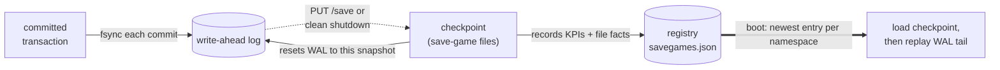

# Save games

Fallen-8 is durable by default. Every committed transaction is appended to a per-namespace **write-ahead log (WAL)** and fsync'd before the call returns; on demand — via `PUT /save` or a clean shutdown — the engine writes a **save game**, a full checkpoint of the graph. A single **registry** at `<deployment>/metadata/savegames.json` records every save game with its KPIs and file facts and is the sole authority for what loads on startup. Between checkpoints the WAL closes the gap, so a crash recovers every committed transaction by replaying the log on top of the last checkpoint. Volatile mode (opt-in) turns all of this off. Save games are for full point-in-time restore points; to move data as portable text instead, see [bulk import/export](bulk-import-export.md).



## Durability model

| Piece | Role |
|---|---|
| **WAL** | Append-only, one per namespace. Each committed data mutation is framed with a CRC-32 and fsync'd before `PUT`/`WaitUntilFinished` returns. A torn trailing entry (crash mid-append) is discarded cleanly on replay. |
| **Checkpoint / save game** | A full snapshot: a primary file plus sidecars (element partitions, indices, services, subgraph and stored-query manifests). Written atomically (temp file + fsync + rename); a save resets the WAL to build on the new snapshot. |
| **Registry** | One JSON document per deployment, written atomically. Records every save game (never overwritten silently; a corrupt document is a loud failure) and decides what boots. |

## What a save game contains

| Content | Persisted | On load |
|---|---|---|
| Vertices & edges + their properties | Yes — id-partitioned element files | Restored |
| Element embeddings | Yes — element state, travels with the elements | Restored ([semantic traversal](semantic-traversal.md)) |
| Indices | Yes — one file per index | Restored; a bound vector index is rebuilt as a derived projection ([indexes](indexes.md), [vector search](vector-search.md)) |
| Services | Yes | Restored (started when `startServices` is set) |
| Subgraph recipes | Yes — one manifest | Recompiled ([subgraphs](subgraphs.md)) |
| Stored queries | Yes — source only, one manifest | Recompiled ([stored queries](stored-queries.md)) |

Between checkpoints the WAL records the same data mutations plus id-space markers (`Trim`, `TabulaRasa`) and subgraph/stored-query registrations committed since the last save, so crash recovery loses nothing committed.

## Startup

The registry — never the files on disk — decides what boots. Each namespace is resolved by its immutable id (a rename keeps its history; a drop + recreate does not inherit the old one's saves):

| Registry state | What loads |
|---|---|
| An entry contains the namespace | Its newest such entry's checkpoint is loaded, then the WAL tail is replayed |
| No entry contains it | Nothing is loaded; the namespace keeps its WAL-replayed construction state — an empty graph on a fresh deployment |

- A checkpoint file merely sitting in the storage directory is **not** auto-loaded. (Exception: a checkpoint strictly newer than the newest registered entry is adopted — it is a durable save whose registry write did not complete before a crash.)
- To **adopt an unregistered checkpoint**, load it once with `PUT /load`; it is then registered permanently and boots normally thereafter.
- A registered entry whose checkpoint file is missing aborts startup loudly rather than serving an empty graph — restore the file, or delete the entry (`DELETE /savegames/{id}`) and restart.

## Configuration

| Key | Default | Effect |
|---|---|---|
| `Fallen8:Durability:StorageDirectory` | app base directory | Directory holding the checkpoint files and the WAL |
| `Fallen8:Durability:CheckpointBaseName` | `Temp.f8s` | Base file name for the clean-shutdown checkpoint |
| `Fallen8:Durability:WalPath` | `<StorageDirectory>/fallen8.wal` | WAL path for the default namespace |
| `Fallen8:Durability:Volatile` | `false` | `true` = pure in-memory: no boot load, no shutdown save, **WAL disabled**; a restart loses all data by choice |
| `Fallen8:Durability:SaveOnShutdown` | `true` | `true` = final checkpoint on clean shutdown; `false` = rely on the per-commit WAL (committed work still survives; the next boot replays a longer log) |
| `Fallen8:Metadata:Directory` | `<app base>/metadata` | Directory holding `savegames.json` |

In the compose environment these bind from environment variables (`Fallen8__Durability__StorageDirectory=/data`, `Fallen8__Metadata__Directory=/data/metadata`) so the graph data and the registry share one named volume; see [running](running.md). A bare `PUT /save` uses the namespace's default checkpoint file — pass `saveGameLocation` to place it under your storage volume explicitly.

## REST surface

Base URL `http://localhost:8080`. `PUT /save` and `PUT /load` target the addressed namespace (bare URLs alias the `default` namespace; every one also answers under `/ns/{ns}/…`). The `/savegames` registry routes and `PUT /save/all` are Fallen-8-level (one registry per deployment), so they are not namespace-twinned. See [namespaces](namespaces.md).

### Saving

| Route | Scope | Body | Responses |
|---|---|---|---|
| `PUT /save` | namespace | `SaveSpecification` (all optional) | `200` created entry · `400` · `500` rolled back |
| `PUT /save/all` | Fallen-8 | — | `200` one entry spanning all namespaces · `429` rate-limited · `500` (body names failed namespaces; successful ones are still registered) |

`SaveSpecification`: `saveGameLocation` (path; defaults to `Temp.f8s` in the storage directory), `savePartitions` (defaults to the optimal count for the CPU). Both `PUT /save` and `PUT /save/all` wait for the save to finish before responding.

### Registry and restore

| Route | Effect | Responses |
|---|---|---|
| `GET /savegames` | List every entry, newest first | `200` |
| `GET /savegames/{id}` | One entry | `200` · `204` unknown id |
| `PUT /savegames/{id}/load` | Restore the entry's namespaces, replacing their in-memory graphs | `200` (waited) · `202` (accepted) · `404` · `500` rolled back |
| `DELETE /savegames/{id}` | Remove the entry; `?deleteFiles=true` also deletes its checkpoint files | `204` · `404` |
| `PUT /load` | Load a checkpoint from an arbitrary path into the addressed namespace | `204` · `400` · `500` rolled back |

Restore query parameters: `?waitForCompletion=true` awaits the load and returns `200` (otherwise it returns `202` immediately); `?namespace={name}` restores just that member of the entry (`404` when the entry does not contain it). Restoring recreates a dropped namespace, replaces an existing one's content, and leaves namespaces the entry does not contain untouched. `PUT /load` takes a `LoadSpecification`: `saveGameLocation` and `startServices`; a checkpoint loaded this way is registered if not already known.

A registry entry (`SaveGameREST`) reports: `id`, `savedAt` (ISO-8601 UTC), `trigger` (`api` \| `shutdown` \| `imported`), `location`, `fileCount`, `totalBytes`, `engineVersion`, `kpis` (`vertexCount`, `edgeCount`, index/plugin/subgraph inventory), and a `namespaces[]` manifest (`name`, `id`, `location`, file facts, `kpis` per member).

## Examples

Save the default namespace and capture the created entry's id:

```bash
curl -X PUT http://localhost:8080/save \
  -H "Content-Type: application/json" -d '{}'

curl http://localhost:8080/savegames        # list, newest first
```

```powershell
$entry = Invoke-RestMethod -Method Put -Uri http://localhost:8080/save `
  -ContentType "application/json" -Body '{}'
$entry.id

Invoke-RestMethod -Uri http://localhost:8080/savegames
```

Restore an entry (waiting for the load), then delete an old one with its files:

```bash
curl -X PUT "http://localhost:8080/savegames/sg-20260724-101500-ab12/load?waitForCompletion=true"

curl -X DELETE "http://localhost:8080/savegames/sg-20260101-000000-9f3c?deleteFiles=true"
```

```powershell
Invoke-RestMethod -Method Put `
  -Uri "http://localhost:8080/savegames/sg-20260724-101500-ab12/load?waitForCompletion=true"

Invoke-RestMethod -Method Delete `
  -Uri "http://localhost:8080/savegames/sg-20260101-000000-9f3c?deleteFiles=true"
```

Adopt a checkpoint that is on disk but not in the registry (registers it permanently):

```bash
curl -X PUT http://localhost:8080/load -H "Content-Type: application/json" \
  -d '{ "saveGameLocation": "/data/Temp.f8s", "startServices": true }'
```

```powershell
Invoke-RestMethod -Method Put -Uri http://localhost:8080/load -ContentType "application/json" `
  -Body '{ "saveGameLocation": "/data/Temp.f8s", "startServices": true }'
```

## Namespaces

`PUT /save/all` checkpoints every namespace into **one** save-game entry — a single consistent restore point for the whole Fallen-8; the clean-shutdown save produces the same shape. Restore the whole entry, or a single member with `?namespace={name}`, via `PUT /savegames/{id}/load`. Each namespace keeps its own checkpoint files and WAL under its own directory, while the registry is shared. The namespace model itself lives in [namespaces](namespaces.md).

## Studio

F8 Studio has a Save games screen that lists entries and drives save, restore, and delete — see [studio](studio.md).

## See also

- [Indexes](indexes.md) — how indices are captured and restored/rebuilt on load
- [Namespaces](namespaces.md) — the namespace model and `/ns/{ns}/…` route twins
- [Bulk import/export](bulk-import-export.md) — the portable-text alternative for moving data
- [Stored queries](stored-queries.md) · [Subgraphs](subgraphs.md) — assets recompiled from a save game
- [Semantic traversal](semantic-traversal.md) · [Vector search](vector-search.md) — embedding and vector-index durability
- [Running](running.md) — storage-directory configuration in the compose environment
- [REST API](rest-api.md) — OpenAPI document and Scalar reference
- [Troubleshooting](troubleshooting.md) — recovering from a missing checkpoint or corrupt registry
