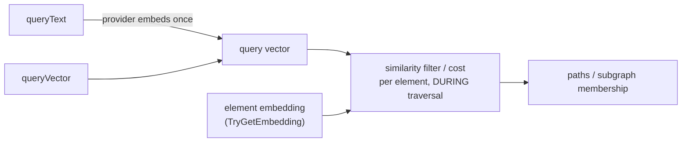

# Semantic traversal

Semantic traversal lets the path and subgraph engines make decisions by **vector similarity
to a query** instead of (or alongside) labels and properties. The query is embedded **once,
before traversal starts**; each candidate element is then scored against its own stored
embedding. Because the query rides a pure-data `semantic` block, similarity-driven traversal
is how Fallen-8 answers "no query language" — it runs **code-free, with dynamic code
execution disabled** (that philosophy lives in [delegates.md](delegates.md)). Every route
here also answers under `/ns/{ns}/…` for a specific graph ([namespaces.md](namespaces.md)).



Three rules define the whole feature:

1. **Embedded once, up front.** Supply `queryVector` (client-side) or `queryText` (the server
   embeds it via the provider). The traversal never sees text and never calls a model — per
   element it is one SIMD similarity computation.
2. **Elements score through their stored embedding.** Each candidate is read via
   `TryGetEmbedding` for the block's `embeddingName` and scored with the block's `metric`. A
   missing embedding, a wrong dimension, or a non-finite score **never matches** (stated, not
   silent).
3. **Scores are the kNN scores.** The same `VectorMath` backs both, so a traversal score is
   bit-identical to [`/scan/index/vector`](vector-search.md). Traversal needs **no** vector
   index — scoring reads the element directly; a bound index (below) is only for kNN search.

## Element embeddings

A named embedding is a `float[]` stored **on** the graph element behind one accessor
(`AGraphElementModel.TryGetEmbedding`). It is WAL-durable element state
([save-games.md](save-games.md)) — one current vector per (element, name); a write replaces,
`DELETE` removes.

| Route | Body / result | Notes |
|---|---|---|
| `PUT /graphelement/{id}/embedding/{name}` | `{ "vector": [...] }` → 202 | Replace semantics; `?waitForCompletion=true` commits before responding |
| `GET /graphelement/{id}/embedding/{name}` | → `{ "name", "vector", "model" }` | `model` is the provider stamp, `null` for bring-your-own |
| `DELETE /graphelement/{id}/embedding/{name}` | → 202 | Removing an absent embedding is a committed no-op |

- Name grammar `^[A-Za-z0-9_-]{1,64}$`; default `default`. Different names may hold different
  dimensions.
- Vector: finite components, dimension in [1, 4096]. 400 on an invalid name, an empty/oversized/
  non-finite vector, or a dimension/zero-norm that a **bound** index of that name would reject;
  404 for an unknown element.
- On the JSONL wire the embedding travels as its reserved typed property — see
  [bulk-import-export.md](bulk-import-export.md).

```bash
curl -X PUT "http://localhost:8080/graphelement/42/embedding/default?waitForCompletion=true" \
  -H "Content-Type: application/json" -d '{ "vector": [0.12, -0.5, 0.33] }'
```
```powershell
$body = @{ vector = @(0.12, -0.5, 0.33) } | ConvertTo-Json
Invoke-RestMethod -Method Put -Uri "http://localhost:8080/graphelement/42/embedding/default?waitForCompletion=true" -ContentType "application/json" -Body $body
```

## Bound vector indices

A `VectorIndex` created with the `embeddingName` option ([vector-search.md](vector-search.md)
owns the kNN mechanics) becomes a **derived projection** of element state:

- Membership = every live element carrying that named embedding at the index's dimension,
  maintained on the writer thread for every embedding write.
- **No explicit adds** — `PUT /index/vector/{id}` answers 400; write the element embedding
  instead.
- Checkpoints persist only the header; **load rebuilds the slab from element state, and WAL
  replay re-projects replayed writes** — a bound index is always correct after a crash, with no
  re-add workaround.
- Query it exactly like any vector index; it is indistinguishable at query time. An optional
  `model` creation option stores an opaque model-identity string for the provider's consistency
  checks (below).

Unbound indices (no `embeddingName`) are unchanged: explicit adds, snapshot-persisted vectors,
no element coupling. An element that is both embedded and bound-indexed stores the vector twice
(roughly 2x memory).

## The `semantic` block

Carried by `POST /path/{from}/to/{to}` and `PUT /subgraph` as the `semantic` field:

| Field | Type | Meaning |
|---|---|---|
| `queryVector` | `float[]` | Query vector (exactly one of vector/text) |
| `queryText` | string | Text the provider embeds once (403 when the provider is off) |
| `embeddingName` | string | Which named embedding to score (default `default`) |
| `metric` | string | `Cosine` (default), `DotProduct`, or `L2` |
| `minScore` | number | Installs a **vertex filter**: pass at >= (Cosine/DotProduct) or <= (L2) this score |
| `costBySimilarity` | bool | **Path only**: installs a vertex cost, `Cosine`→`1-score`, `L2`→distance |

`minScore` and `costBySimilarity` are **declarative** — pure data, never touching the
dynamic-code gate. `costBySimilarity` needs a weighted algorithm (`DIJKSTRA`; the hop-count
`BLS` ignores costs) and rejects `DotProduct` (no honest non-negative mapping). Compiled C#
fragments can instead read the query off the `context` parameter
(`context.TrySimilarity(element, out score)`) — see [delegates.md](delegates.md); the block
never widens the dynamic-code gate in either direction.

**One owner per delegate slot.** Common 400s (all carry a reason):

| Request | Answer |
|---|---|
| `minScore` + a vertex-filter fragment (inline or stored) | 400 |
| `costBySimilarity` + a vertex-cost fragment, `metric: DotProduct`, or on `PUT /subgraph` | 400 |
| `queryVector` and `queryText` together | 400 |
| empty/non-finite vector, zero-norm under Cosine, bad name/metric | 400 |
| `queryText` with the provider disabled | 403 |
| inline fragments with `EnableDynamicCodeExecution=false` | 403 (unchanged; [security.md](security.md)) |

```bash
# Only vertices semantically close to the query may lie on the path:
curl -X POST http://localhost:8080/path/1/to/9 \
  -H "Content-Type: application/json" \
  -d '{ "semantic": { "queryVector": [0.1, 0.2], "minScore": 0.7 } }'
```
```powershell
$body = @{ semantic = @{ queryVector = @(0.1, 0.2); minScore = 0.7 } } | ConvertTo-Json -Depth 4
Invoke-RestMethod -Method Post -Uri http://localhost:8080/path/1/to/9 -ContentType "application/json" -Body $body
```

### On a subgraph

`PUT /subgraph` re-evaluates its filters on every `POST /subgraph/{name}/recalculate`, so the
semantic block binds **once, at registration**: the vector is captured, recalculation reuses
it, and no inference ever runs on the writer thread. With `queryText`, the *resolved* vector
persists in the subgraph recipe, so a semantic subgraph survives restart and WAL replay without
the provider present ([subgraphs.md](subgraphs.md)).

- `semantic.minScore` fills the top-level vertex pre-filter slot.
- A vertex pattern step's `semanticMinScore` fills **that step's** filter slot, so a fully
  declarative pattern ("near-query vertex -edge-> near-query vertex") runs with dynamic code
  off. Setting it together with the step's `vertexFilter`, on an edge step, or without a
  request-level `semantic` block is a 400. `costBySimilarity` is rejected (a path concept).

## The embedding provider (text-in)

`queryText`, `POST /embedding/element`, and `POST /embedding/search` need an embedding provider.
It is **optional, capability-gated, and lives in the API app only** — the engine
(`fallen-8-core`) never loads a model, so a bare `dotnet run` is model-free and the provider
answers 403. It is exposed through `Microsoft.Extensions.AI`'s `IEmbeddingGenerator`; the model
loads lazily on first use, and a failed load latches (503) rather than retry-storming.

Configure it under `Fallen8:Embedding` (off unless `Enabled`):

| Key | Default | Meaning |
|---|---|---|
| `Enabled` | `false` | Master switch; endpoints answer 403 when off |
| `Backend` | `Onnx` | `Onnx` \| `LLamaSharp` \| `Ollama` — the whole backend swap |
| `ModelName` / `ModelVersion` | — | Identity name (required when enabled) + optional version |
| `Dimension` | — | Declared output length; a mismatch against real output latches 503 |
| `IntendedMetric` | `Cosine` | Metric the vectors are meant for |
| `MaxBatchSize` / `MaxTextLength` | 64 / 8192 | Request bounds |
| `QueryPrefix` | `""` | Retrieval prefix applied to **query-time** embeddings only |
| `Onnx.{ModelPath,VocabPath,…}`, `LLamaSharp.ModelPath`, `Ollama.{Endpoint,Model}` | — | Backend-specific settings |

Weights are **never downloaded by Fallen-8** — paths point at operator-provided files.

| Backend | In-process | Weights | Note |
|---|---|---|---|
| `Onnx` | yes (CPU) | ONNX export + WordPiece vocab | self-contained; the bge family is the tested reference |
| `LLamaSharp` | yes (CPU) | embedding-capable GGUF | reuses a local Ollama blob; not bit-identical to the daemon |
| `Ollama` | no | a model you `ollama pull` | zero in-process memory; couples availability to the container (503 while down) |

In the compose environment the provider is **on by default**: the shipped Ollama sidecar serves
**bge-m3** (MIT, 1024-dim, Cosine) and the `fallen8` service is wired to it; opt out with
`F8_EMBEDDINGS=false` ([running.md](running.md)).

Endpoints (all 403 while disabled; 502 for bad backend output; 503 when the backend is unavailable):

| Endpoint | Purpose |
|---|---|
| `POST /embedding/element`, `/embedding/elements` | Embed text -> the element's named embedding (one atomic transaction; a bound index projects) |
| `POST /embedding/search` | Embed a query once -> exact kNN against a vector index (scores identical to `/scan/index/vector`) |
| `POST /embedding/text` | Raw text -> vectors, for client-side pipelines |
| `semantic.queryText` | Text-in path/subgraph traversal (above) |

**Model-identity contract (hard 409, never coercion).** Every provider write stamps the vector
with `name[@version]#dimension#metric` (e.g. `bge-micro-v2#384#Cosine`); a bring-your-own
overwrite clears the stamp. Embedding into, or searching, an index whose **dimension** differs
from the provider's — or whose declared `model` differs from the provider's stamp — is a **409
before any write**. A model change is therefore an external re-index (new index, re-embed): the
provider's declared name, dimension, and metric must match the stored vectors.

Clients read provider state from `GET /status` -> `embedding: { enabled, backend, modelName,
modelVersion, dimension, intendedMetric, loaded }` (a config read that never triggers the lazy
load; [observability.md](observability.md)). F8 Studio gates its text-in controls on it
([studio.md](studio.md)).

```bash
# Text-in semantic path query (provider on): embed once, then filter the path by similarity:
curl -X POST http://localhost:8080/path/1/to/9 \
  -H "Content-Type: application/json" \
  -d '{ "semantic": { "queryText": "red bicycles", "minScore": 0.7 } }'
```
```powershell
$body = @{ semantic = @{ queryText = "red bicycles"; minScore = 0.7 } } | ConvertTo-Json -Depth 4
Invoke-RestMethod -Method Post -Uri http://localhost:8080/path/1/to/9 -ContentType "application/json" -Body $body
```

## See also

- [vector-search.md](vector-search.md) — VectorIndex kNN mechanics (metrics, brute force, `/scan/index/vector`)
- [delegates.md](delegates.md) — the no-query-language philosophy and the `context` parameter for compiled fragments
- [path-finding.md](path-finding.md) / [subgraphs.md](subgraphs.md) — the traversal surfaces the block rides
- [security.md](security.md) — API key and the dynamic-code flag
- [stored-queries.md](stored-queries.md) — pre-compiled fragments that can read `context`
- [samples.md](samples.md) — embedded datasets to try semantic queries against
- [namespaces.md](namespaces.md) — per-namespace routing (`/ns/{ns}/…`)
