Fallen-8 is an in-memory graph engine with a thin REST app wrapped around it. The engine
holds the graph in RAM and runs the algorithms; the app exposes it over HTTP (and, in the
all-in-one image, serves the browser UI too). Three kinds of client reach it: **AI agents**
through the [MCP server](/fallen-8-core/mcp-server/),
and **F8 Studio** (the browser UI) plus **your own services** straight over the REST API. Data
also arrives on its own: the [integrations runtime](/fallen-8-core/integrations/) reads systems on
your own network and writes what it saw in through the same REST API. This
doc is the map of how the pieces fit; each piece's contract lives in its own doc, linked below.

```mermaid
%%{init: {'theme':'base','themeVariables':{'fontFamily':'ui-monospace, SFMono-Regular, Menlo, Consolas, monospace','lineColor':'#666666'}}}%%
flowchart TB
    agents["AI agents"]:::client
    studio["F8 Studio<br/>(React SPA, browser)"]:::client
    uistandalone["F8 Studio standalone<br/>nginx · config.js → apiUrl"]:::client
    hostembed["F8 Studio embedded<br/>host portal shell · mountStudio(config)"]:::client
    svc["Your services / code"]:::client

    mcp["MCP server · fallen-8-mcp<br/>separate deployable · bridges MCP → REST"]:::mcp

    subgraph app["fallen-8-core-apiApp (ASP.NET Core · thin layer)"]
        direction TB
        rest["REST controllers + OpenAPI"]:::sys
        ns["Namespace catalog<br/>(one engine per namespace)"]:::sys
        roslyn["Roslyn compiler + code cache<br/>(fragments · stored queries · plugin source)"]:::sys
        semantic["Semantic gateway<br/>(embeddings + chat, optional)"]:::sys
        ingestion["Ingestion pipeline<br/>(parse · chunk · embed · write, optional)"]:::sys
        savegames["Save-game registry<br/>(load on start · save on stop)"]:::sys
        wwwroot["wwwroot (all-in-one image:<br/>also serves F8 Studio)"]:::sys
    end
    subgraph engine["fallen-8-core (in-memory engine · one per namespace)"]
        direction TB
        writer["Single writer thread<br/>← transaction queue"]:::sys
        model["Graph model<br/>(vertices, edges, properties, embeddings)"]:::sys
        plugins["Plugins<br/>(indices · path · subgraph · analytics · services)"]:::sys
        durab["Durability<br/>(WAL + checkpoints)"]:::sys
        feed["Change feed<br/>(dispatcher + ring buffer)"]:::sys
    end
    sidecar["Model sidecar (Ollama)<br/>embeddings + delegate assist"]:::ext
    docling["Document sidecar (docling-serve)<br/>binary-to-structured conversion"]:::ext
    nlp["NLP sidecar (spaCy)<br/>named entities + key terms"]:::ext
    integrations["Integrations runtime · fallen-8-integrations<br/>separate deployable · no host port · writes via REST"]:::mcp
    files["Files mount<br/>/files · read only"]:::ext
    sources["Your network<br/>CSV · UniFi console · Fronius inverter"]:::ext

    subgraph obs["Observability · one Grafana pane"]
        direction TB
        collector["OTel Collector<br/>ingest + spanmetrics"]:::sys
        promstore["Prometheus<br/>metrics"]:::sys
        tempo["Tempo<br/>traces"]:::sys
        loki["Loki<br/>logs"]:::sys
        grafana["Grafana<br/>dashboards"]:::sys
        collector --> promstore
        collector --> tempo
        collector --> loki
        promstore --> grafana
        tempo --> grafana
        loki --> grafana
    end

    agents -->|MCP| mcp
    mcp -->|HTTP| rest
    studio -->|HTTP| rest
    uistandalone -->|HTTP · CORS| rest
    hostembed -->|HTTP · CORS| rest
    svc -->|HTTP| rest
    studio -.->|"custom model endpoint (optional, browser-direct)"| sidecar
    wwwroot -.- studio
    rest --> ns
    rest --> roslyn
    rest --> semantic
    rest --> ingestion
    rest --> savegames
    rest -->|proxy /integrations/*| integrations
    semantic -.->|embeddings + chat| sidecar
    ingestion -.->|document conversion| docling
    ingestion -.->|entity + term enrichment| nlp
    rest -.->|OTLP metrics/traces/logs| collector
    mcp -.->|OTLP| collector
    integrations -->|HTTP · REST · own API key| rest
    integrations -.->|reads| sources
    files -.-> integrations
    integrations -.->|OTLP| collector
    ns --> writer --> model
    model --- plugins
    model --- durab
    savegames -.->|decides what loads| durab
    writer --> feed
    feed -.->|committed changes| rest
    rest -.->|SSE change feed| studio

    classDef client fill:#45494D,stroke:#666666,color:#FEFEFE
    classDef mcp fill:#E2001A,stroke:#FC0606,color:#FEFEFE
    classDef sys fill:#141516,stroke:#45494D,color:#FEFEFE
    classDef ext fill:#141516,stroke:#666666,color:#C6C7C8,stroke-dasharray:5 4
    style app fill:#000000,stroke:#E2001A,stroke-width:1.5px,color:#C6C7C8
    style engine fill:#000000,stroke:#E2001A,stroke-width:1.5px,color:#C6C7C8
    style obs fill:#000000,stroke:#E2001A,stroke-width:1.5px,color:#C6C7C8
```

## The engine (`fallen-8-core`)

Everything the database *is* lives here; it has no dependency on ASP.NET and can be embedded
as a library (see the `Try*` API in [Graph model](/fallen-8-core/graph-model/)). One engine
instance is one graph. [Namespaces](/fallen-8-core/namespaces/) are a hosting concern the app owns
(below), so embedding the engine as a library gives you exactly one graph and no namespace API.

- **The [graph model](/fallen-8-core/graph-model/)** is a directed property graph: vertices and edges are
  both first-class elements carrying typed properties and, optionally, named
  [embeddings](/fallen-8-core/semantic-traversal/).
- **Mutation goes through a transaction queue.** Callers enqueue a transaction; a **single
  writer thread** applies them one at a time, so writes are serialized and readers never lock.
  This is why the REST mutation calls take `waitForCompletion`: it waits for the writer to
  finish the enqueued transaction. Reads go straight to the in-memory structures.
- **The [change feed](/fallen-8-core/change-feed/)** is the only server-to-client push channel. The
  writer thread hands committed-transaction descriptors to a dispatcher over a non-blocking
  bounded inbox; the dispatcher sequences them, keeps a catch-up ring buffer for reconnects, and
  fans out to subscribers on its own task, so a slow reader never delays a write. The app streams
  it as Server-Sent Events at `GET /changefeed` (`Fallen8:ChangeFeed:Enabled=false` turns it off).
- **Algorithms and indices are [plugins](/fallen-8-core/plugins/).** Path traversers, subgraph algorithms,
  whole-graph analytics, index types, and services are discovered by a plugin factory and
  addressed by name. The built-ins are the plugins that ship in the box; a per-namespace registry
  holds the ones [registered at runtime](/fallen-8-core/plugin-registration/) from C# source.
- **Durability** is a write-ahead log plus full-graph checkpoints, written through the same
  writer thread; which checkpoint loads on startup is decided one layer up, by the app's
  registry. The whole story (including volatile mode) is in
  [Save games](/fallen-8-core/save-games/).

## The REST app (`fallen-8-core-apiApp`)

A thin ASP.NET Core layer. It owns what the engine deliberately does not:

- **The HTTP surface**: versioned controllers, an OpenAPI document, and the Scalar reference
  ([REST API](/fallen-8-core/rest-api/)), plus the [security](/fallen-8-core/security/) boundary (the API key; dynamic
  code execution is always on).
- **The [namespace](/fallen-8-core/namespaces/) catalog.** A Fallen-8 is a collection of namespaces, and
  the app is what holds it: one engine instance per namespace, each with its own vertices, edges,
  indices, subgraphs, stored queries, and storage paths, plus the `/ns/{name}/…` addressing and the
  reserved `default` namespace that bare routes address.
- **Runtime compilation of user code.** Fallen-8 has [no query language](/fallen-8-core/delegates/): path
  and subgraph filter/cost fragments arrive as C# strings, and the app compiles them with Roslyn
  into typed delegates and caches the result. The same Roslyn path also compiles
  [stored queries](/fallen-8-core/stored-queries/) at registration and whole
  [plugins registered from source](/fallen-8-core/plugin-registration/). Compiling is the app's job, not
  the engine's, and there is no switch for it: compiled code runs in-process with full trust, so
  the API key is the only boundary ([Security](/fallen-8-core/security/)). The one capability switch here
  is `Fallen8:Security:EnableDynamicPluginLoading` (default **on**, overridable per namespace via
  `PATCH /ns/{name}`), and it gates only plugin *registration*, never invocation.
- **The save-game registry and the durability lifecycle.** One JSON document per deployment
  (`metadata/savegames.json`, relocatable with `Fallen8:Metadata:Directory`) records every
  checkpoint and is the sole authority for what each engine loads on boot; on startup every
  namespace loads its newest registered save game (replaying the paired WAL), and a clean shutdown
  checkpoints every namespace into one Fallen-8-level entry. That is why `/savegames/*` and
  `PUT /save/all` are Fallen-8-level rather than per-namespace.
- **The optional [embedding provider](/fallen-8-core/semantic-traversal/).** Text-in embedding lives only
  in the app so the engine stays model-free; a bare run has it off, and the compose
  environment wires it to the model sidecar.
- **The optional [ingestion pipeline](/fallen-8-core/unstructured-ingestion/).** Documents become
  Document/Chunk vertices through parse, chunk, embed, write, running off-thread on a single
  global queue; binary formats convert in the docling sidecar and an optional spaCy sidecar
  enriches chunks into a deduplicated Entity graph (both app-only callers), and the engine gains
  no parser.

The app can also serve [F8 Studio](/fallen-8-core/studio/) as static files from its `wwwroot`, which is
what the all-in-one image does; a data plane published without a built SPA present is a pure REST
deployment (see [Topology and the deployable](#topology-and-the-deployable)).

## AI agents and the MCP server

AI agents do not call the REST API directly. They go through **`fallen-8-mcp`**, a separate
deployable that bridges the [Model Context Protocol](https://modelcontextprotocol.io) to the
REST surface over HTTP: it references neither the engine nor the app. It is a small,
token-frugal tool surface, read-only by default, with opt-in write, admin, and code tiers and
three auth modes. The full story is in [MCP server](/fallen-8-core/mcp-server/).

## Data from your own network: the integrations runtime

**`fallen-8-integrations`** is a separate deployable that runs one integration job at a time: it
reads a system on your own network, describes what it saw as a snapshot, and writes that
description into one namespace over the REST API. Like the MCP server it references neither the
engine nor the app, and for a sharper reason: jobs hand it credentials belonging to your
controllers, so it holds **no host port at all**. The browser reaches it only through the app's
authenticated proxy at `/integrations/*`. It stores no credential of any kind, so its one mount is
the read-only files directory a provider may name a file in. The full story is in
[Integrations](/fallen-8-core/integrations/).

## F8 Studio and the model sidecar

[F8 Studio](/fallen-8-core/studio/) is a React single-page app. It talks to the REST API like any other
client: it has no privileged channel, including for models. The app is the **semantic
gateway**. Both embeddings and the natural-language assist default to going **through the
instance**: the browser hands the app *text* and the app embeds or proxies server-side. That is
`POST /embedding/element` to store an embedding, `POST /embedding/search` for semantic search, the
`semantic` block on `/path` and `/subgraph`, `POST /document/search` over ingested chunks, and
`POST /chat` for the assist. On the embedding paths the vector never touches the browser at all;
`POST /embedding/text` is the bare text-to-vector route, there for other clients. In the compose
environment the backend behind all of this is the Ollama sidecar, which serves both the embedding
model and the chat model. F8 itself bundles no model weights or
runtime. The one path that stays off the instance is a **custom** NL-assist endpoint: there
the browser calls the model backend directly and any API key is held only in the browser
(the earlier browser-only default was retired in favour of the gateway; see
[studio.md](/fallen-8-core/studio/)).

F8 Studio also ships **standalone**, which is what the compose environment runs by default: its own
nginx container serving the SPA, pointed at an arbitrary REST data plane by a runtime `config.js`
(the `apiUrl` the browser calls), rewritten from an environment variable at container start. The
endpoint it ships with is a *managed default*
instance re-synced from `config.js` on every load, while user-added instances persist separately;
cross-origin calls need the data plane's `AllowedCorsOrigins` to include the UI's origin. See
[Standalone F8 Studio](/fallen-8-core/standalone-ui/).

The third way Studio reaches a graph is as a **library a host portal mounts inside its own
shell**: one `mountStudio(element, config)` call carries the instances and credentials, and the
embed talks to the REST API cross-origin exactly like the standalone container does. The
contract, the artifact and its boundaries live in [Embed F8 Studio](/fallen-8-core/embed-studio/).

## Observability

The engine and app emit metrics, traces, and logs through BCL instruments; the app, the
[MCP server](/fallen-8-core/mcp-server/) and the [integrations runtime](/fallen-8-core/integrations/)
push them over OTLP to a small consumer stack that ships with the
environment: an OpenTelemetry Collector ingests the push and derives per-action metrics from
spans, Prometheus stores metrics, Tempo stores traces, Loki stores logs, and Grafana is the
single pane. Each process stamps a tenant/instance/namespace identity on every signal so one
Grafana can separate many instances. This is a **push** relationship and a separate set of
containers, always on with `npm run env:up`. The full story, including what isolation is and is
not guaranteed, is in [Observability](/fallen-8-core/observability/).

## Topology and the deployable

The [compose environment](/fallen-8-core/running/) is managed as a whole, and `npm run env:up` runs the
**split topology** by default: the data plane (engine plus REST, no bundled UI) on `:8080` and F8
Studio in its own nginx container on `:8081`, whose origin the data plane allow-lists for CORS
([standalone UI](/fallen-8-core/standalone-ui/)). The **all-in-one** image (the SPA baked into `wwwroot`, API
and UI both on `:8080`) is still built and is what a bare `docker compose up` runs.

Around the data plane the same environment brings up the Ollama model sidecar, the docling
document-conversion sidecar (`F8_INGESTION=false` skips it), the spaCy NLP sidecar
(`F8_NLP=false` skips it), the `f8-mcp` bridge on `:8090` (anonymous and read-only in this local-dev
posture), the `f8-integrations` runtime on the `integrations` profile with no published port
(`F8_INTEGRATIONS=false` skips it), and the observability containers above. The data plane is durable by default: checkpoints,
the WAL, and the save-game registry share one mounted named volume.

## See also

- [Running](/fallen-8-core/running/): how to launch each of these
- [Standalone F8 Studio](/fallen-8-core/standalone-ui/): deploying the UI apart from the data plane
- [Graph model](/fallen-8-core/graph-model/): the data model and the transaction/read contract
- [Delegates](/fallen-8-core/delegates/): why there is no query language and how fragments compile
- [Plugins](/fallen-8-core/plugins/): the extension model for indices and algorithms
- [Plugin registration](/fallen-8-core/plugin-registration/): registering a plugin from C# source at runtime
- [Change feed](/fallen-8-core/change-feed/): the server-to-client push channel and its delivery contract
- [Save games](/fallen-8-core/save-games/): the durability subsystem
- [Namespaces](/fallen-8-core/namespaces/): the graph-collection model
- [Security](/fallen-8-core/security/): the API-app boundary
- [MCP server](/fallen-8-core/mcp-server/): how AI agents reach Fallen-8
- [Observability](/fallen-8-core/observability/): the multi-tenant metrics/traces/logs pipeline and consumer
