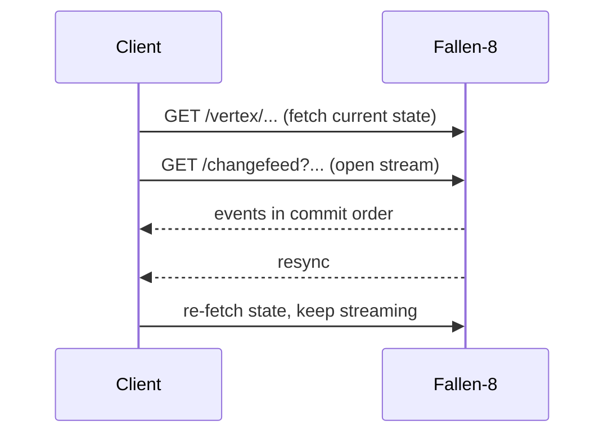

import { Tabs, TabItem } from '@astrojs/starlight/components';

`GET /changefeed` streams every committed graph mutation as [Server-Sent Events](https://developer.mozilla.org/docs/Web/API/Server-sent_events), in commit order, over one long-lived `text/event-stream` connection. Each event is metadata about one mutation (ids, labels, the edge type, and property *keys*, never property values) with declarative server-side filtering and a bounded in-memory catch-up buffer. The whole client contract is: **fetch the state you display, then stream; on any `resync` event, re-fetch.**

In F8 Studio the feed is visible as the [Events panel](/studio/#events): a bell in the top bar that counts filtered events live, opening onto the newest 100 with the same filter grammar.

## Endpoint

| | |
|---|---|
| Route | `GET /changefeed` (default namespace) · `GET /ns/{ns}/changefeed` (named namespace) |
| Content type | `text/event-stream`; the stream stays open until the client disconnects or the server ends it (see [catch-up and resync](#catch-up-and-resync)) |
| Auth | The same fallback policy as every route: no credential is required until `Fallen8:Security:ApiKey` is set, after which every request needs one. Nothing is loopback-only, so an unauthenticated instance is open to anyone who can reach the port (see [security](/security/)) |
| `200` | The SSE stream |
| `400` | Unknown `kinds`/`elements` value or a malformed `since` |
| `401` | A credential is required and none was supplied |
| `503` | Feed disabled (`Fallen8:ChangeFeed:Enabled=false`), the per-namespace subscriber limit is reached, or the feed is gone because its namespace was dropped or the server is shutting down. The `title` distinguishes them, so a full subscriber table (retry later) is never confused with a vanished namespace (retrying the same URL never succeeds) |

Each namespace owns an independent feed: its own epoch, catch-up buffer, and subscriber limit; see [namespaces](/namespaces/). Filters are plain query parameters, never compiled code (see [security](/security/)).

## Filter grammar

All parameters are optional (unset = wildcard), repeatable and/or comma-separated (union within a dimension), and matched exactly and case-sensitively. Dimensions combine with AND.

| Parameter | Values | Notes |
|---|---|---|
| `kinds` | `vertexCreated` `vertexRemoved` `edgeCreated` `edgeRemoved` `propertySet` `propertyRemoved` | `resync` is accepted but always delivered regardless |
| `elements` | `vertex` `edge` | |
| `labels` | exact labels | an unlabeled element never matches a labels filter |
| `keys` | exact property keys | only property events carry a key, so setting this excludes create/remove events, subscribe twice to see both |
| `since` | `<epoch>:<seq>` (the whole `id:` value) or a bare sequence number | catch-up position; see below |

An unknown `kinds`/`elements` value or a malformed `since` is a `400` problem+json, never a silently empty stream.

## Event schema

One JSON object per `data:` line. Fields are **absent** (not null) when they do not apply to the kind. Payloads never contain property values, re-fetch the element when you need a value (see [graph model](/graph-model/)).

| Field | Type | Present for |
|---|---|---|
| `seq` | int64 | every event: monotonic, commit order, gap-free per epoch |
| `ts` | ISO-8601 UTC | every event: commit timestamp, shared by a transaction's events |
| `kind` | string | every event: one of the kinds above, or `resync` |
| `element` | `vertex`/`edge` | element events |
| `id` | int32 | element events |
| `label` | string | element events with a label |
| `edgePropertyId` | string | `edgeCreated`: the edge's type ([edge type vs label](/graph-model/#edge-type-vs-label)) |
| `key` | string | `propertySet` / `propertyRemoved` |
| `source`, `target` | int32 | `edgeCreated` |
| `reason` | string | `resync` |

```jsonc
{"seq":4712,"ts":"2026-07-15T12:34:56.789Z","kind":"propertySet","element":"vertex","id":42,"label":"person","key":"name"}
```

Removing a vertex also emits one `edgeRemoved` per cascade-removed edge, in the same transaction (so with the same `ts`) and carrying that edge's own label.

Embedding writes ride the feed as property events on the reserved keys `$embedding:<name>` and
`$embeddingModel:<name>` (see [graph model](/graph-model/)). Removing an embedding is a
`propertySet` on those keys too, never a `propertyRemoved`, so track embedding changes through
`keys`, not through `kinds`.

On the wire each event is one SSE frame; a `: keepalive` comment is sent every `KeepAliveSeconds` while idle so proxies do not time the stream out:

```
id: 0b1e4c2e-8f3a-4d1b-9c2e-1a2b3c4d5e6f:4712
event: propertySet
data: {"seq":4712,"ts":"2026-07-15T12:34:56.789Z","kind":"propertySet","element":"vertex","id":42,"label":"person","key":"name"}
```

The `id:` line is `<epoch>:<seq>`: `epoch` is a GUID assigned to that namespace's feed when its engine starts (so a post-restart `seq` is never mistaken for a pre-restart one), `seq` is the sequence number. Pass a whole `id` value back as `since` to catch up.

Every frame names its type (`event: <kind>`), so a native `EventSource` dispatches per kind and its `onmessage` never fires. Register one listener per kind you consume, plus one for `resync`:

```js
const source = new EventSource("http://localhost:8080/changefeed?kinds=vertexCreated");
source.addEventListener("vertexCreated", (e) => console.log(JSON.parse(e.data)));
source.addEventListener("resync", (e) => refetch(JSON.parse(e.data).reason));
```

## Catch-up and resync

Missed events are served from a bounded in-memory ring buffer (`BufferSize`, default 8192 events). Reconnect with `since` set to the whole last `id` you saw; the position is exclusive, so the buffered events after it replay first and the stream then continues live and gap-free. Native `EventSource` reconnects send `Last-Event-ID`, which the server honours as `since` when the query parameter is unset. A subscription without `since` starts at the live head: nothing that committed earlier is replayed.

The epoch guard applies only to the `<epoch>:<seq>` form. A bare `seq` carries no epoch, so it is replayed against whichever feed answers: after a restart, or after the namespace's engine was recreated, it serves that sequence window of a *different* event stream instead of a `resync(seekOutOfRange)`. Pass the `id:` value back verbatim.

The server can also end the stream, with no `resync` first: the namespace was dropped, the process is shutting down, or the feed faulted (in which case every subscriber stream is completed deliberately, so clients reconnect). A native `EventSource` reconnects by itself; a `fetch`-based client must treat end-of-stream as "reconnect with `since` = the last `id` you saw", with backoff, which is what F8 Studio does.

When continuity **cannot** be preserved, the stream says so in-band with a `resync` event instead of silently dropping mutations. `resync` bypasses every filter: a suppressed one would corrupt the client's view. On any `resync`, re-fetch the state you display; for `trim`/`tabulaRasa`/`load`, also treat every element id you hold as invalid (they may be renumbered or gone).

| `reason` | Trigger | Also invalidate held ids |
|---|---|---|
| `overflow` | Consumer too slow, or the writer→dispatcher inbox dropped | no |
| `seekOutOfRange` | `since` is outside the buffered window, or from a different epoch | no |
| `trim` | Tombstone compaction renumbered elements | yes |
| `tabulaRasa` | The graph was cleared | yes |
| `load` | The graph was loaded/restored from disk | yes |
| `delegateWrite` | A committed delegate (plugin write) transaction, whose effect the feed cannot express as element deltas. Emitted for every such commit whatever the body touched, so an [analytics](/graph-analytics/) run with a write-back property costs one per 50 000-vertex chunk | no |



## Configuration

Bound from the `Fallen8:ChangeFeed` section (enabled by default in the hosted API):

```jsonc
"Fallen8": {
  "ChangeFeed": {
    "Enabled": true,             // false => endpoint answers 503
    "BufferSize": 8192,          // catch-up ring capacity (events)
    "SubscriberQueueSize": 1024, // per-subscriber bounded queue (events)
    "MaxSubscribers": 32,        // per namespace; beyond it => 503
    "KeepAliveSeconds": 15       // idle SSE comment heartbeat
  }
}
```

## Behind a proxy

The server sets `Cache-Control: no-cache`, disables its own response buffering, and heartbeats every `KeepAliveSeconds`. An intermediary has to cooperate: turn response buffering off for `/changefeed` (nginx: `proxy_buffering off;`) and give it a read timeout above `KeepAliveSeconds`, or the stream stalls or is killed mid-flight. This applies to the recommended exposed posture, which puts a TLS-terminating reverse proxy in front of Fallen-8 (see [security](/security/)).

## Worked example

Subscribe to person-vertex creations and removals, then create and remove a `person`:

<Tabs syncKey="shell">
<TabItem label="Bash">

```bash
curl -N "http://localhost:8080/changefeed?kinds=vertexCreated,vertexRemoved&labels=person"
```

</TabItem>
<TabItem label="PowerShell">

```powershell
# Use curl.exe (the bare `curl` alias is Invoke-WebRequest, which buffers instead of streaming).
curl.exe -N "http://localhost:8080/changefeed?kinds=vertexCreated,vertexRemoved&labels=person"
```

</TabItem>
</Tabs>

As the vertex (id 42) is created then removed, two frames arrive; `: keepalive` comments appear between them while idle:

```
id: 0b1e4c2e-8f3a-4d1b-9c2e-1a2b3c4d5e6f:4712
event: vertexCreated
data: {"seq":4712,"ts":"2026-07-15T12:34:56.789Z","kind":"vertexCreated","element":"vertex","id":42,"label":"person"}

id: 0b1e4c2e-8f3a-4d1b-9c2e-1a2b3c4d5e6f:4713
event: vertexRemoved
data: {"seq":4713,"ts":"2026-07-15T12:35:01.114Z","kind":"vertexRemoved","element":"vertex","id":42,"label":"person"}
```

An `EventSource` in the browser cannot set headers, so consume the same wire format with `fetch` + a stream reader when an API key is configured: the key must never go into a query string.

## See also

- [Graph model](/graph-model/): the elements, properties, and transactions whose commits the feed reports
- [Namespaces](/namespaces/): the per-namespace feed and `/ns/{ns}/…` routing
- [Security](/security/): the API key and why the feed needs no dynamic code
- [REST API](/rest-api/): REST conventions, problem+json, and the OpenAPI document
