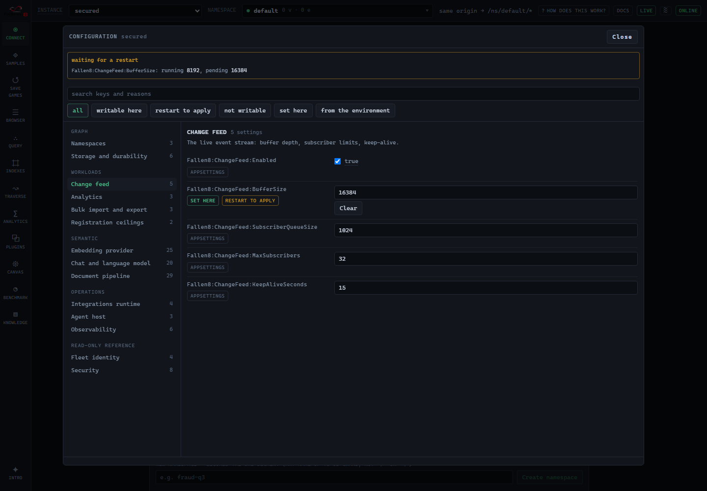

Fallen-8 reads its configuration the way any ASP.NET Core application does: from `appsettings.json`, from `Fallen8__Section__Key` environment variables, from the command line. What this page is about is the other half, added later: an instance can now **show you every setting it binds** and let you **change the ones that are safe to change**, from the Configuration panel in [F8 Studio](/studio/) or over REST.

That distinction matters more than it sounds. Before this, the only way to know what a running instance was actually configured with was to go and read the files you deployed it with, and the only way to change anything was to edit them and restart. Now the instance itself is the authority on its own configuration, and it will tell you where each value came from.



## What you can change, and what you cannot

Every setting falls into one of three tiers, and the panel shows which:

| Tier | What it means |
|---|---|
| **live** | Writable, and it takes effect in the running process. |
| **restart** | Writable, and it takes effect at the next boot. Stored immediately; nothing changes until you restart. |
| **not writable** | Cannot be changed over REST at all. The instance publishes the key, the rule that excludes it and the reason, but not its value. |

Most writable settings are restart-tier, and the panel says so per setting rather than letting you assume otherwise. **A wrong "this applied" claim is the worst thing this surface could do**, because you would only find out when the behaviour you expected never arrived, so the tier is derived from what the running code can actually honour, not from what would be convenient.

The live tier is narrower still, and honest about it. The settings that are live today are all **caps that are consulted when work starts**: the change feed's subscriber limit and queue depth, its keep-alive period, the plugin and stored-query registration ceilings, and the namespace ceiling. Raising one governs the next subscribe, the next registration, the next namespace immediately. Lowering one **evicts nothing**: an open change-feed stream keeps its slot, a registered plugin stays registered, an existing namespace is not deleted. The panel reports that as "in effect for new work" rather than a bare "applied", because for anything already running the old limit is still the one that matters.

### Why so much is not writable

Roughly half of the settings an instance binds are never writable over REST, and the exclusions follow rules rather than case-by-case judgement, so a setting added later classifies itself:

- **Nothing under `Fallen8:Security`.** One blanket rule, which is easier to review than a list of exceptions. It covers the keys that can lock everyone out (blanking the API key would leave every route answering 401 with no way back in over REST), the code-execution switch, the CORS perimeter, the rate limits that are the only brake on the sensitive endpoints, and the configuration-write switch itself.
- **Nothing that addresses on-disk state.** The storage directory is not a write location but a *delete* location: dropping a namespace removes files under it. Moving the write-ahead log would orphan commits no checkpoint has absorbed. The checkpoint base name is also the glob that finds existing checkpoints.
- **Nothing that is part of stored-data identity.** The embedding model name, version, dimension and metric are stamped beside every stored vector; changing one would not error, it would silently mislabel data you already have. The same goes for anything that changes the embedding *function* under an unchanged stamp, and for the index identifiers, where a change orphans a populated index and makes search return silently empty.
- **No URL the server dials.** The embedding, chat, document-conversion and NLP sidecar addresses, the OpenTelemetry endpoint, and the integrations runtime address. Writable, these would turn an authenticated instance into a request forwarder onto your own network.
- **No capability flag.** `Embedding`, `Chat`, `Ingestion` and `Integrations` each have an `Enabled` switch that is your opt-out; lifting one from outside would be straightforward privilege escalation. The Prometheus pair moves together, because enabling the exporter alone would open a metrics endpoint that is anonymous by default.
- **No credential this server presents to something else.** The [Nahil](/nahil/) keys are the case: the rule above covers the credential the server *demands*, and it is scoped to `Fallen8:Security`, so a secret handed to a third party was not covered by anything until a backend needed one. Writable, it would let a caller redirect your metered spend; published, it would hand the key over. Never-writable is the only tier that prevents both.
- **No fleet-attribution key.** The tenant and instance identity is stamped onto telemetry at boot, so a change could only falsify the identity of signals that already went out under the real one.

## Where a value came from

Every setting reports its **source**, and this is the field worth reading first when something is not what you expected:

| Source | Meaning |
|---|---|
| `default` | No layer sets it; the value is the code's own default. |
| `appSettings` | `appsettings.json` or an environment-specific variant. |
| `userSecrets` | Development user secrets. |
| `environment` | A `Fallen8__…` environment variable. |
| `commandLine` | A command-line argument. |
| `host` | An in-process host setting (a test host, or an embedding host). |
| `override` | This instance's own stored value, written through the panel. |

**Two of those mean you cannot change the setting here: `environment` and `commandLine`.** A stored value can never outrank a variable you set where the instance is deployed, and that is deliberate: the shipped compose environment declares a couple of dozen `Fallen8__` variables, and the documentation tells you to set more by hand for the settings that have no `F8_*` shorthand. If stored configuration quietly won over those, your deployment would stop describing your instance.

So instead of storing a value that could never take effect, a write to such a setting is **refused**, and the refusal names the exact variable to remove. The alternative would be a time bomb: a stored value that does nothing until the day someone removes the variable, and then changes behaviour for reasons nobody can trace. A row like that renders read-only in the panel with the variable named underneath it.

Note that a variable declared *empty* still counts as declared. Compose writes `Fallen8__Security__ApiKey=${F8_API_KEY:-}`, so on a default deployment that variable exists with an empty value, and treating "unset" as "no opinion" would let stored configuration override a blank someone chose on purpose.

### Where stored values live

Written settings go into `config.overrides.json` in the metadata directory (`Fallen8:Metadata:Directory`), beside the save-game registry and the namespace inventory, so they survive a restart and travel with the volume you already back up. That layer sits **above** `appsettings.json` (which ships most settings at their code defaults, so a layer underneath would be useless) and **below** the environment and the command line.

An instance that has not been told where its metadata lives keeps no stored configuration at all, and a write is refused with an explanation rather than appearing to succeed and vanishing. The container image and the compose environment both set the directory; a bare `dotnet run` does not, and it also has no API key, so it accepts no write either way.

A `config.overrides.json` that cannot be read does **not** stop the instance from starting. It is a preferences file, not a data pointer: the failure is logged at boot, the file is ignored for that boot, and the instance comes up on the configuration underneath it. Boot also logs one line for every stored value the environment outranks, and one for any key someone edited into the file by hand that the instance will not accept.

## Restart required

When a stored value differs from the value the process started with, the panel says so: a banner names how many settings are waiting, and each one shows both the value **running now** and the value the **next boot** will use.

That signal is **derived, never stored**. The instance snapshots every setting's effective value once at startup and compares against it, which means there is no marker file to go stale, nothing to clean up, and the pending set clears exactly when the process restarts. It is recomputed on every read, so it survives a page reload, a closed tab, a different browser and a reconnect.

One consequence worth knowing: `appsettings.json` is watched for changes and nothing acts on those changes, so hand-editing that file also lights the banner. That is why the wording is "differs from what this instance started with" rather than "you changed this". Someone else's edit, or your own from an hour ago, reads the same way.

**There is no restart button, and no restart endpoint.** A single-process self-hosted server has no supervisor contract to restart into, so Fallen-8 will not pretend it can restart itself. The banner tells you what your own `docker compose restart` (or service restart, or `Ctrl+C` and up again) will apply.

## Turning writes on

Changing configuration over REST takes **two independent acts**, and neither is enough alone:

1. Configure an API key (`Fallen8:Security:ApiKey`).
2. Set `Fallen8:Security:EnableConfigurationWrite=true`.

Without a key the write is refused whatever the second says. Every other capability in Fallen-8 requires authentication only when a key is configured, which is the right shape for them, but it is the wrong shape here: it would make configuration anonymously writable on a default deployment. An unauthenticated instance already allows anonymous code execution, which is why the startup log warns about it in capital letters, but that is *per request*. A configuration write persists a change to this instance's posture that outlives the process, and the difference is worth one extra deliberate act.

The panel explains the requirement instead of showing a Save button that would always be refused.

## Reading configuration is not gated the same way

`GET /config` answers without a key on an instance that has not configured one, because that is what makes the Connect screen useful before you have set anything up. Two things follow from that.

First, **a never-writable setting publishes no value**. The key, its tier, the rule and the reason, yes; the value, no. That is what keeps sidecar addresses, model file paths, durability paths and the credential the server presents to [Nahil](/nahil/) out of a response an unauthenticated caller could read.

Second, and stated plainly rather than left for you to find: the response has carried the OpenTelemetry endpoint and the embedding model identity since before this feature existed, and those are still there. On an instance with no API key, an anonymous caller can read them. That is a deliberate decision rather than an oversight, and the reasoning is that it buys nothing to withhold them: the same caller on the same keyless instance can already execute arbitrary code in the process and read any configuration value it likes. **The withholding rule is defence against casual exposure (a screenshot, a log, a cache), not a security boundary. The security boundary is the API key.** If that matters for your deployment, the answer is to configure a key, which is the same answer as for every other route.

## Over REST, and for agents

`GET /config` returns the whole inventory: every key with its tier, its effective value, its source, and whether it is waiting for a restart. `PATCH /config` writes a batch of them:

```bash
curl -X PATCH http://localhost:8080/config \
  -H "X-Api-Key: $F8_API_KEY" -H 'Content-Type: application/json' \
  -d '{"settings": {"Fallen8:Plugins:MaxCount": "128"}}'
```

Values are sent as text, because that is what configuration is. A `null` value **clears** a stored override and restores whatever layer sits below it, which is the undo; there is no history, no versioning and no diff view, deliberately, for a single-operator self-hosted server.

The whole batch is validated before anything is stored, so it applies completely or changes nothing. A key that is unknown or never writable is a `400` naming the rule that excludes it. A value outside the setting's domain is a `400` naming the bound. A key the environment declares is a `409` naming the variable. Each result reports the value **read back after binding**, which can differ from what you sent: several settings clamp their own value, and you should be able to see that rather than assume.

Agents reach the same surface through the [MCP server](/mcp-server/): `f8_admin` gains `get_settings` and `set_settings`, both on the admin tier and both requiring the server capability as well. `get_settings` is worth reading first whenever a limit or a capability refuses a call, because it carries the reason a setting is what it is.

## Where the settings themselves are documented

This page deliberately lists no keys. The instance is the live inventory, and a second list here would drift from it the first time a setting was added. For what an individual setting *means*, the reference table on [Running Fallen-8](/running/#configuration-keys) covers the ones you set before the server exists, and each feature's own page documents its own: [save games](/save-games/), [namespaces](/namespaces/), [observability](/observability/), [semantic traversal](/semantic-traversal/), [ingestion](/unstructured-ingestion/), [security](/security/).

This surface also covers **this instance only**. The [MCP server](/mcp-server/) and the [integrations runtime](/integrations/) are separate deployables that read their own configuration prefixes, and nothing here reaches them.
