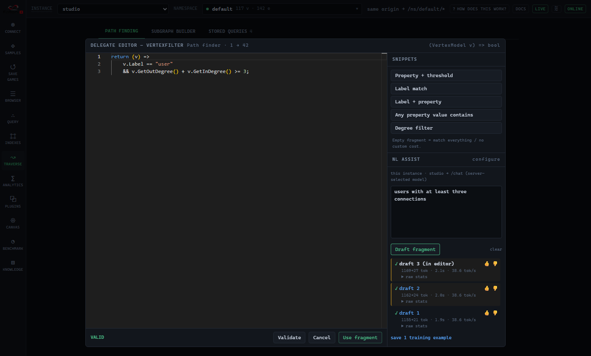

Fallen-8 has no query language: a filter or a cost is a
[C# fragment](/delegates/) compiled at runtime. That is powerful and it is also the
steepest part of the learning curve, so [F8 Studio](/studio/) can draft a fragment from a
sentence like "only follow edges created in the last week". This page covers where those drafts come
from, and how to produce a better model than the one that ships.

The in-editor experience itself, the backend switch, the draft list and the review flow, is documented
once on [F8 Studio](/studio/#nl-assist). Read that first if you just want to use it.



## The models

Assist is model-agnostic: any Ollama or OpenAI-compatible endpoint works. What ships is a pair of
fine-tunes specialised on the delegate contract:

| Model          | Base       | Where it runs                          | Role                                                |
| -------------- | ---------- | -------------------------------------- | --------------------------------------------------- |
| `phi4-f8-mini` | Phi-4-mini | CPU or GPU, pulled by default          | Studio's default: small enough for any box           |
| `phi4-f8`      | Phi-4 (14B)| GPU, roughly 16 GB VRAM, pulled by default | The stronger draft, opt out with `F8_PULL_PHI4F8=0` |
| `phi4-mini`    | Phi-4-mini | CPU or GPU, pulled by default          | The stock, un-tuned base, useful as a comparison     |

The models do not have to run on this machine: [Nahil](/nahil/) serves the same API from remote
hardware, which is a configuration change and nothing else. Two cautions. Nahil catalogs a model
under its **published registry name**, and that name does not always mean what a local tag of the
same spelling means - this fine-tune has two live published repos, so `phi4-f8-mini` and
`f8-delegate` both resolve there, to different weights
([which to pick](/nahil/#one-name-can-mean-two-different-builds)). And a registry build carries
neither the chat template nor the stop tokens a locally built image bakes in - send those per
request via `options.stop` on `POST /chat`.

Fallen-8 ships **no weights**. The compose environment's Ollama sidecar pulls them on first start from
the repositories named by `F8_DELEGATE_REPO` and `F8_PHI4F8_REPO`, so the models and their MIT licences
bind whoever runs them ([running](/running/#first-start-pulls-models)). Until a fine-tune
exists in that Ollama, the default model 404s and the stock `phi4-mini` preset is the fallback.

## Why a fine-tune at all

A stock instruct model writes plausible C# that does not compile against the delegate contract: it invents
member names, gets the lambda shape wrong, or reaches for types the fragment sandbox never references. The
fine-tune's whole purpose is to make the *first* draft compile, because a draft that does not compile
costs the user a round trip through the validator.

The training data is generated, never hand-written, and **every row is compiled before it is kept**: the
generator posts each candidate fragment to `POST /delegates/validate` and discards anything that does not
build. Rows are templated from the live delegate contract (the type model, the snippets, the kinds), so
the dataset cannot drift away from the product without the drift guard noticing. Each row carries the
*real* runtime prompt from Studio's own prompt module, so training matches the shipping prompt exactly
rather than a Python re-encoding of it. Whole-type
[plugin](/plugin-registration/) rows train alongside the fragment rows, compile-gated the
same way through `POST /plugins/{category}/validate`.

## The pipeline

The offline pipeline lives in
[`nl-assist-finetune/`](https://github.com/cosh/fallen-8-core/tree/main/nl-assist-finetune) and is not
needed to build or run Fallen-8. Nothing it produces is committed: you generate the dataset and the model
on your own machine.

```
dataset-gen/   generate the compile-gated (intent, fragment) corpus
train/         QLoRA config, trainer, merge, Modelfile template
run.sh         deps -> dataset -> train -> merge -> gguf -> ollama create -> provenance
eval/          held-out eval set, scored on compile plus a semantic gate
feedback/      fold captured thumbs-up drafts back into the corpus
infra/         provision a throwaway cloud GPU: train both variants, or evaluate the published ones
```

| Stage        | Needs                                                     | Roughly                                                              |
| ------------ | --------------------------------------------------------- | -------------------------------------------------------------------- |
| Dataset      | Node plus a running apiApp as the compile authority        | `npx tsx nl-assist-finetune/dataset-gen/generate.ts`                 |
| Train        | Linux or WSL2 with an NVIDIA GPU, Python 3.13, CUDA torch  | `./run.sh all` (add `VARIANT=phi4-f8` for the 14B)                   |
| Evaluate     | A model backend plus the apiApp; a GPU in practice         | `npx tsx nl-assist-finetune/eval/baseline.ts --semantic`             |
| Publish      | An ollama.com account                                      | `PUBLISH_REPO=<ns>/phi4-f8-mini ./run.sh publish`                    |
| Version      | A repository tag                                           | tagging `vX.Y.Z` names the published build, if it has no version yet (`scripts/tag-models.sh`) |

The dataset stage is deterministic, so a GPU-only box can copy `dataset/train.jsonl` from wherever it was
generated and skip Node and the apiApp entirely. `./run.sh all` emits an Ollama model plus a
`PROVENANCE.<model>.md` recording the base model, its licence, the pinned tool versions and the dataset
hash, so the licence position travels with the artifact. Point Studio at the result by setting the NL
assist `model` field: no Fallen-8 code changes.

Publishing always overwrites `:latest`, so a running deployment would otherwise have no way to say
which build it holds. Tagging the repository `vX.Y.Z` therefore gives the published models that
version too - the same bytes under a second name - so a deployment can pin
`F8_DELEGATE_REPO=<ns>/phi4-f8-mini:vX.Y.Z` instead of tracking a moving tag.

One version per distinct build, though, not one per release. Publishing happens on a retrain and
releasing on a tag push, so most releases carry no new weights, and a release whose `:latest`
already answers to an earlier version adds nothing and says so in its log. The newest release
number is therefore not always a model tag: pin the version the model actually carries, which the
tags list on ollama.com and the startup log both name.

Evaluation needs no GPU to *start*, but on a CPU these models generate at roughly 14 seconds per token,
which makes a full run impractical rather than merely slow. So the evaluation has the same cloud path as
training: `infra/eval-deploy.sh` provisions a throwaway GPU VM, pulls the published models, runs the full
held-out evaluation on them, copies the results back to your machine and only then deletes the
infrastructure. Because the artifact is a small JSON file rather than a registry push, that VM deliberately
does not delete itself. The same job runs on any box that already has a GPU, an Ollama daemon and an
apiApp, via `infra/eval-run.sh`.

The pipeline's own README covers the toolchain in full, including the Ubuntu prerequisite script, the
Python-version and CUDA-wheel traps, and the WSL2 driver rule (install the NVIDIA driver on Windows, never
inside the distro). The step-by-step operator procedure, including how to run the evaluation on its own,
is in its
[RUNBOOK](https://github.com/cosh/fallen-8-core/blob/main/nl-assist-finetune/RUNBOOK.md).

## Evaluation is a gate, not a vibe

`eval/eval-set.json` is **held out**: it never enters training, and the consolidation step drops any
captured row whose intent appears in it. A run makes one first-pass call per row through Studio's real
prompt modules and scores three things: does the fragment compile, do the semantic-proxy checks pass, and
how long did it take. The optional semantic gate goes further and compares the *element set* the drafted
fragment actually selects on a seeded graph against the expected one, which catches a fragment that
compiles and means the wrong thing.

Runs are recorded in a ledger so movement is visible run over run. Performance numbers are hardware-bound,
so compare only runs from the same machine.

## The feedback loop

Studio's assist panel asks you to rate every draft, and the rated ones export as a JSONL file. That file
is the input to the loop:

1. Drop the exported `f8-training-*.jsonl` into `feedback/inbox/`.
2. Run `npx tsx nl-assist-finetune/feedback/consolidate.ts`.
3. It keeps the thumbs-up rows, **re-validates every fragment** and drops non-compilers, drops anything
   whose intent is in the held-out eval set, dedupes against the existing corpus, and appends the
   survivors to `dataset/captured.jsonl`.
4. The next training run reads `captured.jsonl` alongside the generated corpus. Re-run the eval gate to
   confirm the new model still wins.

Nothing leaves your machine in this loop. A fine-tune exists only in the Ollama on the box that trained
it, and it reaches another instance only if you publish it yourself.

## When the product changes, the model goes stale

The model drafts against a contract, so a change to that contract can silently invalidate what it learned:
a new delegate kind, a renamed member on the type model, a changed prompt, a new scenario class. The repo
handles this with a running
[retrain log](https://github.com/cosh/fallen-8-core/blob/main/nl-assist-finetune/RETRAIN-LOG.md): a
feature that touches the fragment surface appends an entry instead of re-deciding whether a retrain is
needed, and the next dataset generation starts by draining every pending entry. If you maintain your own
fine-tune, that log is the list of things your model has not been trained for yet.

## See also

- [F8 Studio](/studio/#nl-assist): the assist panel, its backends, and the review flow
- [Delegates](/delegates/): the fragment contract the model is trained against
- [Semantic traversal](/semantic-traversal/): the chat gateway that serves instance-mode assist
- [Running Fallen-8](/running/): the model sidecar, first-start pulls, and GPU acceleration
- [Plugin registration](/plugin-registration/): the whole-type plugins assist can also draft
