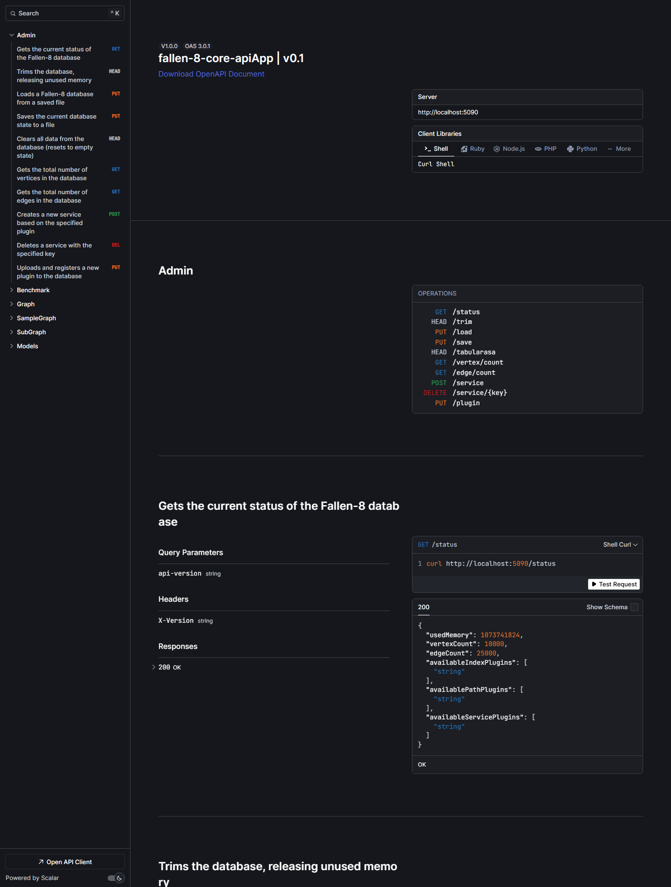

import { Tabs, TabItem } from '@astrojs/starlight/components';

The `fallen-8-core-apiApp` exposes the engine as an ASP.NET Core REST API. This page is the map of that surface: where the machine-readable contract lives, how routes and versioning are shaped, the conventions that hold across every endpoint, and a directory pointing each endpoint group at its deep-dive doc. It does not re-document individual endpoints — the OpenAPI document and the per-topic pages own those.

## OpenAPI document and Scalar reference

The machine-readable contract is an OpenAPI 3 document named `v0.1`, rendered interactively by the [Scalar](https://github.com/scalar/scalar) reference. Both are mapped **only in the Development environment** (`Program.cs` maps them behind `app.Environment.IsDevelopment()`).

A local `dotnet run --project fallen-8-core-apiApp` runs in Development, and the bundled launch profile binds `http://localhost:5000`:

- OpenAPI document: `http://localhost:5000/openapi/v0.1.json`
- Scalar reference: `http://localhost:5000/scalar/v0.1`

(If you run with HTTPS enabled instead, the .NET default host is `https://localhost:5001`.)

The Docker/compose image runs in **Production** — its `Dockerfile` sets no `ASPNETCORE_ENVIRONMENT` and binds `:8080` — so neither endpoint is served at `http://localhost:8080`. To browse the contract, use a local `dotnet run`.

<Tabs syncKey="shell">
<TabItem label="Bash">

```bash
curl http://localhost:5000/openapi/v0.1.json
```

</TabItem>
<TabItem label="PowerShell">

```powershell
Invoke-RestMethod http://localhost:5000/openapi/v0.1.json
```

</TabItem>
</Tabs>



## Versioning and route shape

The API is versioned at **0.1**, the default. `AssumeDefaultVersionWhenUnspecified` is on, so you never have to name a version. To pin one, use any of the configured readers — the query string `api-version`, the `X-Version` header, or the media-type `ver` parameter. Responses carry `api-supported-versions` (`ReportApiVersions`).

Controllers declare `[Route("api/v{version:apiVersion}/[controller]")]`, but **every action overrides it with an absolute route** (a template starting with `/`), so the version segment never reaches the URL. The routes are the bare paths — `/path/{from}/to/{to}`, `/vertex`, `/status`, … — exactly as the samples use them. `/path/4/to/3` is a real route; `/api/v0.1/path/4/to/3` is **not**.

<Tabs syncKey="shell">
<TabItem label="Bash">

```bash
# The bare path is the route; the version defaults to 0.1.
curl -X POST http://localhost:8080/path/4/to/3 -H 'Content-Type: application/json' -d '{}'
# Optionally pin the version (query string shown; the X-Version header works too):
curl "http://localhost:8080/vertex/count?api-version=0.1"
```

</TabItem>
<TabItem label="PowerShell">

```powershell
Invoke-RestMethod http://localhost:8080/path/4/to/3 -Method Post -ContentType application/json -Body '{}'
Invoke-RestMethod 'http://localhost:8080/vertex/count?api-version=0.1'
```

</TabItem>
</Tabs>

## Conventions

These hold across the whole surface; each topic's own page carries the detail.

| Convention | Rule |
|---|---|
| JSON casing | `camelCase` in both directions (Web defaults, source-generated). |
| Errors | Every error response is RFC 7807 `application/problem+json` — a consistent `title`/`status`/`detail` shape for a validation `400`, a `404`, a `409`, and a server fault alike. The status codes are unchanged; only the body is uniform. |
| Not found / invalid | The engine follows `Try*(out …) : bool`; over REST an expected miss is a `404` (never an exception/500). |
| Mutations | Every write is a transaction; pass `?waitForCompletion=true` to block until it commits. See [graph model](/fallen-8-core/graph-model/). |
| Status codes | Each action is annotated with `[ProducesResponseType]`, so the exact codes and DTOs live in the OpenAPI document / Scalar, not here. |
| Namespaces | Every namespace-scoped route also answers under `/ns/{name}/…`; bare URLs address the reserved `default` namespace. See [namespaces](/fallen-8-core/namespaces/). |
| Authentication | When configured, the API key travels in the `X-Api-Key` header (name configurable) — the header name and key configuration are owned by [security](/fallen-8-core/security/). |

## Endpoint directory

Every endpoint group and the page that documents it. Routes shown bare; each also exists under `/ns/{name}/…` unless noted **(Fallen-8-level)**.

| Group | Routes | Doc |
|---|---|---|
| Vertices, edges & elements | `PUT/GET /vertex`, `/vertex/{id}`, `/vertex/{id}/edges/…`, `PUT/GET /edge`, `/edge/{id}`, `GET/DELETE /graphelement/{id}`, `/graphelement/{id}/{propertyId}`, `GET /graph`, `GET /vertex/count`, `/edge/count` | [graph-model.md](/fallen-8-core/graph-model/) |
| Indexes & scans | `POST/PUT/DELETE /index…`, `POST /scan/graph/property/{id}`, `POST /scan/index/{all,range,fulltext,spatial}` | [indexes.md](/fallen-8-core/indexes/) |
| Vector search | `PUT /index/vector/{id}`, `POST /scan/index/vector` | [vector-search.md](/fallen-8-core/vector-search/) |
| Path finding | `POST /path/{from}/to/{to}` | [path-finding.md](/fallen-8-core/path-finding/) |
| Subgraphs | `PUT/GET/DELETE /subgraph`, `/subgraph/{name}`, `/subgraph/{name}/graph`, `POST /subgraph/{name}/recalculate` | [subgraphs.md](/fallen-8-core/subgraphs/) |
| Stored queries | `POST/GET/DELETE /storedquery`, `/storedquery/{name}` | [stored-queries.md](/fallen-8-core/stored-queries/) |
| Graph analytics | `GET /analytics/algorithms`, `POST /analytics/{name}`, `/analytics/{name}/partition/{id}` | [graph-analytics.md](/fallen-8-core/graph-analytics/) |
| Embeddings & semantics | `PUT/GET/DELETE /graphelement/{id}/embedding/{name}`, `POST /embedding/{element,elements,search,text}` | [semantic-traversal.md](/fallen-8-core/semantic-traversal/) |
| Namespaces **(Fallen-8-level)** | `GET /ns`, `GET/PUT/PATCH/DELETE /ns/{name}` | [namespaces.md](/fallen-8-core/namespaces/) |
| Bulk import/export | `GET /bulk/export`, `POST /bulk/import` | [bulk-import-export.md](/fallen-8-core/bulk-import-export/) |
| Change feed | `GET /changefeed` (Server-Sent Events) | [change-feed.md](/fallen-8-core/change-feed/) |
| Save games | `PUT /save`, `PUT /save/all` **(Fallen-8-level)**, `PUT /load`, `GET /savegames`, `/savegames/{id}`, `PUT /savegames/{id}/load`, `DELETE /savegames/{id}` **(Fallen-8-level)** | [save-games.md](/fallen-8-core/save-games/) |
| Delegate validation **(Fallen-8-level)** | `POST /delegates/validate` | [delegates.md](/fallen-8-core/delegates/) |
| Plugin registration | `POST /plugins/{algorithm,function}`, `POST /plugins/{category}/validate`, `POST /plugins/function/{name}/invoke`, `GET /plugins`, `GET/DELETE /plugins/{name}` | [plugin-registration.md](/fallen-8-core/plugin-registration/) |
| Services | `POST /service`, `DELETE /service/{key}` | [plugins.md](/fallen-8-core/plugins/) |
| Observability | `GET /status`, `/statistics`, `/metrics`, `/healthz`, `/readyz` | [observability.md](/fallen-8-core/observability/) |
| Sample & benchmark data | `PUT /unittest`, `GET /generate`, `/benchmark` | [samples.md](/fallen-8-core/samples/) |
| Maintenance | `HEAD /trim`, `HEAD /tabularasa` (clear graph), `HEAD /tabularasa/all` **(Fallen-8-level)** | [graph-model.md](/fallen-8-core/graph-model/) |

## Generating a client

The OpenAPI document is standard OpenAPI 3, so any generator produces a typed client from it — [`openapi-generator`](https://openapi-generator.tech/), [NSwag](https://github.com/RicoSuter/NSwag), or [Kiota](https://learn.microsoft.com/openapi/kiota/) all work. Point the tool at `http://localhost:5000/openapi/v0.1.json` (a Development `dotnet run`), or save that file and generate offline in CI.

## See also

- [Running Fallen-8](/fallen-8-core/running/) — launching the server for `dotnet run` (Development) vs. Docker (Production)
- [Namespaces](/fallen-8-core/namespaces/) — the `/ns/{name}/…` routing scheme and management API
- [Security](/fallen-8-core/security/) — the API key header and key configuration (dynamic code is always on)
- [Graph model](/fallen-8-core/graph-model/) — elements, properties, and the `waitForCompletion` transaction contract
- [Observability](/fallen-8-core/observability/) — `/status`, `/statistics`, `/metrics`, and the health probes
