[F8 Studio](/studio/)'s **Samples** screen ships a gallery of curated graphs that load in one
click. Each comes styled for the canvas, indexed where it helps, and paired with example
queries, so every card is a short guided tour of a different Fallen-8 capability, analytics,
weighted paths, semantic search, visualization. A tag bar at the top filters the gallery by
capability. This doc walks through each one, with screenshots and queries you can run yourself.


## How loading works

Clicking **Load** fetches the dataset, imports it, builds the sample's indices, and re-reads the
elements onto the canvas with the sample's style. For the baked datasets no embedding work
happens at load time, because the vectors are already in the file. The datasets ship with the app
and are served same-origin from `/samples` by default, so the gallery shows exactly the samples
the app was built with and works offline. `VITE_F8_SAMPLES_BASE` repoints them at a remote mirror
or a fork, but it is a Vite build variable, inlined into the bundle: it has to be set when the SPA
is built. A prebuilt Studio image cannot be repointed at runtime (its only runtime knob is
`F8_API_URL`).

One sample is different: **Wind Farm Fleet Integrity** additionally ingests three synthetic documents
through the live [semantic layer](/unstructured-ingestion/) after the graph is
imported, so it adds three steps (seeding the asset index, binding the layer, ingesting) and it
does compute embeddings at load time. It therefore needs more of the environment than the others,
and its card checks four things: ingestion enabled (`F8_INGESTION`), the embedding provider
(`F8_EMBEDDINGS`), the docling sidecar reachable (the PDF and the spreadsheet convert there), and
the NLP sidecar (`F8_NLP`) for the entity network. The first three block: the card disables **Load**
and names what to fix, as it also does while it has not yet read the instance's capability state. A
missing NLP sidecar only warns, because enrichment is additive: the sample still loads, without the
entity network, so steps 3 and 6 of the walkthrough below need `F8_NLP` on.

- **Import needs an empty graph** (a non-empty graph answers `409`, whatever its ids). Loading into
  an instance that still holds elements or indices is gated behind a typed-name confirm that erases
  first, save a checkpoint ([save games](/save-games/)) if you need the current data,
  or switch to a fresh [namespace](/namespaces/).
- **The datasets are `fallen8-jsonl`**: the same format [bulk import/export](/bulk-import-export/)
  uses, fetched and streamed through `POST /bulk/import`.
- **Bring-your-own-vector always works.** The embedded samples carry their vectors in the
  file, so vector scans work even with no embedding provider. The **text-in** features
  (semantic search by typed text) additionally need a provider whose model identity matches
  the baked vectors: each card tells you whether that works on the current instance. See
  [semantic traversal](/semantic-traversal/).

## The samples

### 🛡️ Asymmetric Cyber Warfare, 6 vertices, 5 edges

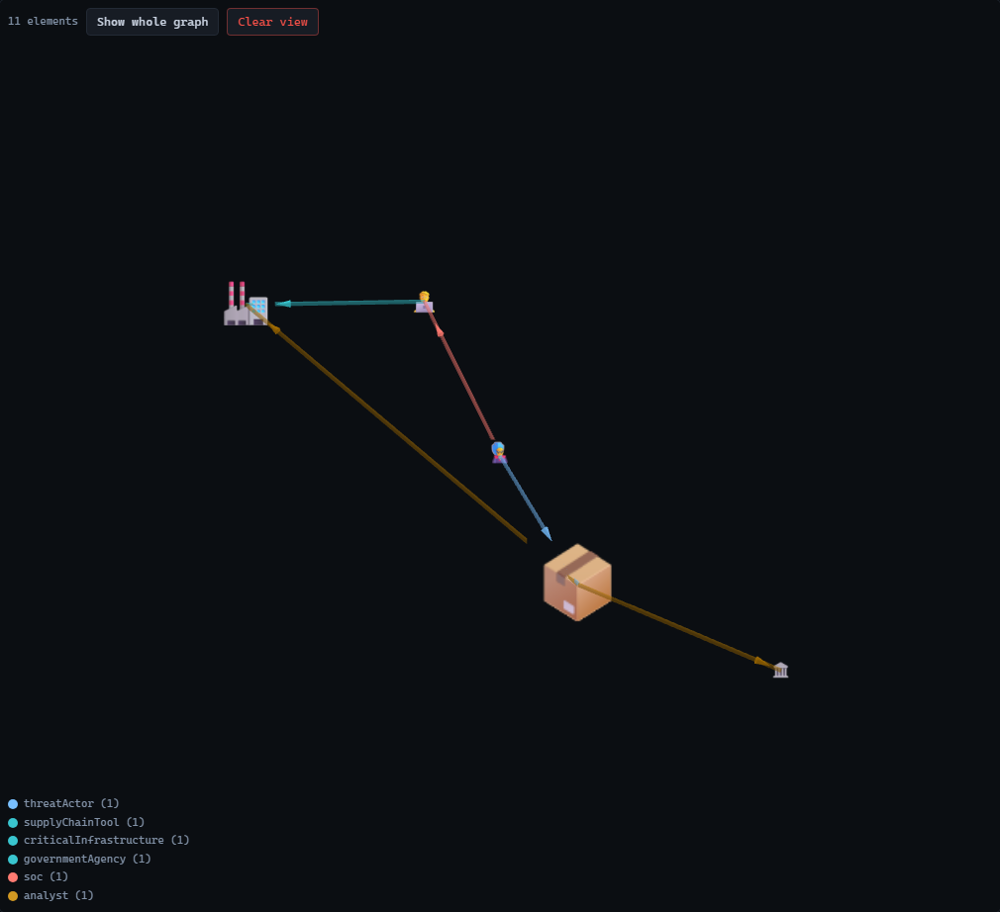

A tiny, story-driven graph: a nation-state actor weaponizes a compromised software supply-chain
tool to deliver a payload to two targets (critical infrastructure and a government agency), while
a SOC and its analyst investigate. Six entities, five directed relationships, emoji nodes, and
labelled edges. It is the same graph the [first-run walkthrough](/studio/) animates. The point:
the full blast radius of a compromise is a single native traversal here, versus the brittle
multi-table joins a relational store forces.

The same graph in the 3D renderer with a force layout:

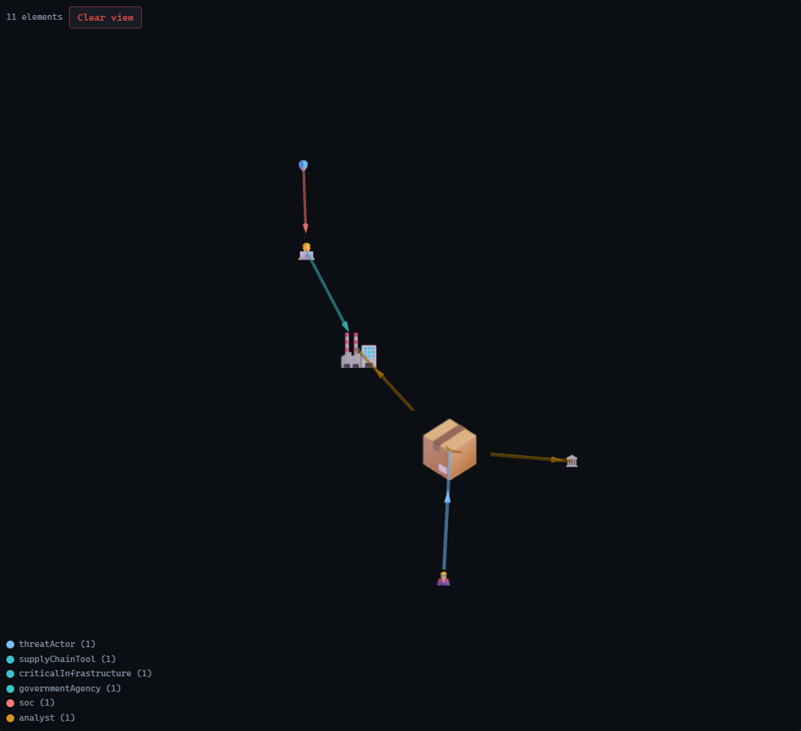

Try it:

- **[Path](/path-finding/)** from the Nation State Actor to the Critical Infrastructure to see
  the blast radius of a supply-chain compromise (look ids up on the Browser screen).
- **[Subgraph](/subgraphs/)** capturing the Software Supply Chain Tool and everything it
  delivers to, then recalculate it as the graph changes.
- **[Analytics](/graph-analytics/) → `PAGERANK`**, then color the canvas by the score: the
  compromised tool and the critical target rank highest.

### 🥋 Zachary's Karate Club, 34 vertices, 78 edges

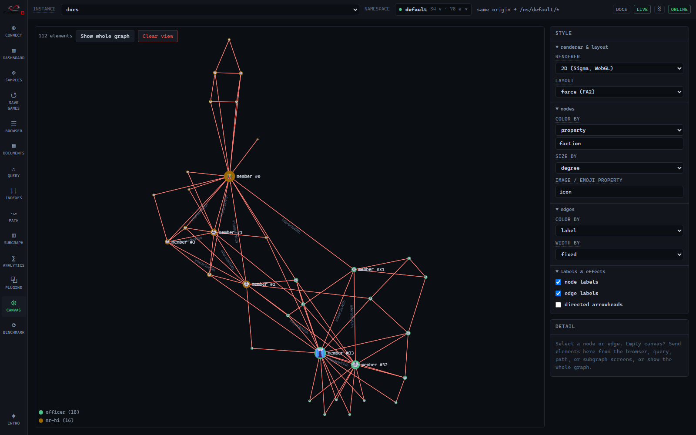

The most famous graph in community detection: club members, friendships, and the real 1977
split. Nodes are colored by `faction` and sized by degree, so the two camps and their leaders
(member #0 and #33) are obvious at a glance.

Try it:

- **[Analytics](/graph-analytics/) → `LABELPROPAGATION`** with write-back, then color the
  canvas by the computed community: it reproduces the club's real split (compare with color
  by `faction`).
- **`TRIANGLECOUNT`** and **`WCC`** on the textbook graph.
- **[Path](/path-finding/)** from Mr. Hi to the Officer (look their ids up on the Browser
  screen).

### 🛡️ AD Attack Surface, 117 vertices, 142 edges

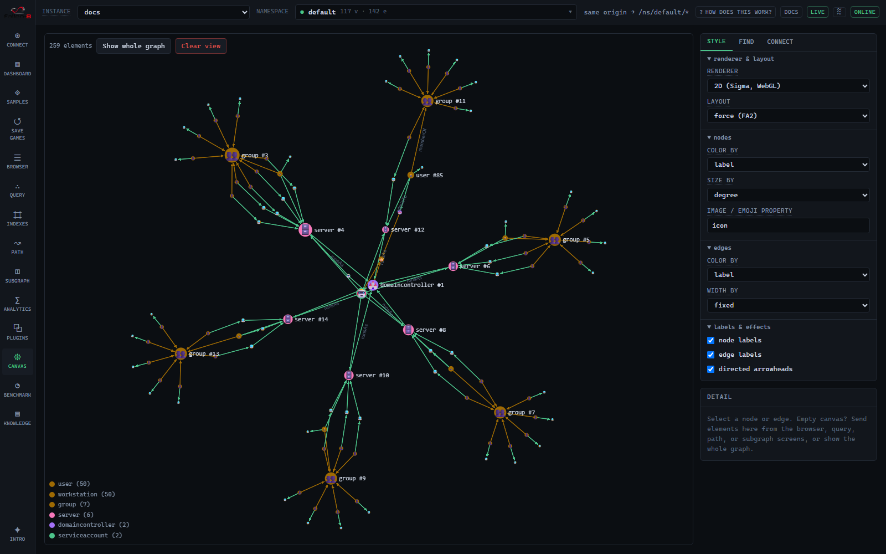

A synthetic Active-Directory estate: users, workstations, servers, and groups. The scenario
is a red-team classic, phish an intern, then find the cheapest path to Domain Admins. Ships
with a bound [vector index](/vector-search/) for semantic search.

Try it:

- **[Path](/path-finding/) → Dijkstra** from the phished `finance.intern` workstation to the
  `DOMAIN ADMINS` group, using cost property `exploitCost`: the result is the cheapest attack
  chain.
- **[Semantic search](/semantic-traversal/):** "where do the financial documents live"
  surfaces the Finance file server.
- **[Analytics](/graph-analytics/) → `DEGREE` / `PAGERANK`** to spot lateral-movement
  choke points.

### 🎬 Movie Night, 191 vertices, 1,697 edges

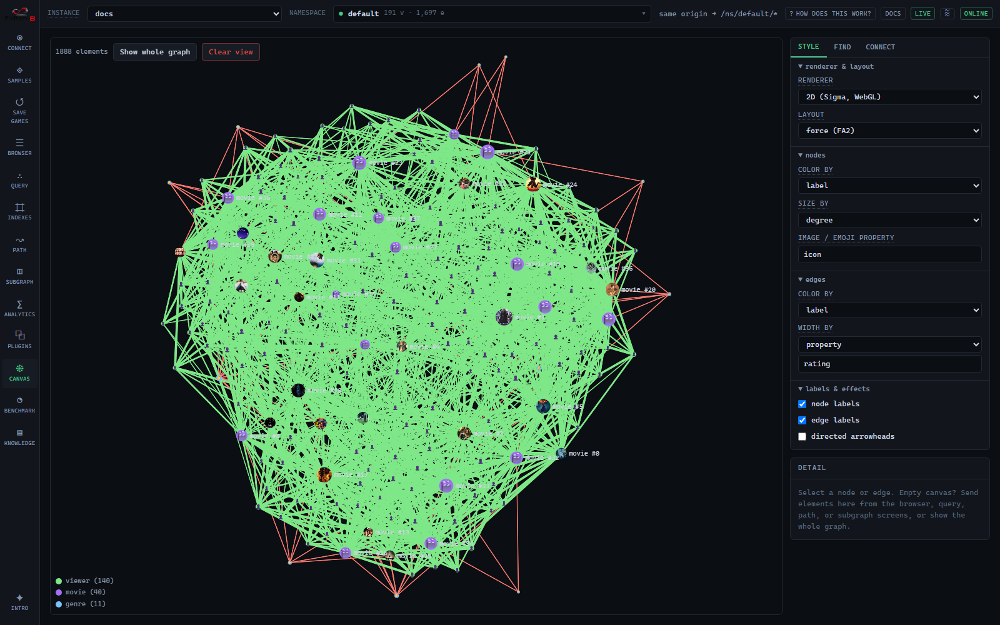

Films, genres, and viewers with real taste communities, poster-image nodes, plot embeddings,
and rating-weighted edges. The richest sample for semantic and recommendation work.

Try it:

- **[Semantic search](/semantic-traversal/):** "mind-bending sci-fi about dreams" surfaces
  Inception; "a haunted hotel" finds The Shining (see the [worked example](#semantic-search)
  below).
- **[Path](/path-finding/):** a 2-hop viewer → movie → viewer → movie chain is a
  recommendation.
- **[Analytics](/graph-analytics/) → `PAGERANK`** ranks the canon; **`LABELPROPAGATION`**
  recovers the taste communities.

### ✈️ World Air Routes, 250 vertices, 5,702 edges

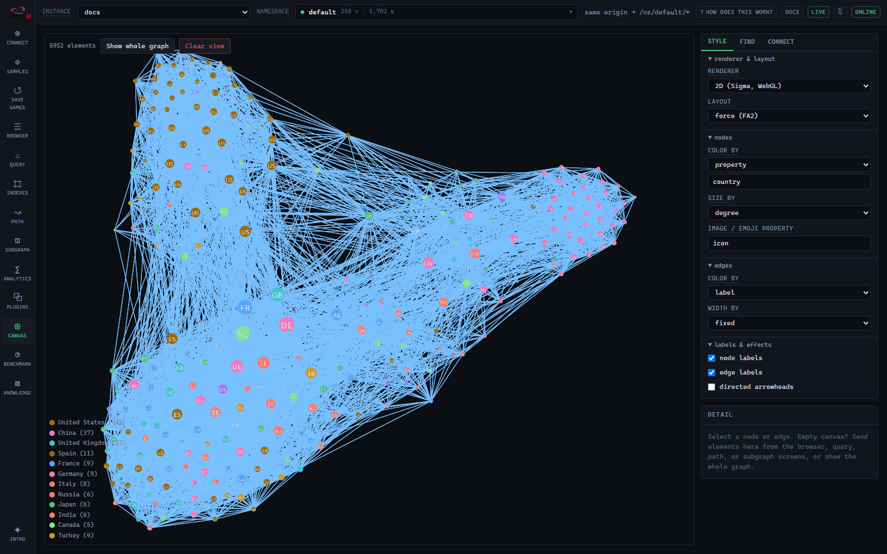

The 250 busiest airports and the flights between them (OpenFlights), colored by country and
sized by degree so the mega-hubs (US, GB, DE, FR…) pop. Each node carries its country flag as
its `icon`; where the browser has no flag-emoji font it falls back to the two-letter country
code, as in the shot above.

Try it:

- **[Path](/path-finding/) → Dijkstra** on cost property `km` between two airports: a real
  minimum-distance itinerary.
- **[Semantic search](/semantic-traversal/):** "major airports in Japan" or "busiest hubs in
  the Middle East".
- **[Analytics](/graph-analytics/) → `PAGERANK` / `DEGREE`** to rank the global hubs.

### 📦 Fallen-8 Dependencies, roughly 1,000 vertices, 1,800 edges

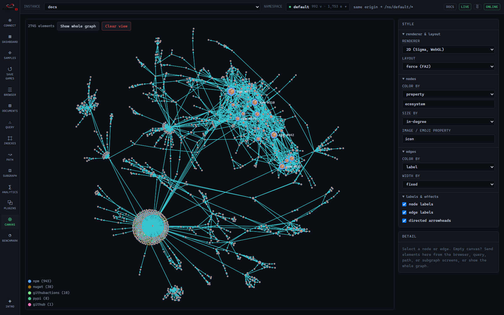

Fallen-8's own supply chain across every ecosystem (npm, NuGet, PyPI, GitHub Actions, plus the
repository itself as a `github` node), colored by ecosystem and sized by in-degree. The static twin
of the live GitHub card. A workflow rebuilds it from a fresh SBOM whenever a dependency manifest
changes, so the exact counts move with the project; the card in the gallery always shows the
current ones.

Try it:

- **[Analytics](/graph-analytics/) → `PAGERANK`** for the most-depended-on packages;
  **`WCC`** to see each ecosystem fall out as its own component.
- **Canvas** → color by `license` or `ecosystem`.

### 🌬️ Wind Farm Fleet Integrity: 94 vertices, 164 edges, plus 3 ingested documents

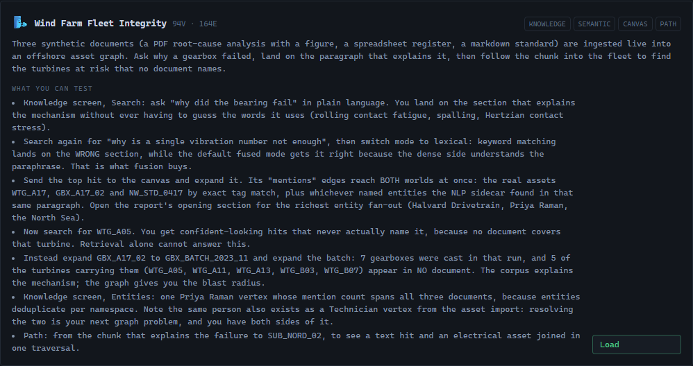

An offshore wind operator's asset graph (turbines, gearboxes, casting batches, substations, work
orders, technicians) with **three synthetic documents ingested into it at load time**: a PDF
root-cause analysis carrying a vibration figure, an XLSX maintenance register, and a markdown
engineering standard. Nothing about the knowledge graph is baked; docling conversion, embedding,
spaCy enrichment and exact-match linking all actually run, which is why this card needs the
sidecars.

It is the sample that shows the [semantic layer](/unstructured-ingestion/)'s real
thesis: a Chunk is an ordinary vertex, so the text you searched and the assets you operate are
**one graph**. Each document reaches the graph a different way, and one chunk ends up bridging
both worlds:

- **Structural linking reaches assets.** Identifier-shaped tokens in the text (`WTG_A17`,
  `GBX_A17_02`, `GBX_BATCH_2023_11`) are matched exactly against an `asset-tags` index, so a
  chunk gets `mentions` edges straight to the real equipment. The register's table chunk extracts
  40 such tags and links to the first 16 of them, that being the `MaxLinksPerChunk` cap rather
  than the end of the list.
- **NER reaches people, organisations and places.** The technicians, the two gearbox
  manufacturers, `Esbjerg`, the `North Sea`: those arrive as deduplicated Entity vertices,
  because prose names with spaces are not identifier-shaped and never link structurally. The
  reliability engineer who signs all three documents is one vertex with three mentions.

The documents are **synthetic**, and so are the two manufacturers named in them: the narrative
attributes a premature failure to a supplier's casting batch, which is not a thing to say about a
real company.

Try it, in order (the last two steps are the point):

1. **Knowledge → Search:** `why did the bearing fail`. You get the section that explains the
   mechanism without having to guess the vocabulary it uses (*rolling contact fatigue*,
   *spalling*, *Hertzian contact stress*). You asked a question; you did not construct a keyword query.
2. **Search `why is a single vibration number not enough`, then switch mode to `lexical`.**
   Keyword matching alone lands on the wrong section (the bearing-failure narrative, which is
   full of those words). The default **fused** mode gets it right, because the dense side
   recognises the paraphrase of "an overall broadband level is a single number summarising all
   the vibration energy". That is what fusion buys you, demonstrated rather than asserted.
3. **Send the top hit to the canvas** and expand it. Its `mentions` edges reach both worlds at
   once: `WTG_A17`, `GBX_A17_02` and `NW_STD_0417` on the asset side by exact tag match, plus
   whichever entities the NLP sidecar found in that paragraph. Open the report's opening section
   for the richest entity fan-out.
4. **Search `WTG_A05`.** You get three confident-looking hits and **not one of them names that
   turbine**, because no document covers it. This is the honest limit of retrieval, and it is the
   moment the graph earns its place.
5. **Expand `GBX_A17_02` → `GBX_BATCH_2023_11`, then expand the batch.** Seven gearboxes came
   from that casting run. The documents name only two of the turbines carrying them. **The other
   five, `WTG_A05` included, are in no document at all**, and their readings all sit under
   the warning level, which is exactly what the root-cause analysis warns about. The corpus
   explains the mechanism; the graph gives you the blast radius.
6. **Knowledge → Entities:** note that the signing engineer exists twice, once as an Entity the
   NLP sidecar derived from text and once as a `Technician` the asset import created. Resolving
   those two is the next graph problem, and Fallen-8 hands you both sides of it.

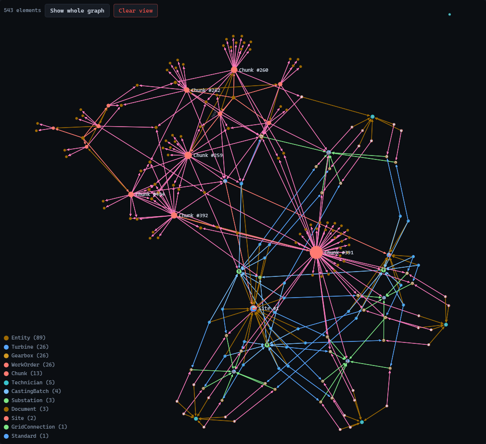

The legend is the point: `Turbine`, `Gearbox`, `WorkOrder`, `CastingBatch` and `Substation` came
from the imported dataset, while `Document`, `Chunk` and the `Entity` vertices were produced by
the ingest a moment earlier. They are one graph, in one canvas, joined by `mentions` edges. The
bright hub in the middle is the register's table chunk reaching its 16 linked assets. (The entity
count shown, around 90, depends on the spaCy model and tier, so expect it to differ a little on
your machine; the asset links do not vary, because exact matching is deterministic.)

The pipeline itself (chunking, the binding, fused retrieval, linking) is documented in
[semantic layer](/unstructured-ingestion/).

### 📈 Scale: 100k × 1M and 🐙 Any GitHub repo

Two more cards round out the gallery:

- **Scale: 100k × 1M**: a 100,000-vertex, ~1M-edge graph generated server-side on the
  **Benchmark** tab (not fetched); use it to feel ingest speed, memory footprint, and
  analytics at scale. See [Benchmark](/benchmark/) for the presets (`scale` is the
  one this card means).
- **Any GitHub repo**: paste `owner/repo` to fetch any public repository's dependency graph
  from GitHub just-in-time and ingest it: the dynamic twin of the Fallen-8 Dependencies
  sample.

## Worked examples

### Semantic search

Load **Movie Night**, open **Query**, pick the `embeddings` index, switch to **text
(provider)**, and search a *concept* rather than keywords. "mind-bending sci-fi about dreams"
ranks Inception top by cosine similarity: the query text is embedded once server-side, then
run as exact kNN.

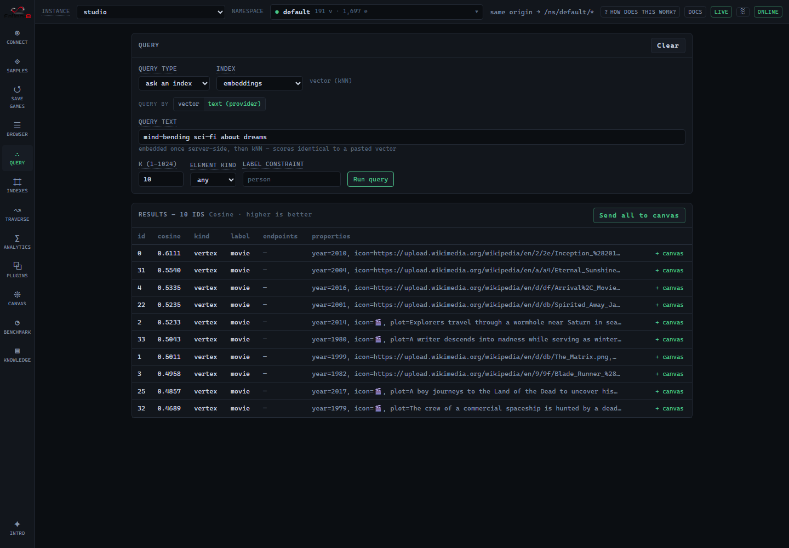

The mechanics (element embeddings, bound indices, the model-identity contract) are in
[semantic traversal](/semantic-traversal/); the kNN scan itself in [vector search](/vector-search/).

### An interesting path

The **Traverse** screen's **Path finding** tab finds routes between two elements. On a
weighted sample (air routes by `km`, the attack surface by `exploitCost`) a Dijkstra run
returns the genuinely cheapest route; the default BLS finds fewest-hop paths.

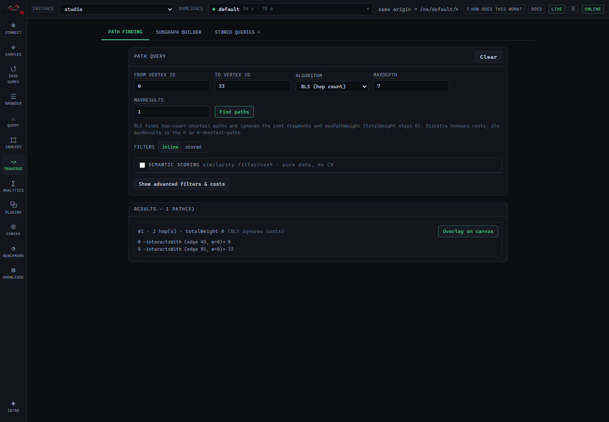

Filters and cost functions are C# [delegates](/delegates/); the full path contract is in
[path finding](/path-finding/).

### A subgraph

The same screen's **Subgraph builder** tab builds an alternating vertex, edge pattern and extracts
everything on a matching path into a new standalone graph.


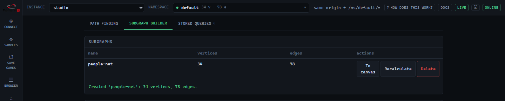

The pattern model and REST lifecycle are in [subgraphs](/subgraphs/).

## Rebuilding and adding samples

The datasets live in the repo's top-level [samples/](https://github.com/cosh/fallen-8-core/tree/main/samples/) and ship with the app;
the gallery is driven entirely by `samples/index.json`, so adding a sample is a data change, not a
UI change. The embedded samples' vectors are produced at build time (never at load) against an
instance with the embedding provider on: the build script embeds through `POST /embedding/text`,
which is why only the three embedded samples (`attack-surface`, `movie-night`, `air-routes`) need
that provider.

Rebuild from `fallen-8-web-ui/`:

```bash
npm run build:samples                        # rewrite every dataset and index.json
npm run build:samples -- --only karate-club  # just one (the others keep their manifest entries)
npm run build:samples -- --verify            # also round-trip each dataset through a live instance
```

`--verify` imports each file and creates its index recipes against `F8_BASE` (default
`http://localhost:5078`), then wipes it; it refuses anything but an **empty** instance. A sample
that ships in the repo also registers its builder in `scripts/build-samples.ts`, which is what
`--only` names; a sample you just want in your own gallery needs nothing but a `fallen8-jsonl` file
and a manifest entry.

A sample can also declare `documents`, which the loader ingests live after the import, plus
`indexSeeds` to fill an equality index from an imported property and `linkIndexIds` to name the
linking allowlist. The seeding step exists because creating an index does not backfill it: a
dictionary index created after an import is empty, so linking against it would find nothing. The
document files themselves live in
[samples/documents/](https://github.com/cosh/fallen-8-core/tree/main/samples/documents/) and are
committed rather than built, because authoring a PDF and a spreadsheet needs a toolchain the
TypeScript build has no business carrying. Regenerating them is a hand-run step from the repo root:

```bash
pip install reportlab openpyxl matplotlib
python samples/documents/generate-documents.py
```

The output is byte-reproducible, so a run with unchanged inputs leaves `git status` clean.

## See also

- [Studio](/studio/): the UI that hosts the gallery
- [Bulk import/export](/bulk-import-export/): the `fallen8-jsonl` format the samples use
- [Semantic traversal](/semantic-traversal/) / [Vector search](/vector-search/): the embedding features the samples exercise
- [Graph analytics](/graph-analytics/) · [Path finding](/path-finding/) · [Subgraphs](/subgraphs/): the algorithms the "try it" steps drive
