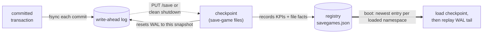

import { Tabs, TabItem } from '@astrojs/starlight/components';

Fallen-8 is durable by default. Every committed transaction is appended to a per-namespace **write-ahead log (WAL)** and fsync'd before the call returns; on demand (via `PUT /save` or a clean shutdown) the engine writes a **save game**, a full checkpoint of the graph. A single **registry** at `<deployment>/metadata/savegames.json` records every save game with its KPIs and file facts and is the sole authority for what loads on startup. Between checkpoints the WAL closes the gap, so a crash recovers every committed transaction by replaying the log on top of the last checkpoint. Volatile mode (opt-in) turns all of this off. Save games are for full point-in-time restore points; to move data as portable text instead, see [bulk import/export](/bulk-import-export/).



## Durability model

| Piece | Role |
|---|---|
| **WAL** | Append-only, one per namespace. Each committed data mutation is framed with a CRC-32 and fsync'd before `PUT`/`WaitUntilFinished` returns. A torn trailing entry (crash mid-append) is discarded cleanly on replay. |
| **Checkpoint / save game** | A full snapshot: a primary file plus sidecars (element partitions, indices, services, and the subgraph, stored-query and plugin manifests). Written atomically (temp file + fsync + rename); a save resets the WAL to build on the new snapshot. |
| **Registry** | One JSON document per deployment, written atomically. Records every save game (never overwritten silently; a corrupt document is a loud failure) and decides what boots. |

## What a save game contains

| Content | Persisted | On load |
|---|---|---|
| Vertices & edges + their properties | Yes: id-partitioned element files | Restored |
| Element embeddings | Yes: element state, travels with the elements | Restored ([semantic traversal](/semantic-traversal/)) |
| Indices | Yes: one file per index | Restored; a load **replaces** the live index set with the checkpoint's (indices created since it are dropped), and a bound vector index is rebuilt as a derived projection ([indexes](/indexes/), [vector search](/vector-search/)) |
| Services | Yes | Restored, but **not started** by the startup load (no configuration key changes that); started by `PUT /savegames/{id}/load`, and by `PUT /load` unless you send `startServices: false` |
| Subgraph recipes | Yes: one manifest | Recompiled ([subgraphs](/subgraphs/)) |
| Stored queries | Yes: source only, one manifest | Recompiled ([stored queries](/stored-queries/)) |
| Registered plugins | Yes, source only (one manifest) | Recompiled ([plugin registration](/plugin-registration/)) |

Between checkpoints the WAL records the same data mutations plus id-space markers (`Trim`, `TabulaRasa`) and the subgraph, stored-query and plugin registrations committed since the last save, so crash recovery loses nothing committed.

## Startup

Two decisions, in this order: the [namespace catalog](/namespaces/#startup-load) decides **which namespaces** this boot loads at all, and then, for each of those, the registry (never the files on disk) decides **what loads into it**. Each namespace is resolved by its immutable id (a rename keeps its history; a drop + recreate does not inherit the old one's saves):

| Namespace and registry state | What loads |
|---|---|
| Loaded, and an entry contains it | Its newest such entry's checkpoint is loaded, then the WAL tail is replayed |
| Loaded, and no entry contains it | Nothing is loaded; the namespace keeps its WAL-replayed construction state, an empty graph on a fresh deployment |
| Its [startup-load policy](/namespaces/#startup-load) excludes it | Nothing at all: no engine is constructed, so no checkpoint is read and no WAL replayed. It stays cataloged and answers `503` until it is loaded |

- A checkpoint file merely sitting in the storage directory is **not** auto-loaded. (Exception: a checkpoint strictly newer than the newest registered entry is adopted: it is a durable save whose registry write did not complete before a crash.)
- To **adopt an unregistered checkpoint**, load it once with `PUT /load`; it is then registered permanently and boots normally thereafter. A namespace that is *not loaded* and has only unregistered checkpoint files refuses [activation](/namespaces/#loading-one-now) with `409` rather than coming up empty beside them, and its detail names the adoption path.
- A registered entry whose checkpoint file is missing aborts startup loudly rather than serving an empty graph: restore the file, or delete the entry (`DELETE /savegames/{id}`) and restart. That abort covers the namespaces this boot **selected**: broken files under a namespace nobody asked to load cannot keep the server down, and they are still exactly as broken when you do load it.
- A corrupt `savegames.json` is a loud failure too, never silently overwritten: fix the JSON, or move the file aside and re-adopt the checkpoints with `PUT /load` (you lose the history, not the data).

## Configuration

| Key | Default | Effect |
|---|---|---|
| `Fallen8:Durability:StorageDirectory` | app base directory | Directory holding the checkpoint files and the WAL |
| `Fallen8:Durability:CheckpointBaseName` | `Temp.f8s` | Base file name of the default checkpoint path, used by the clean-shutdown save, `PUT /save/all`, and a bare `PUT /save` |
| `Fallen8:Durability:WalPath` | `<StorageDirectory>/fallen8.wal` | WAL path for the default namespace |
| `Fallen8:Durability:Volatile` | `false` | `true` = pure in-memory: no boot load, no shutdown save, **WAL disabled**; a restart loses all data by choice |
| `Fallen8:Durability:SaveOnShutdown` | `true` | `true` = final checkpoint on clean shutdown; `false` = rely on the per-commit WAL (committed work still survives; the next boot replays a longer log) |
| `Fallen8:Metadata:Directory` | `<app base>/metadata` | Directory holding `savegames.json` |

In the compose environment these bind from environment variables (`Fallen8__Durability__StorageDirectory=/data`, `Fallen8__Metadata__Directory=/data/metadata`) so the graph data and the registry share one named volume; see [running](/running/). A bare `PUT /save` writes to the addressed namespace's default checkpoint path (`CheckpointBaseName` inside its directory); pass `saveGameLocation` to write somewhere else explicitly.

## REST surface

Base URL `http://localhost:8080`. `PUT /save` and `PUT /load` target the addressed namespace (bare URLs alias the `default` namespace; every one also answers under `/ns/{ns}/…`). The `/savegames` registry routes and `PUT /save/all` are Fallen-8-level (one registry per deployment), so they are not namespace-twinned. See [namespaces](/namespaces/).

### Saving

| Route | Scope | Body | Responses |
|---|---|---|---|
| `PUT /save` | namespace | `SaveSpecification` (all optional) | `200` created entry · `400` · `500` rolled back · `503` the addressed namespace is not loaded |
| `PUT /save/all` | Fallen-8 | (none) | `200` one entry spanning every **loaded** namespace · `429` rate-limited · `500` (body names failed namespaces; successful ones are still registered) |

**A namespace with no engine in this process is never a member of a save**, so what a spanning entry covers depends on what the boot loaded. `PUT /save/all` skips such a namespace and names it in a `skippedNamespaces` member (on the `200`, and as a problem extension on the `500`); the clean-shutdown save skips it with an informational log line; a `PUT /save` addressed at it refuses with `503`. Its checkpoint files and its WAL are left untouched, which is the point: an empty save of a namespace that holds data would both bury the real checkpoint under a newer entry and reset that namespace's WAL to a bare header. The consequence to keep in mind is that "the newest entry is my whole Fallen-8" holds only while every namespace is loaded. See [namespaces](/namespaces/#startup-load).

`SaveSpecification`: `saveGameLocation` (path; defaults to `CheckpointBaseName` in the addressed namespace's directory), `savePartitions` (defaults to the optimal count for the CPU). Both `PUT /save` and `PUT /save/all` wait for the save to finish before responding.

**A save never overwrites an existing checkpoint.** If the target path is already on disk, the engine writes a versioned sibling instead: `<path>#<stamp>`, where the stamp is a monotonically increasing UTC timestamp. So repeated saves to the default location pile up as `Temp.f8s`, then `Temp.f8s#…`, then another `Temp.f8s#…`. Two consequences: read the returned entry's `location` as the authoritative path (it is not necessarily the path you asked for), and prune old snapshots yourself with `DELETE /savegames/{id}?deleteFiles=true`, which deletes exactly that entry's own primary file and sidecars and never a sibling version's.

### Is it safe to act on what you just read?

`GET /status` carries a **durability block** for the addressed namespace, so a client can tell the
difference between "the graph is complete" and "the graph is what survived":

| Field | Means |
|---|---|
| `walEnabled` | this namespace is logging commits to a write-ahead log (there is no persistent handle: every append opens the file, fsyncs and closes it) |
| `degraded` | the log's failure fence has tripped, or an anchored log is waiting for its paired load: commits are landing in memory but not durably |
| `recoveryRan` | a log replay has happened in this engine's lifetime |
| `lastRecoveryTruncated` | that replay stopped before the end of the log, so the graph is a **prefix** of the committed history |
| `lastRecoveryReplayedEntries` | how many transactions it replayed |
| `lastCheckpointDroppedIndices` | how many indexes the last checkpoint could not write, so they will be absent after the next load |

The block is read as a group, so its fields always describe one outcome rather than a half-finished
replay. Why it exists: a client that reconciles against the graph and then **deletes what nothing
asserts any more** would otherwise draw that conclusion from truncated history with no way to know.
The [integrations runtime](/integrations/) does exactly that, and defers its deletions
unless this block says writes are reaching disk, the last recovery was not truncated, and the last
checkpoint dropped no indexes.

`lastCheckpointDroppedIndices` above zero is the other case worth acting on: a derived index you own
is gone after the next load, and [rebuilding it](/indexes/) from element state is one
call.

### Registry and restore

| Route | Effect | Responses |
|---|---|---|
| `GET /savegames` | List every entry, newest first | `200` |
| `GET /savegames/{id}` | One entry | `200` · `204` unknown id |
| `PUT /savegames/{id}/load` | Restore the entry's namespaces, replacing their in-memory graphs | `200` (waited) · `202` (accepted) · `404` · `500` (four causes, below) |
| `DELETE /savegames/{id}` | Remove the entry; `?deleteFiles=true` also deletes its checkpoint files | `204` · `404` |
| `PUT /load` | Load a checkpoint from an arbitrary path into the addressed namespace | `204` · `400` · `500` rolled back |

Restore query parameters: `?waitForCompletion=true` awaits the load and returns `200` (otherwise it returns `202` immediately); `?namespace={name}` restores just that member of the entry (`404` when the entry does not contain it, the other `404` being an unknown id). Restoring recreates a dropped namespace, replaces an existing one's content, and leaves namespaces the entry does not contain untouched. `PUT /load` takes a `LoadSpecification`: `saveGameLocation` and `startServices` (default `true`); a checkpoint loaded this way is registered if not already known. Unlike `PUT /savegames/{id}/load` it does no pre-flight file check, so a path that does not exist answers `204` with nothing loaded (the miss reaches the server log only): verify the counts afterwards.

**A restore is not a rollback, because the WAL always participates.** A successful save re-anchors its namespace's WAL to the checkpoint it just wrote. Restoring the entry the live log is anchored to (normally the newest) therefore loads that checkpoint and then replays everything committed since it, landing back on the current committed state: "restore the last save game to undo my recent writes" is a no-op. Restoring an *older* entry re-anchors the log to it and **discards** the transactions committed after it, which is the honest way back to a point in time; the discard is announced as a loud server-log warning. `PUT /load` of an arbitrary path behaves identically.

`500` from `PUT /savegames/{id}/load` has four causes, and the first two are all-or-nothing pre-flight failures that touch no graph at all: a member's checkpoint file is missing (`Save game files missing`, the REST twin of the startup abort above) or a dropped namespace could not be recreated (`Namespace restore failed`). The third is a member that is not loaded in this process and could not be activated (`Namespace restore failed` as well); it names in `activatedNamespaces` the members that were already activated and restored before it failed, and nothing else was. Only the fourth, a rolled-back load transaction, can leave a partial restore; that body carries a `failedNamespaces` member naming the namespaces that failed.

**Restoring into a namespace this process did not load** activates it *and* sets its startup-load policy to enabled, reporting both in the response's `activatedNamespaces`. Activating alone would let the data you just restored go invisible again at the next boot; refusing would dead-end a legitimate recovery behind "change the policy, restart, restore". Such a member is restored directly from *this* entry's checkpoint rather than from the namespace's own newest one, and the policy write happens first, so a failure there means nothing was restored at all. It is loaded synchronously even with `waitForCompletion=false` (whose `202` carries no body); `GET /ns` then shows it as `ready`.

A registry entry (`SaveGameREST`) reports: `id`, `savedAt` (ISO-8601 UTC), `trigger` (`api` \| `shutdown` \| `imported`), `location`, `fileCount`, `totalBytes`, `engineVersion`, `kpis` (`vertexCount`, `edgeCount`, `usedMemoryBytes` for the process working set at save time, plus the index/plugin/subgraph inventory), and a `namespaces[]` manifest (`name`, `id`, `location`, file facts, `kpis` per member). The top level is conditional: on a multi-namespace entry (what `PUT /save/all` and the shutdown save produce) `location` is `null` and `fileCount`/`totalBytes`/`kpis` are sums across the members, so read `namespaces[].location` for a member's checkpoint. A single-member entry mirrors that member at the top level, and a pre-namespace entry has no `namespaces` at all (it reads as a `default`-only save). Two members describe the **operation** rather than the entry and appear only on the response that produced them, never in `savegames.json`: `skippedNamespaces` (from `PUT /save/all`) and `activatedNamespaces` (from `PUT /savegames/{id}/load`).

## Examples

Save the default namespace and capture the created entry's id:

<Tabs syncKey="shell">
<TabItem label="Bash">

```bash
curl -X PUT http://localhost:8080/save \
  -H "Content-Type: application/json" -d '{}'

curl http://localhost:8080/savegames        # list, newest first
```

</TabItem>
<TabItem label="PowerShell">

```powershell
$entry = Invoke-RestMethod -Method Put -Uri http://localhost:8080/save `
  -ContentType "application/json" -Body '{}'
$entry.id

Invoke-RestMethod -Uri http://localhost:8080/savegames
```

</TabItem>
</Tabs>

Restore an entry (waiting for the load), then delete an old one with its files:

<Tabs syncKey="shell">
<TabItem label="Bash">

```bash
curl -X PUT "http://localhost:8080/savegames/sg-20260724-101500-ab12/load?waitForCompletion=true"

curl -X DELETE "http://localhost:8080/savegames/sg-20260101-000000-9f3c?deleteFiles=true"
```

</TabItem>
<TabItem label="PowerShell">

```powershell
Invoke-RestMethod -Method Put `
  -Uri "http://localhost:8080/savegames/sg-20260724-101500-ab12/load?waitForCompletion=true"

Invoke-RestMethod -Method Delete `
  -Uri "http://localhost:8080/savegames/sg-20260101-000000-9f3c?deleteFiles=true"
```

</TabItem>
</Tabs>

Adopt a checkpoint that is on disk but not in the registry (registers it permanently). Point at the exact primary file: the first save to a path is the bare name, later saves are versioned, so the newest snapshot is the `Temp.f8s#<stamp>` with the highest stamp; files whose name continues with `_` are its sidecars and never a load target.

<Tabs syncKey="shell">
<TabItem label="Bash">

```bash
curl -X PUT http://localhost:8080/load -H "Content-Type: application/json" \
  -d '{ "saveGameLocation": "/data/Temp.f8s#5250912345678901234", "startServices": true }'
```

</TabItem>
<TabItem label="PowerShell">

```powershell
Invoke-RestMethod -Method Put -Uri http://localhost:8080/load -ContentType "application/json" `
  -Body '{ "saveGameLocation": "/data/Temp.f8s#5250912345678901234", "startServices": true }'
```

</TabItem>
</Tabs>

## Namespaces

`PUT /save/all` checkpoints every **loaded** namespace into **one** save-game entry: a single consistent restore point for as much of the Fallen-8 as this process holds (all of it, unless a [startup-load policy](/namespaces/#startup-load) excluded something, in which case the response names what it skipped); the clean-shutdown save produces the same shape. Restore the whole entry, or a single member with `?namespace={name}`, via `PUT /savegames/{id}/load`. Each namespace keeps its own checkpoint files and WAL under its own directory (`default` uses the storage directory itself, every other namespace a `namespaces/<id>/` subdirectory of it), while the registry is shared. The namespace model itself lives in [namespaces](/namespaces/).

## Studio

F8 Studio has a Save games screen that lists entries and drives save, restore, and delete; see [studio](/studio/).

## See also

- [Indexes](/indexes/): how indices are captured and restored/rebuilt on load
- [Namespaces](/namespaces/): the namespace model and `/ns/{ns}/…` route twins
- [Bulk import/export](/bulk-import-export/): the portable-text alternative for moving data
- [Stored queries](/stored-queries/) · [Subgraphs](/subgraphs/): assets recompiled from a save game
- [Semantic traversal](/semantic-traversal/) · [Vector search](/vector-search/): embedding and vector-index durability
- [Running](/running/): storage-directory configuration in the compose environment
- [REST API](/rest-api/): OpenAPI document and Scalar reference
- [Troubleshooting](/troubleshooting/): common API, NL-assist and sidecar failure modes
