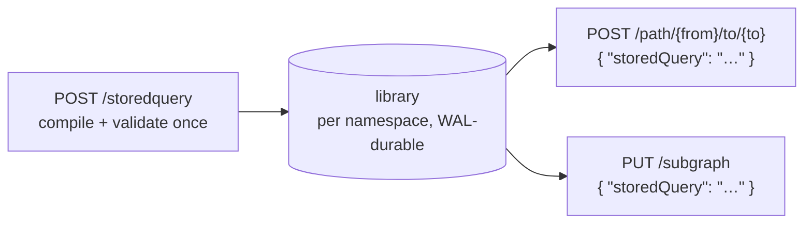

import { Tabs, TabItem } from '@astrojs/starlight/components';

Fallen-8 has no query language, queries are C# delegates ([delegates](/delegates/)). A stored query is the precompiled flavor of that: a named, compile-validated definition, either a **path** filter/cost set or a **subgraph** pattern template, registered once and afterwards invoked by name from the path and subgraph endpoints, with nothing compiled per request. Each namespace has its own library ([namespaces](/namespaces/)); like every namespace-scoped route, `/storedquery` also answers under `/ns/{ns}/…`.



## REST surface

| Route | Effect | Notable responses |
|---|---|---|
| `POST /storedquery` | Register: validate, compile once, publish | `201` summary · `400` malformed or compile failure (body carries compiler diagnostics) · `401` no credential (when a key is configured) · `409` duplicate name or library quota · `413` body over 1 MiB · `429` rate-limited |
| `GET /storedquery` | List summaries, ordered by name | `200` · `401` |
| `GET /storedquery/{name}` | Full detail incl. the stored specification JSON and, for `Failed` entries, recompile diagnostics | `200` · `401` · `404` |
| `DELETE /storedquery/{name}` | Deregister | `204` · `401` · `404` · `500` rolled-back removal |

Entries are immutable: to change one, delete and re-register.

## Registration model

| Field | Required | Notes |
|---|---|---|
| `name` | yes | `^[A-Za-z0-9_-]{1,128}$`, case-sensitive, unique per namespace |
| `kind` | yes | Exactly `Path` or `SubGraph` |
| `description` | no | Free text, shown in list/detail |
| `path` | iff `kind` = `Path` | The `filter` / `cost` blocks of a [path request](/path-finding/) |
| `subGraph` | iff `kind` = `SubGraph` | The `vertexFilter` / `edgeFilter` / `patterns` of a [subgraph request](/subgraphs/) |

Exactly one of `path` / `subGraph` must be present and must match `kind`. The fragments inside are the same C# fragments the inline endpoints accept, compiled with the same bounds. Deliberately **not** stored: these stay per invocation:

- **Path:** `pathAlgorithmName`, `maxDepth`, `maxResults`, `maxPathWeight`, `semantic`
- **SubGraph:** the instance `name`, `additionalInformation`

A `SubGraph` template's pattern steps may not carry `semanticMinScore`: a template's delegates bind at *its* registration, where there is no semantic query to score against, so such a registration is rejected with `400` (inline the filters instead).

List and detail responses carry `name`, `kind`, `description`, `createdAt` (UTC) and `compileState`; the detail adds `specificationJson` and `compileDiagnostics` (`null` unless the state is `Failed`). `specificationJson` is JSON *text* holding the stored `path` / `subGraph` block alone, so re-registering it on another instance means wrapping it back into a `name` / `kind` envelope. `compileState` is one of `Compiled` (invocable), `Failed` (recompile on load failed, invoking returns `409`, diagnostics on the detail; delete and re-register), or `SourceOnly` (loaded without a compiler, e.g. the embedded engine).

## Invocation

Reference the entry with `"storedQuery": "<name>"` instead of inline fragments, mutually exclusive with them (`400` when mixed):

- `POST /path/{from}/to/{to}` accepts a stored query of kind `Path`; bounds and algorithm come from the request. The `semantic` block still works: stored fragments read the query vector via their `context` parameter ([semantic traversal](/semantic-traversal/)).
- `PUT /subgraph` accepts a stored query of kind `SubGraph` and instantiates the template under the request's `name`. The created subgraph is self-contained: deleting the stored query later does not affect it. `semantic` is **not** available on a stored-template invocation (`400`); inline the filters instead.

Invocation errors: `404` unknown name, `400` wrong kind, `409` not invocable (`Failed`/`SourceOnly` compile state).

### Worked example: register once, invoke by name

Register a path query that only traverses vertices with `age > 30`:

<Tabs syncKey="shell">
<TabItem label="Bash">

```bash
curl -X POST http://localhost:8080/storedquery \
  -H "Content-Type: application/json" \
  -d '{
    "name": "adults-shortest",
    "kind": "Path",
    "description": "age>30 vertices, weight-by-distance",
    "path": {
      "filter": { "vertexFilter": "return (v) => v.TryGetProperty(out int age, \"age\") && age > 30;" },
      "cost":   { "edgeCost": "return (e) => 1.0;" }
    }
  }'
```

</TabItem>
<TabItem label="PowerShell">

```powershell
$spec = @{
  name = "adults-shortest"
  kind = "Path"
  description = "age>30 vertices, weight-by-distance"
  path = @{
    filter = @{ vertexFilter = 'return (v) => v.TryGetProperty(out int age, "age") && age > 30;' }
    cost   = @{ edgeCost = 'return (e) => 1.0;' }
  }
} | ConvertTo-Json -Depth 5
Invoke-RestMethod -Method Post -Uri http://localhost:8080/storedquery -ContentType "application/json" -Body $spec
```

</TabItem>
</Tabs>

Invoke it: the request carries no code, only the name plus the per-request algorithm and bounds. The stored `edgeCost` is only consumed by a weighted algorithm, so ask for `DIJKSTRA` (the default `BLS` counts hops and ignores costs, see [path finding](/path-finding/)):

<Tabs syncKey="shell">
<TabItem label="Bash">

```bash
curl -X POST http://localhost:8080/path/1/to/5 \
  -H "Content-Type: application/json" \
  -d '{ "storedQuery": "adults-shortest", "pathAlgorithmName": "DIJKSTRA", "maxDepth": 5 }'
```

</TabItem>
<TabItem label="PowerShell">

```powershell
Invoke-RestMethod -Method Post -Uri http://localhost:8080/path/1/to/5 -ContentType "application/json" `
  -Body '{ "storedQuery": "adults-shortest", "pathAlgorithmName": "DIJKSTRA", "maxDepth": 5 }'
```

</TabItem>
</Tabs>

A `SubGraph` template stores the pre-filters and the pattern sequence, and nothing else:

```json
POST /storedquery
{
  "name": "person-net",
  "kind": "SubGraph",
  "subGraph": {
    "vertexFilter": "return (v) => v.Label == \"person\";",
    "patterns": [
      { "type": "Vertex", "patternName": "p1", "vertexFilter": "return (v) => v.Label == \"person\";" },
      { "type": "Edge",   "patternName": "knows", "direction": "OutgoingEdge", "edgePropertyFilter": "return (p) => p == \"knows\";" },
      { "type": "Vertex", "patternName": "p2", "vertexFilter": "return (v) => v.Label == \"person\";" }
    ]
  }
}
```

Invoking it looks the same as the path case, with the per-instance name alongside the reference:

```json
PUT /subgraph
{ "name": "person-net-today", "storedQuery": "person-net" }
```

## What the library buys you

- **Compile once, invoke many.** A fragment is validated and compiled a single time at registration; every invocation reuses the pinned artifact, so a hot query pays no per-request Roslyn cost and callers send only a name plus bounds.
- **A curated catalog.** An operator registers a vetted set of named queries that agents and clients reference by name instead of re-sending raw C#, and `GET /storedquery` lists them for discovery.
- **Portable definitions.** `GET /storedquery/{name}` returns the stored specification JSON, which is your migration path between instances, and entries survive save/load and crash recovery (below).

Every `/storedquery` route needs the credential when an API key is configured (`401` without it), and so does invoking one by name. There is no code capability to grant or revoke on top of that: `/path`, `/subgraph` and `/storedquery` are never gated off, and the inline-versus-stored check those endpoints perform exists only to keep the two request shapes mutually exclusive (`400` when mixed).

Stated honestly: dynamic code execution is always on (there is no switch to lock the engine down to stored-queries-only), and an invoked stored query still runs in-process with full trust. The library is a reuse and curation convenience, **not** a sandbox. The API key is documented in [security](/security/).

## Durability and limits

Registrations and removals are transactions: they survive `PUT /save` / load and crash recovery via the write-ahead log, with sources recompiled on load ([save games](/save-games/)).

| Limit | Value |
|---|---|
| Library size | 256 per namespace (`Fallen8:StoredQueries:MaxCount`); exceeding it is a `409` |
| Name length | 128 characters |
| Registration body | 1 MiB; registration is rate-limited like the other code endpoints |

## See also

- [Delegates](/delegates/): the no-query-language philosophy, fragment shape, compilation, `/delegates/validate`
- [Security](/security/): the API key that gates access to the code endpoints
- [Path finding](/path-finding/) · [Subgraphs](/subgraphs/): the endpoints that accept `storedQuery`
- [Studio](/studio/): the Path and Subgraph screens capture the fragments you authored with "Save as stored query…" and manage the matching entries in a **Stored path queries** / **Stored subgraph queries** panel
- [MCP server](/mcp-server/): agents invoke by name via `f8_paths` / `f8_subgraph`; registering and listing stay operator work over REST
- [Semantic traversal](/semantic-traversal/): the `semantic` block stored path queries can combine with
- [Save games](/save-games/): checkpoints and the write-ahead log
- [Namespaces](/namespaces/): per-namespace isolation and the `/ns/{ns}/…` route twins
- [REST API](/rest-api/): OpenAPI document and Scalar reference
