F8 Studio is the browser UI for Fallen-8: a React single-page app. The default compose environment runs it as its own [standalone](/fallen-8-core/standalone-ui/) container (F8 Studio on `:8081`, the REST API on `:8080`); the API app can also serve it from its own `wwwroot` (the all-in-one image). Build and serving are covered in [running.md](/fallen-8-core/running/). It is a workbench over one instance's REST surface (connect to a server, inspect and mutate a graph, run queries and algorithms, visualize results) and, because Fallen-8 has no query language ([delegates.md](/fallen-8-core/delegates/)), it gives humans and code-generating agents a place to author, validate, and refine the C# delegate fragments that queries are made of.

## Layout

A fixed icon rail on the left switches screens; a top bar names the **active instance** (dropdown), the **active namespace** (dropdown), and the resulting endpoint prefix (`baseUrl → /ns/{ns}/*`), with a link to these docs plus the events bell (below), live-feed and health chips pinned right. Every screen except Connect is locked until the active instance answers `GET /status` and the credential is authorized. Switching either instance or namespace remounts the current screen, so in-progress results never leak across contexts.

Each screen's input form and the Canvas contents are remembered per instance-and-namespace: leaving a screen and returning restores exactly what you had entered. Fetched results are re-run on demand rather than persisted. Instances you register, and their API keys, live only in this browser's local storage.

Connect, Save games, and Benchmark are Fallen-8-level (they can span namespaces); the rest operate on the active namespace and live under `/q/{ns}/…`.

A low-key **Replay intro** button is pinned to the bottom of the rail and is always available: it plays the first-run walkthrough (below) on demand.

Every screen also carries a **How does this work?** button in the top bar, next to the docs link. It opens a small popover listing the one to three documentation pages that explain the current section, each opening here in a new tab, so the relevant deep dive is one click away from wherever you are.

| Screen | Scope | Purpose |
|---|---|---|
| Connect | Fallen-8 | Register instances, instance configuration (semantic providers + observability), manage namespaces |
| Dashboard | namespace | Status overview: vertex/edge counts, memory |
| Samples | namespace | One-click demo-graph gallery with a capability tag filter |
| Save games | Fallen-8 | Checkpoint registry (load / delete) + administration (save/load/erase, jsonl import/export) |
| Browser | namespace | Look up an element, inspect properties/embeddings, adjacency, bulk view, mutations |
| Query | namespace | Property scans (one named key, or a contains search across all properties) and index queries (equality/range/fulltext/spatial/vector) |
| Indexes | namespace | Create and manage indexes and their content |
| Path | namespace | Route finding (BLS / Dijkstra) with filters, costs, semantic scoring |
| Subgraph | namespace | Subgraph lifecycle + pattern builder |
| Analytics | namespace | Graph shape + run algorithms with write-back |
| Plugins | namespace | Built-in plugin families + the runtime-authored plugin registry |
| Canvas | namespace | 2D/3D visualization of whatever you send to it |
| Benchmark | Fallen-8 | Optionally generate a random graph, measure edge-traversal throughput on any loaded graph |
| Knowledge | namespace | The semantic layer: index binding, document ingest, entity network, chunk search |
| Integrations | namespace | Run an [integration](/fallen-8-core/integrations/) against a system on your own network and read its report. Present only when the instance has an integrations runtime |

## Events

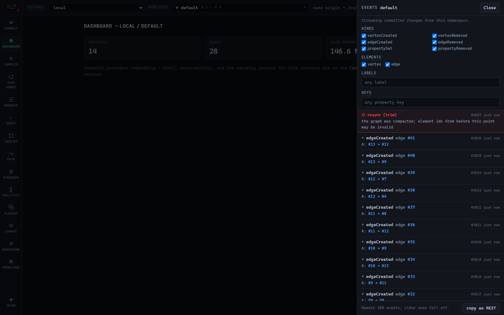

The bell in the top bar is the [change feed](/fallen-8-core/change-feed/) made visible. Without being clicked, it counts the events matching your interest filter (display capped at 99+), and it switches to a warning when the stream lost continuity (a `resync`) while you weren't looking. Clicking it slides in the **Events panel**: the newest 100 events of the **active namespace**, newest first, live as they commit, from any client of the same instance (another tab, `curl`, an MCP agent). Each row shows the kind, the element id as a click-to-inspect link into the Browser, the label, the property key for property events, the edge type and endpoints for edge creations, the sequence number, and the commit time. Event payloads carry keys only, never property values; the link is how you reach the current value. `resync` entries render as gap markers with the reason (buffer overflow, graph replaced, catch-up position out of range, direct delegate write).

The filter block speaks the REST grammar verbatim: **kinds**, **elements**, **labels**, and **keys** combine with AND across dimensions and OR within one, matching exactly and case-sensitively; an unlabeled element never matches a `labels` filter, and a `keys` filter hides creations/removals (only property events carry a key). Studio holds a single stream per namespace and applies the filter in the browser, so changing it is instant, applies to the badge as well as the list, and can reveal already-buffered events; the filter persists per instance and namespace. **Copy as REST** hands the configured filter over as the equivalent `GET /changefeed` query for `curl` or a service, never including the API key. Switching namespaces (or instances) and back resumes the stream from the last seen event, so what happened while you were away replays from the server's catch-up buffer; when it no longer can, a `resync` entry says so instead of silently skipping. The event list itself is session-only: a reload starts it empty, since the server keeps no readable history beyond its replay buffer.

## First run

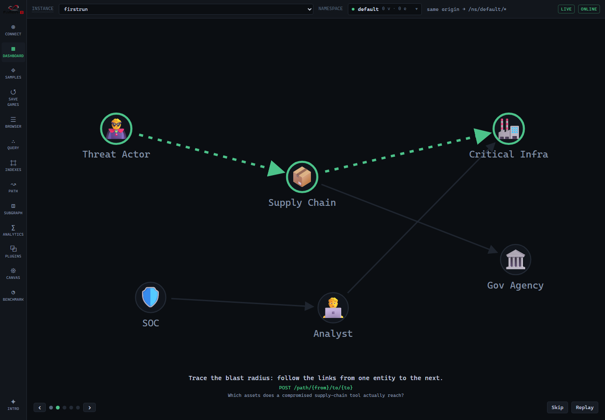

On an empty namespace the Dashboard opens with a short animated walkthrough instead of three zeroed tiles. It plays through five beats on a small built-in mock graph ("Asymmetric Cyber Warfare": a threat actor, a compromised supply-chain tool, its targets, and the defenders, drawn with emoji nodes and directed arrows), each with one line of caption: a graph is entities and typed relationships; trace the blast radius from one entity to the next (`POST /path/{from}/to/{to}`); rank what matters with analytics (`POST /analytics/PAGERANK`); extract a matched pattern as its own recalculable graph (`PUT /subgraph`); and search by meaning then expand (`POST /scan/index/vector`). It then rests on a handoff: **Browse sample graphs** (opens the curated Sample gallery), **Import your own data** (JSONL to `POST /bulk/import`), or **Explore on my own**.

Each beat holds for about ten seconds, and **Prev / Next / the step dots** (plus the Left/Right arrow keys) let you step through the features at your own pace; a manual step pauses the autoplay. The show is entirely client-side and read-only: it draws the mock as SVG and animates it, and it creates nothing. Only the handoff buttons act, and only on click. It is skippable and replayable, pauses when the tab is hidden, and honours `prefers-reduced-motion` by rendering the final framed state with no motion. Dismissing it is remembered per namespace, but it reappears if that namespace is genuinely empty again. **Replay intro** in the rail reopens the same walkthrough at any time, on the mock graph, over whatever screen you are on, without touching your data or the dismissed state. The same graph ships as the **Asymmetric Cyber Warfare** [sample](/fallen-8-core/samples/) so you can load the real thing in one click.

## Connect

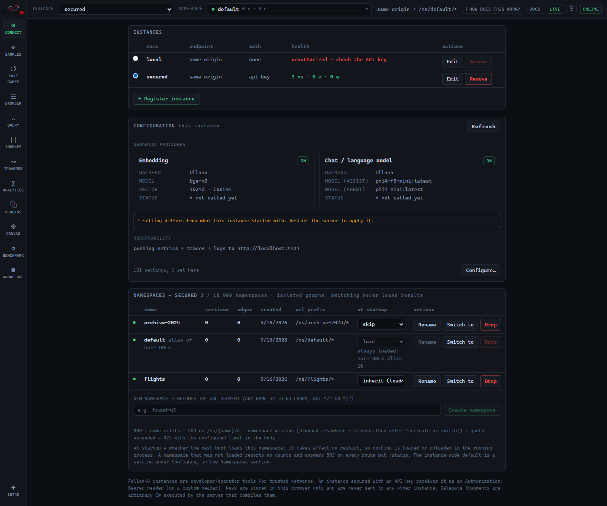

Three panels. The **Instances** table lists registered servers with a radio to activate one, its endpoint and auth kind, and a live health cell (a lazy `GET /status` showing vertex/edge counts, or `unreachable` / `unauthorized`). "+ Register instance" takes a name, a base URL (empty = same origin as Studio), and an optional API key; keys are stored in this browser only and sent as a bearer/custom header ([security.md](/fallen-8-core/security/)). When Studio is deployed [standalone](/fallen-8-core/standalone-ui/), the endpoint it was configured with appears as a **managed default** instance while the ones you add here are **personal**. The two differ in what persists and in whether they can carry a credential, and a key-secured server needs a personal instance: [managed vs personal](/fallen-8-core/standalone-ui/#instances-managed-vs-personal). A cross-origin instance that reads `unreachable` while its server is up is usually a missing CORS allow-list entry, and the health cell says so. The **Configuration** panel (below) shows the active instance's instance-wide config read-only. The **Namespaces** panel manages the active instance's namespaces, create, rename, switch to, drop, with counts and the `/ns/{name}/*` URL prefix; `default` aliases the bare routes and cannot be renamed or dropped ([namespaces.md](/fallen-8-core/namespaces/)).

The **Configuration** panel is read-only (instance config is set at startup via env/appsettings, so it is display + guidance, not an editor). It is sourced from `GET /config`. It shows the **semantic providers**: the embedding provider (backend / model / dimension / metric) and the **chat gateway** (backend / model), each card carrying a live status line that says whether the model is loaded right now and, when the Ollama backend reports it, whether it sits on the GPU or the CPU (a model that has not been used yet reads "not loaded (loads on first use)"). It also shows the **observability** posture: a one-line status ("pushing metrics + traces + logs to `<endpoint>`" / "Prometheus at `/metrics`" / off) with a **Configure…** overlay that groups every value under **Push (OTLP)**, **Pull (Prometheus scrape)**, and **Statistics snapshot** (so the live push path is never mistaken for the off-by-default scrape endpoint), each row showing its `Fallen8__…` env key. Secrets are never shown (only whether an API key is required). See [semantic-traversal.md](/fallen-8-core/semantic-traversal/) and [observability.md](/fallen-8-core/observability/).

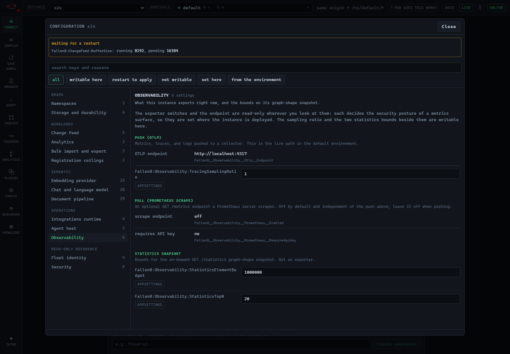

## Dashboard

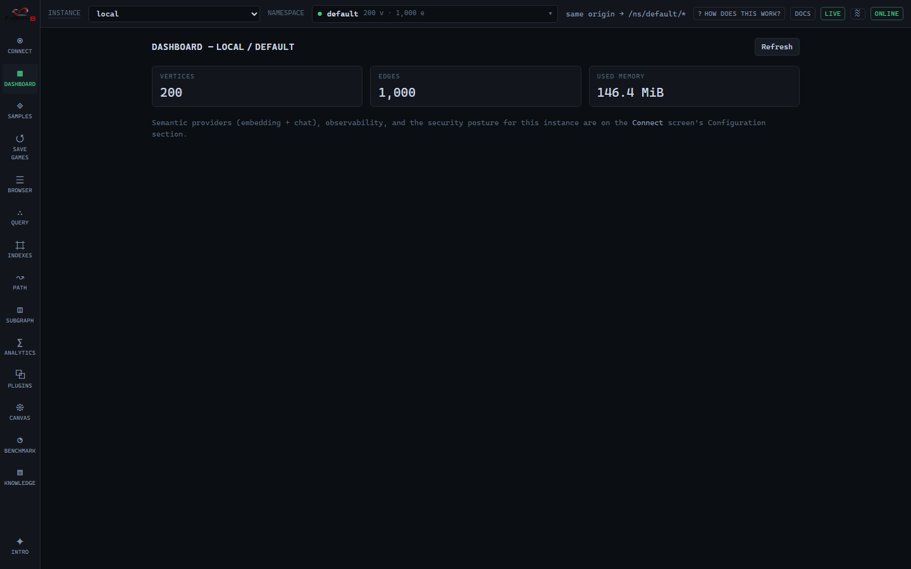

A lean status overview for the active namespace: vertex/edge counts and used memory from `GET /status` ([observability.md](/fallen-8-core/observability/)). On an empty namespace it opens with the first-run walkthrough (above) instead of zeroed tiles. Everything that used to crowd the Dashboard now has its own home: the sample gallery is **Samples**, the plugin inventories and registry are **Plugins**, persistence and administration are **Save games**, stored queries are managed per scenario on **Path** and **Subgraph**, and the semantic providers + observability moved to the Connect **Configuration** section.

## Samples

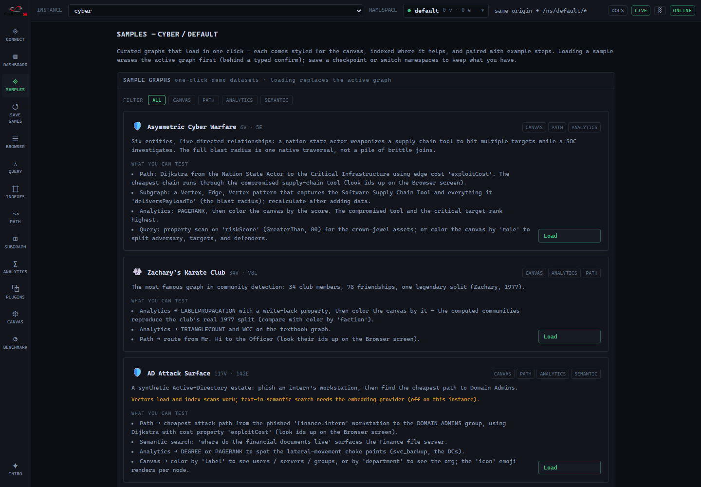

The one-click demo-graph gallery. Each full-width card names a curated dataset, its vertex/edge counts, its capability badges, and a **what you can test** list; **Load** fetches the dataset, imports it, builds its indices, and drops it onto the canvas with the sample's style. A tag bar at the top filters the gallery by capability, offering only the tags the shipped manifest actually uses (currently canvas / path / analytics / semantic / knowledge). A live **Any GitHub repo** card ingests any public repository's dependency graph just-in-time, and a **Scale** card points at the Benchmark tab's server-side generator. Loading into a non-empty graph erases it first behind a typed confirm, save a checkpoint or switch namespaces to keep the current data. Walkthrough with queries: [samples.md](/fallen-8-core/samples/).

A sample that carries documents does more on load, and the progress line names each step: after importing it fills its equality indexes key by key (index creation does not backfill), binds the semantic layer, and ingests the manifest's documents through the live `/document` pipeline, then reports the index keys written and the documents and chunks created. Because that runs for real, such a card can also **refuse** to load, saying why: ingestion off, the embedding provider off, or the docling sidecar unreachable when the sample uploads a binary format. A missing NLP sidecar only warns: the documents load without the entity network.

## Browser

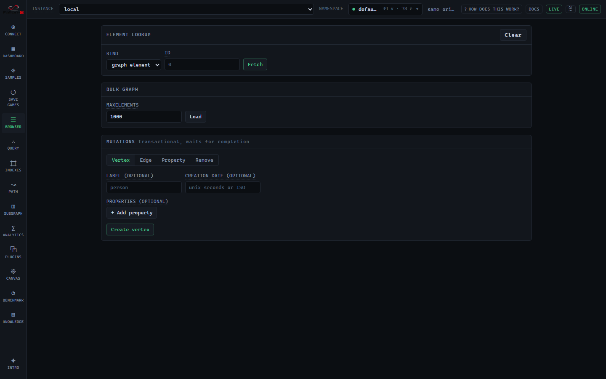

Look up a graph element, vertex, or edge by id. The inspector shows the label, timestamps, edge endpoints, and two tabs: **Properties**, and **Embeddings** to set, replace, or remove a named embedding on the element from a pasted vector or (with the provider) from text ([semantic-traversal.md](/fallen-8-core/semantic-traversal/)). An adjacency panel lists neighbors with degrees for one-click hopping, and a bulk view loads up to `maxElements` with a truncation badge and a filter. A mutations panel creates and edits vertices, edges, and properties ([graph-model.md](/fallen-8-core/graph-model/)). "Send to canvas" is available throughout.

## Knowledge

Documents in, graph out ([unstructured-ingestion.md](/fallen-8-core/unstructured-ingestion/)): the semantic layer over the graph, last in the rail after Benchmark. A **State** panel reports the index binding and creates the required indices on request (nothing is created implicitly; ingestion is refused until the layer is bound). Drop a file on the dropzone or paste text, watch the ingest land live (it is queued and its row flips from processing to indexed over the change feed), browse the deduplicated **entity network** the text mentions, and search the chunks. A document row expands into its chunks (order, kind, heading path, extracted identifiers, a text preview) and can be deleted, which cascades its chunks and every edge on them behind a typed confirm.

**Search chunks** takes the query text, a **mode** (`fused`, or `dense` / `lexical` to isolate one retrieval side), `k`, and a neighbour **window** to expand each hit with, and it names the mode actually used, so a `fused` run that degraded to one side is visible rather than silent. "Send hits to canvas" turns hits into ordinary chunk vertices there, ready to inspect, expand, or use as path seeds; a single row's **Inspect** sends just that chunk. The screen gates on the instance's ingestion capability and states its degraded modes plainly: provider off means text-only ingest, docling sidecar unreachable means txt/md only. A budget line tracks chunk usage against the enforced namespace ceiling.

## Integrations

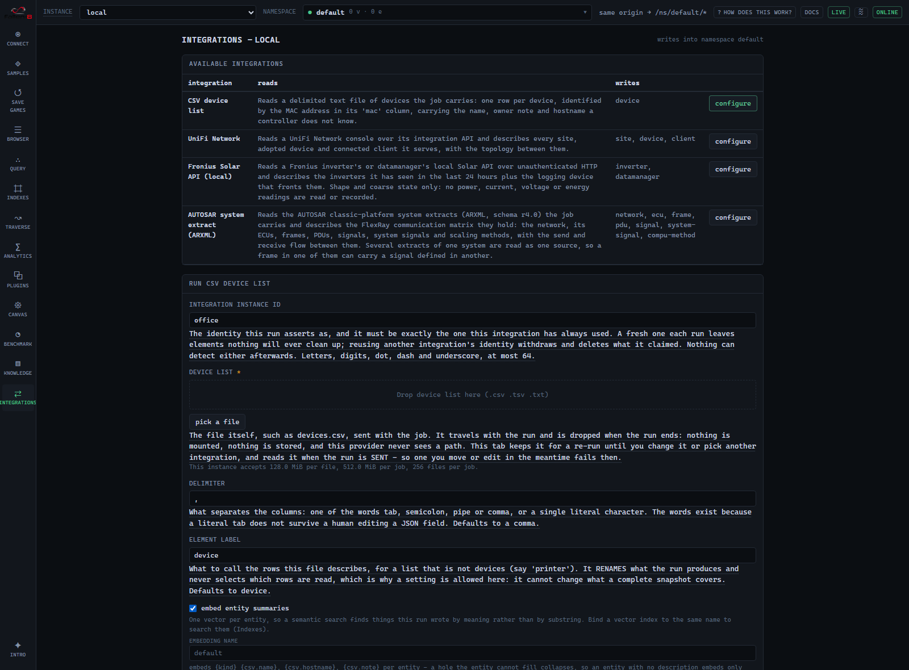

Run an [integration](/fallen-8-core/integrations/) against a system on your own network. The screen is rendered from the runtime's descriptors alone - nothing about any particular integration is coded here - so the **Available integrations** table (what each one reads, and what kinds it writes) and the run form below it appear for a fourth integration the moment the runtime offers one.

The form is the descriptor's own settings, in its own words: required fields marked, defaults pre-filled, and **run now** disabled until the ones it cannot run without are there (it says which). The **integration instance id** is the identity the run asserts as, and the screen spells out what that means, because it is the one field nobody can fix afterwards: a fresh id leaves the previous run's elements claimed by nothing, and reusing another integration's id withdraws and deletes what that one owned. A credential setting is used for the single run and then forgotten - nothing stores it and no report echoes it - so it is typed here each time. Submitting shows the run's report: what it created, matched, withdrew and deleted, plus any diagnostics, which is the honest account of one run rather than a success toast.

The screen is present only when the instance has an integrations runtime behind its proxy; without one it says so instead of offering a form that cannot work.

## Query

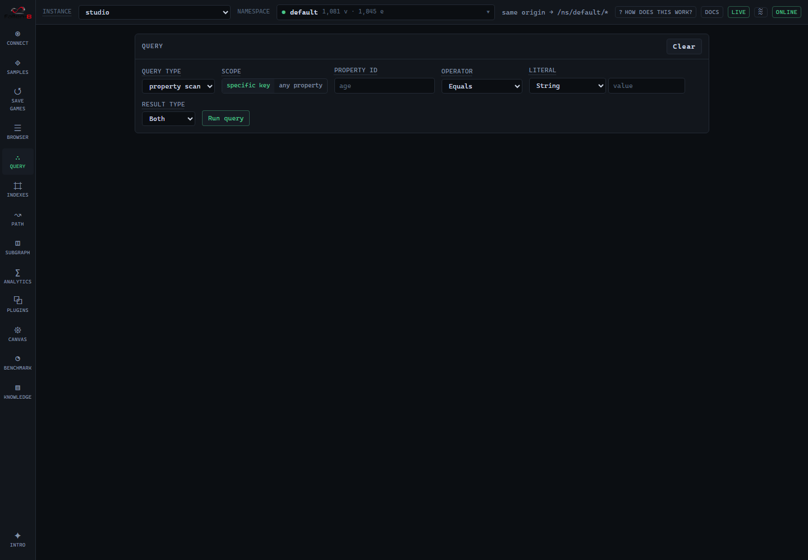

Two modes. A **property scan** has two scopes, both taking a result type (Vertices / Edges / Both): **specific key** takes a property id, a comparison operator, and a typed literal; **any property** takes a single search term and an optional label restrictor, and returns the elements any of whose property values contains the term (case-insensitive, values compared as text so numbers and dates match too). It is a cold, un-indexed full-graph scan meant for discovery; index a property for repeated or large-graph lookups. **Ask an index** picks from the live inventory and offers only the forms the index answers: equality/operator, range, fulltext, spatial, or vector (kNN). A vector query is entered as a pasted vector or as text embedded server-side by the provider, with `k`, an element-kind filter, and a label constraint. Results report the id count, a vector metric legend (higher/lower is better), fulltext highlights, and a scored table; send the whole result set to the canvas, or add a single row's element with its per-row canvas action. Index semantics live in [indexes.md](/fallen-8-core/indexes/) and [vector-search.md](/fallen-8-core/vector-search/).

Stored queries are not managed here: a stored query is unique to its scenario (`Path` or `SubGraph`), so it is registered and managed on the **Path** and **Subgraph** screens ([stored-queries.md](/fallen-8-core/stored-queries/)).

## Canvas

Renders exactly what you send from the Browser, Query, Path, Subgraph, Analytics, Knowledge, or Samples screens; it never loads anything on its own. Two toolbar actions control that working set, both view-only (the database is never touched). **Show whole graph** is the one explicit way to put everything on the canvas in a single click: it merges up to 20,000 vertices and 20,000 edges into the view, and when the namespace is bigger an honest "showing the first X of Y" notice appears next to the element count instead of silently pretending the graph is complete. **Clear view** empties the working set entirely: nodes, edges, the path overlay, and the current selection; your style configuration and the other screens' state survive.

The right-hand panel is a tool strip with three tabs (**Style**, **Find**, and **Connect**) over a shared **detail** panel that always shows whatever node or edge you have selected. Style, the default tab, is sectioned:

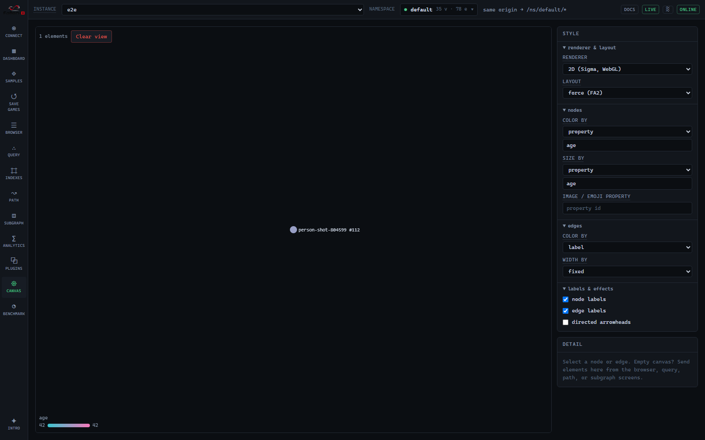

| Section | Controls |
|---|---|
| renderer & layout | 2D (Sigma, WebGL) or 3D (three.js); 2D layouts force/circular/circle-pack/grid/random, 3D force/dag-top-down/dag-radial |
| nodes | color by label or property; size fixed, by property, or by in-/out-/total degree; image or emoji from a property |
| edges | color by label or property; width fixed or by property |
| labels & effects | node and edge label toggles, directed arrowheads |

When you switch **color by** or **size by** (and the edge equivalents) to **property**, a text field appears directly under the picker for the property key. It is seeded with the first property present on the canvas so it is never blank, suggests the other keys as you type, and stays free text, so you set the key yourself. You do not hand-pick the colors: each distinct value gets a stable color from a fixed palette, unless every value is numeric, in which case elements shade along a cyan→pink gradient; missing or blank values render grey. Sizes and widths from a numeric property are min-max scaled into a range. For edges, "label" anywhere on this panel means the display name: the edge's optional label, falling back to its type, `edgePropertyId` ([edge type vs label](/fallen-8-core/graph-model/#edge-type-vs-label)).

**Find** searches the whole graph without leaving the canvas. It reuses the all-property search (a case-insensitive substring across every property value, optionally narrowed to one label), so you type a term (e.g. `acme`), pick vertices/edges/both, and get a compact result list of matches. Each row shows the element's id and label, whether it is **already on the canvas**, and a one-click add; **Send all** adds every match at once (the first 500 are hydrated). Clicking a row's id selects it into the detail panel below, so you can inspect an element's full properties before deciding to add it. Hovering a row spotlights that element's node on the canvas with a brief eclipse-style corona, so you can see where a match already sits before adding more. It is an un-indexed discovery scan; for hot or very large graphs, an [index](/fallen-8-core/indexes/) is the right tool.

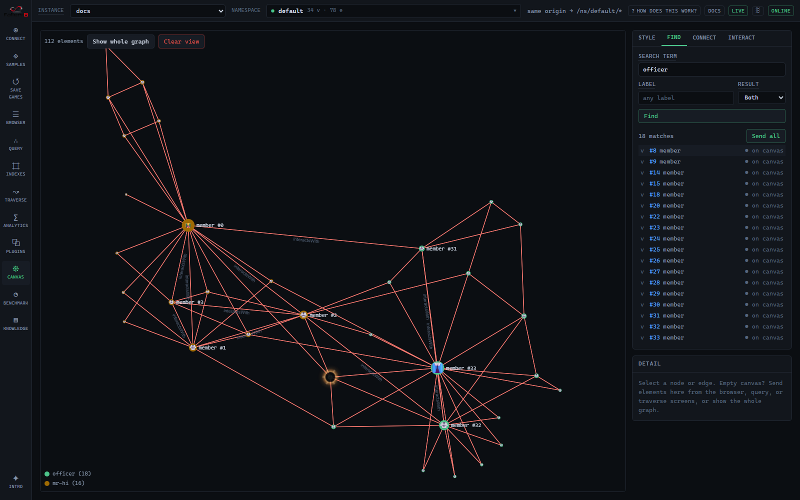

**Connect** reveals how the vertices already on the canvas relate. It runs Fallen-8's shortest-path search (BLS) between every pair of canvas vertices, up to a **max hops** you set, and lists each connection it finds. Point it at **all** canvas vertices or **pick** a subset from a filterable list; the panel always shows how many pairs a run will search and refuses to start above a 500-pair budget (pick fewer vertices to narrow), because a partial sweep would falsely report pairs as unreachable. A long run shows per-pair progress and can be **cancelled**. Each found connection can be **added or removed** individually (or all at once): adding merges only the intermediate vertices and edges the path introduces, and removing a connection keeps any intermediate that another kept connection still runs through. Nothing here touches the database; it is all view assembly.

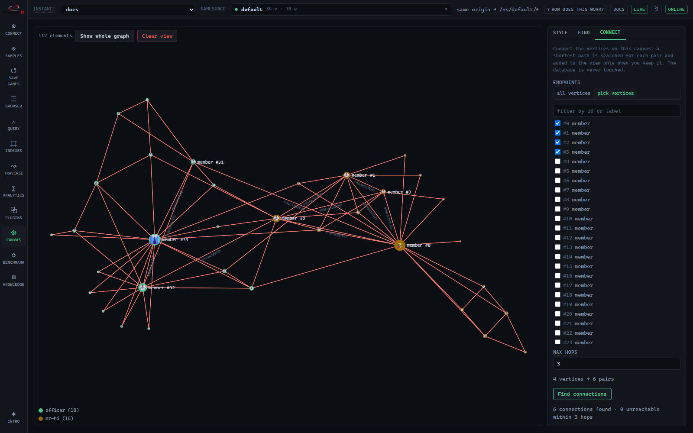

A legend (categorical or gradient) reflects the active color mode. Selecting a node or edge (on the canvas, or from a Find result) opens the detail panel with its properties; **Expand neighbors** merges a vertex's 1-hop neighborhood, and **Remove from view** affects only the canvas: it never deletes from the database. A path found on the Path screen arrives as a highlighted overlay.

## Path

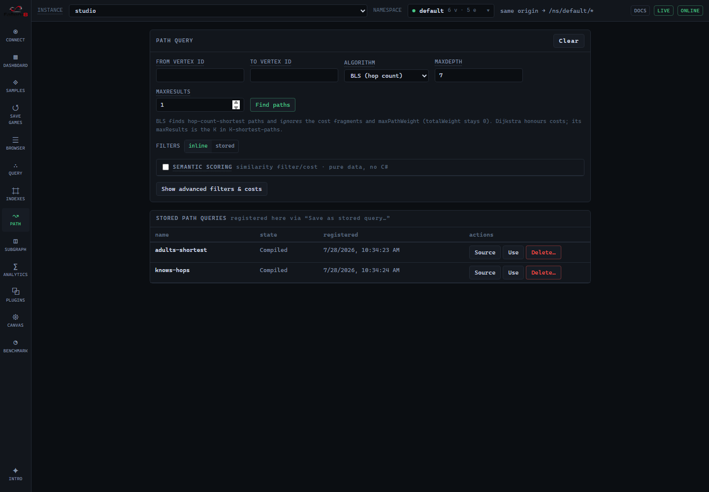

From/to vertex ids, algorithm **BLS** (hop count) or **Dijkstra** (weighted), `maxDepth`, `maxResults` (the K for Dijkstra's K-shortest-paths), and `maxPathWeight` (Dijkstra only; BLS ignores costs). The algorithm picker also lists this namespace's runtime-registered path plugins, marked `(registered)`, so a plugin authored on the **Plugins** screen becomes usable here. Filters and costs come from **inline fragments or a stored query**, kept mutually exclusive by a source toggle. The inline advanced tier exposes five delegate slots (`filter.vertexFilter`, `filter.edgeFilter`, `filter.edgePropertyFilter`, `cost.vertexCost`, `cost.edgeCost`) each authored in the delegate editor, and the set can be saved as a stored query. A **semantic scoring** block (query vector + `minScore` filter + `costBySimilarity`) is pure data and compiles no C#. Results list each path's hops and total weight with "Overlay on canvas". A **Stored path queries** panel below manages this instance's `Path` entries: read-only source, recompile diagnostics, delete, and a **Use** action that loads one back into the filter picker.

Because fragments are validated in the editor before the query runs, an empty result here is a genuine "no paths found" rather than a swallowed compile error. Inline fragments always run (dynamic code execution is always on); on a key-protected instance they need the API key like any other request. Algorithm behavior: [path-finding.md](/fallen-8-core/path-finding/); semantic scoring: [semantic-traversal.md](/fallen-8-core/semantic-traversal/).

## Subgraph

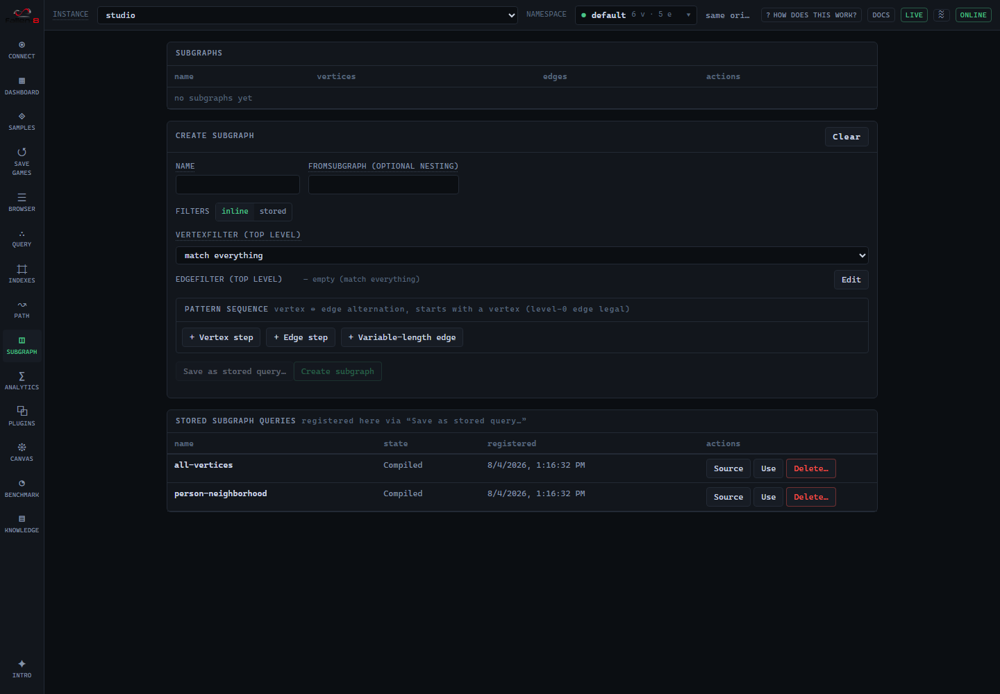

A table lists existing subgraphs (with a badge for semantic ones) offering To canvas / Recalculate / Delete. The create form takes a name and an optional `fromSubGraph` for nesting, an inline-or-stored source toggle, a top-level `vertexFilter` (fragment or semantic mode) and `edgeFilter`, and a **pattern sequence builder**: add Vertex, Edge, or Variable-length edge steps with type, name, direction, and min/max length. Vertex↔edge alternation is validated as you build. A **semantic query** section appears when any vertex slot is in semantic mode (one query per request, bound at creation), and the whole specification can be saved as a stored query. A **Stored subgraph queries** panel below manages this instance's `SubGraph` templates: read-only source, recompile diagnostics, delete, and a **Use** action that loads one into the picker. Concept and rules: [subgraphs.md](/fallen-8-core/subgraphs/).

## Analytics

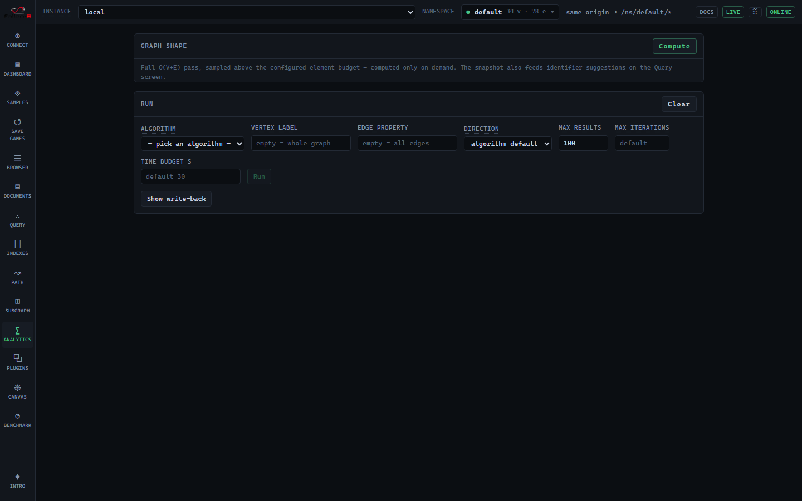

**Graph shape** runs an on-demand `GET /statistics` pass, counts, top vertex/edge labels and property keys, degree percentiles, and the index list; its snapshot also feeds identifier suggestions across Studio. Elements the server tallied under no label (and properties under no key) keep their own bucket, rendered as a faint `<no label>` / `<no key>` row, so the cardinality lists always add up to the totals. **Run** picks an algorithm from the live plugin list, scopes it by vertex label / edge property / direction, and sets max results, max iterations, and a time budget (PageRank adds damping and epsilon). Optional **write-back** stamps each score onto a vertex property (snapshot-durable only), which you can then color by on the Canvas to read results spatially. The result panel shows convergence, statistics, partitions with paged members, and a scored table. A run already in progress returns 429; an exhausted budget returns 408. Algorithms and semantics: [graph-analytics.md](/fallen-8-core/graph-analytics/).

## Plugins

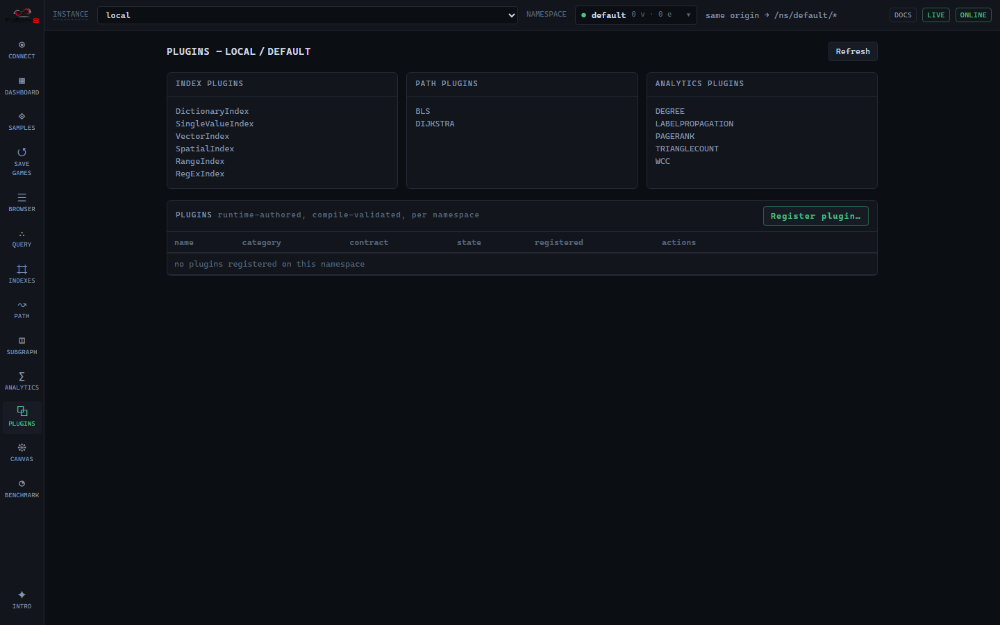

The one home for everything plugin-related. The top row shows the **built-in plugin families** discovered on the engine (index / path / analytics) from `GET /status`. Below it, the **registry** table lists the active namespace's runtime-authored, compile-validated plugins (name, category, contract, and compile-state badge) with read-only source and recompile diagnostics, a function runner for a registered graph function, and delete (entries are immutable: delete and re-register is the edit flow). **Register plugin…** opens the whole-type authoring editor. Registrations are per namespace. Concept and REST: [plugins.md](/fallen-8-core/plugins/).

## Indexes

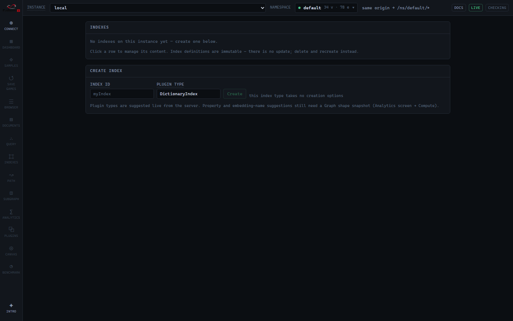

The inventory table shows each index's id, type, query capabilities, key/value counts, and a **binding badge** when a vector index is bound to a named embedding (a self-maintained projection). Row actions are Query (jumps to the Query screen with the index preselected) and Delete (typed confirm). Create takes an id and plugin type; a VectorIndex adds dimension, metric, and an optional embedding binding and model. SpatialIndex cannot be created over REST. Per-index content management (typed-key add/remove, vector add, element remove) follows the index's capabilities: a bound vector index manages its own content and rejects manual writes. Index types and REST: [indexes.md](/fallen-8-core/indexes/).

## Save games

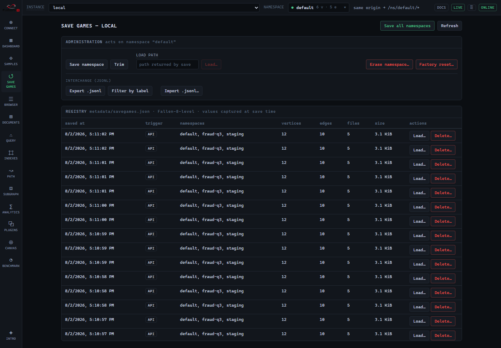

The persistence home. The top is the **Administration** section, holding the namespace-scoped persistence and lifecycle actions (they act on the active namespace shown in the top bar): **Save namespace**, **Trim**, **Load** from a checkpoint path, **Erase namespace**, and the Fallen-8-wide **Factory reset** (the destructive actions require typing the target name). An **interchange (jsonl)** subsection exports the graph (optionally filtered by label or edge type) and imports jsonl into an empty graph, import requires an empty target, which the server enforces with a 409 ([bulk-import-export.md](/fallen-8-core/bulk-import-export/)).

Below it is the persistent checkpoint registry as a Fallen-8-level table: saved-at, trigger, member namespaces, aggregate counts, file count, and size. "Save all namespaces" writes one entry spanning every namespace; **Load** restores the entire entry or a single namespace (typed confirm); **Delete** optionally removes the checkpoint files on disk. The registry lists every entry; once it grows past about fifteen rows it caps its height and a scrollbar scrolls through the rest, so a long save history never grows the page (no rows are hidden below a 10,000-row safety ceiling). Semantics: [save-games.md](/fallen-8-core/save-games/).

## Benchmark

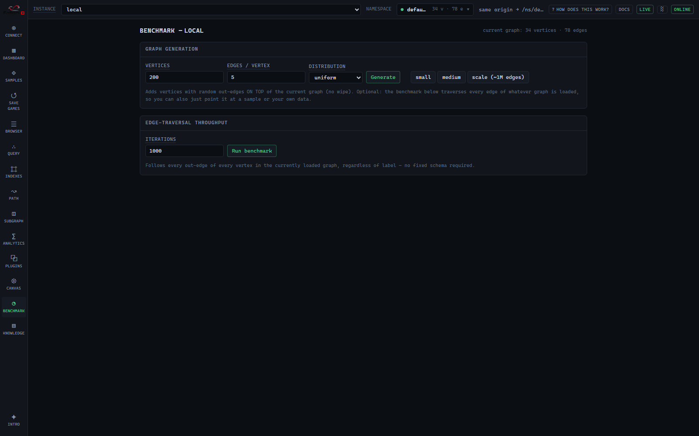

Fallen-8-level. **Graph generation** optionally adds random vertices with out-edges *on top of* the current graph (no wipe); you can equally point the benchmark at a sample or at your own data. The **edge-traversal** run then follows every out-edge of every vertex and reports edges per run and average/median/stddev TPS, with a per-session history. It measures raw edge-traversal throughput, not query latency or analytics. Presets, what the numbers mean, and the REST equivalents: [benchmark.md](/fallen-8-core/benchmark/).

## The delegate editor

Opened from every fragment slot on the Path and Subgraph screens (the Query screen uses no fragments). It is a Monaco C# editor with per-kind snippets for the five slot types, `VertexFilter`, `EdgeFilter`, `EdgePropertyFilter`, `VertexCost`, `EdgeCost`. It validates as you type against the server (`POST /delegates/validate`) and renders diagnostics inline at the returned positions; **Use fragment** is blocked until the exact text on screen has passed validation (an empty fragment means "match everything"). Validation and inline fragment execution are always available; they only need the instance's API key when one is configured ([security.md](/fallen-8-core/security/)). The compilation model is owned by [delegates.md](/fallen-8-core/delegates/).

### NL assist

The editor's side panel drafts a fragment from a natural-language description, calling a model through one of two backends:

| Setting | Detail |
|---|---|
| backend | **this Fallen-8 instance** (default) or **custom endpoint** (browser-direct) |
| instance mode | browser → the active instance's `POST /chat` → its model backend (the Ollama sidecar). The model is server-owned (`Fallen8:Chat:Ollama:Model`, default `phi4-f8-mini`); nothing to configure. Needs the instance's chat gateway enabled (`Fallen8:Chat:Enabled` / `F8_CHAT`), [semantic-traversal.md](/fallen-8-core/semantic-traversal/). |
| custom mode | the browser calls the endpoint **directly**; api kind `ollama` or `openai`-compatible; presets for the fine-tuned `phi4-f8-mini`/`phi4-f8`, stock `phi4-mini`/`phi4`, OpenAI, Anthropic. Any API key is held only in the browser and never sent to a Fallen-8 instance. |

Instance mode is the default because Fallen-8 is now the semantic gateway (embeddings and chat both proxy through the instance). **This retires the earlier "never through the Fallen-8 instance" rule for the default path**: the prompt travels to the same instance you already trust with your graph, so instance mode shows no egress notice; the surviving guarantee is that a **custom** endpoint and its key stay browser-direct and never reach F8. A non-loopback custom endpoint still shows the "text leaves this machine" notice.

Each draft is inserted as ordinary editable text and run through the same validation the editor uses, never auto-submitted; on an invalid draft the editor feeds the compiler diagnostics back to the model and retries a bounded number of times before stopping. Drafts accumulate in a scrollable list with the **newest on top**; each is highlighted as awaiting review until you judge it 👍/👎, and the rated ones can be exported as training examples. A model that is not present on the backend makes the call 404 ([troubleshooting.md](/fallen-8-core/troubleshooting/)). The plugin authoring editor's NL panel works the same way.

## Server capabilities Studio uses

Studio degrades gracefully when a capability is off, but these features need server-side support:

| Studio capability | Needs on the server | Docs |
|---|---|---|
| Delegate validation + inline path/subgraph filters & costs | The API key when one is configured (dynamic code is always on) | [security.md](/fallen-8-core/security/) |
| NL assist drafting (instance mode, default) | The chat gateway enabled (`Fallen8:Chat:Enabled` / `F8_CHAT`) + its Ollama backend reachable | [semantic-traversal.md](/fallen-8-core/semantic-traversal/) |
| NL assist drafting (custom mode) | A reachable model backend the browser calls directly (`OLLAMA_ORIGINS` for a browser-direct Ollama) | [security.md](/fallen-8-core/security/) |
| Text-in embedding, semantic search, text query vectors | Embedding provider enabled | [semantic-traversal.md](/fallen-8-core/semantic-traversal/) |
| The whole Knowledge screen (document ingest, chunk search, entities) | Ingestion enabled (`Fallen8:Ingestion:Enabled` / `F8_INGESTION`), plus the docling sidecar for pdf/docx/xlsx/pptx/html; without it, txt/md only | [unstructured-ingestion.md](/fallen-8-core/unstructured-ingestion/) |
| The entity network over ingested documents | The NLP sidecar (`Fallen8:Nlp:Enabled` / `F8_NLP`); enrichment is additive, so ingestion still succeeds without it | [unstructured-ingestion.md](/fallen-8-core/unstructured-ingestion/) |
| Stored-query invocation (Path / Subgraph) | The API key when one is configured (no capability gate on top of it) | [stored-queries.md](/fallen-8-core/stored-queries/) |
| Live chip, push refreshes, the Events panel | Change feed enabled | [change-feed.md](/fallen-8-core/change-feed/) |
| "Any GitHub repo" sample card | Internet access to GitHub's dependency graph | [samples.md](/fallen-8-core/samples/) |

## See also

- [running.md](/fallen-8-core/running/): how Studio is built and served
- [delegates.md](/fallen-8-core/delegates/): the delegate model Studio helps you author
- [namespaces.md](/fallen-8-core/namespaces/) · [security.md](/fallen-8-core/security/) · [rest-api.md](/fallen-8-core/rest-api/): the model and surface behind the UI
