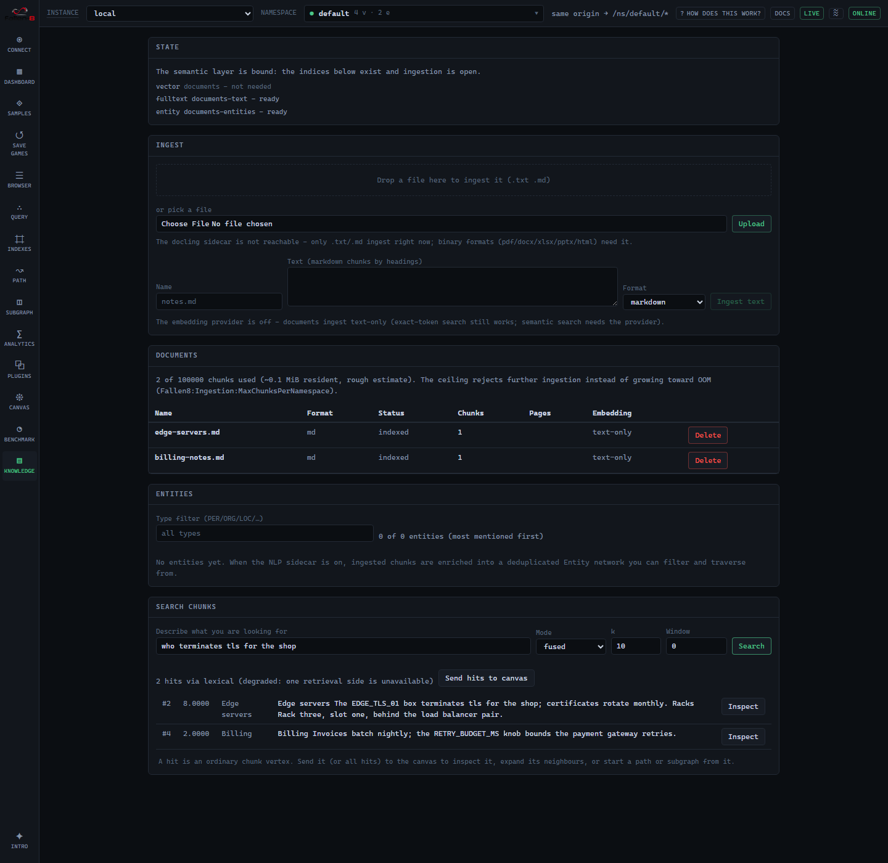
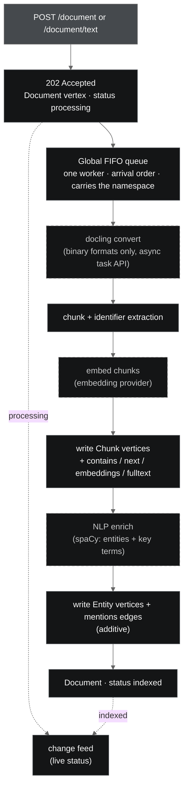

Fallen-8's **semantic layer** takes unstructured documents (PDF, Word, Excel, PowerPoint,
HTML, markdown, plain text) and turns them into ordinary graph state: one **Document
vertex**, its content as **Chunk vertices** carrying the text and an embedding, a
deduplicated network of **Entity vertices** the text mentions, and typed edges between them.
From there everything you already know applies, because nothing about these vertices is
special: fused search finds a chunk by describing it, and the hit is a vertex id you can feed
straight into [path finding](/fallen-8-core/path-finding/) or
[subgraphs](/fallen-8-core/subgraphs/).

The scenario this serves: you keep describing knowledge in documents. Ingest them, then type
*"the server that terminates TLS for the shop"*, land on the matching chunk, and walk the
graph from there, through the entities it mentions.

**Want to see it rather than read it?** The
[Wind Farm Fleet Integrity sample](/fallen-8-core/samples/) loads an asset graph and ingests
three synthetic documents (a PDF with a figure, a spreadsheet, a markdown standard) through this exact
pipeline in one click, then walks you to the payoff: a chunk whose `mentions` edges reach both
the entity network and the real equipment, and a fleet-wide risk that no document states.



## Quick start

In the [compose environment](/fallen-8-core/running/) ingestion is on by default: the
`docling` sidecar (document conversion) and the `nlp` sidecar (entity/term extraction) start
with everything else, and F8 Studio's **Knowledge** screen (last in the rail, after Benchmark)
offers upload, drag-and-drop, raw-text ingest, the entity view and search. Opt out of the
whole thing with `F8_INGESTION=false`, or of just the entity enrichment with `F8_NLP=false`.

Before the first ingest you **bind the semantic layer** once, creating the indices it uses.
Nothing is created implicitly (see [Binding](#binding-the-semantic-layer)); in the Studio the
**State** panel does it with one click.

Over REST:

```bash
# 1. Bind the layer once (creates the required indices; idempotent):
curl -sf -X POST http://localhost:8080/document/binding/ensure

# 2. Markdown/plain text ingests WITHOUT the docling sidecar:
curl -sf -X POST http://localhost:8080/document/text \
     -H "Content-Type: application/json" \
     -d '{ "name": "edge-notes.md", "text": "# Edge\n\nEDGE_TLS_01 terminates tls." }'

# Binary formats convert in the docling sidecar first:
curl -sf -X POST http://localhost:8080/document -F "file=@handbook.pdf"

# Manage:
curl -sf http://localhost:8080/document            # list + chunk budget
curl -sf http://localhost:8080/document/3          # one document + chunk previews
curl -sf http://localhost:8080/document/entities   # the entity network, most-mentioned first
curl -sf -X DELETE "http://localhost:8080/document/3?waitForCompletion=true"
```

A bare `dotnet run` has ingestion off (`Fallen8:Ingestion:Enabled`, default `false`); every
`/document` route answers 403 until it is enabled. `GET /status` carries the whole capability
state (`ingestion`: enabled flag, accepted formats, sidecar reachability, enforced limits;
`nlp`: enabled/configured/reachable), which is exactly what the Studio gates its UI on.

## The pipeline, end to end

Ingestion is **asynchronous**: the request creates the Document stub and returns `202
Accepted` immediately; the heavy work (convert, chunk, embed, enrich, write) runs off the
request thread on a **single global FIFO queue** shared by every namespace, drained in arrival
order by one worker. A large scanned PDF never blocks the caller or holds a connection open;
its Document row simply shows `processing` and flips to `indexed` when the worker finishes,
live over the [change feed](/fallen-8-core/change-feed/).



Step by step, and the order matters:

1. **The Document vertex is created first** with `status: processing`, then the job is
   enqueued and `202` returned. Status transitions are ordinary committed property writes, so
   progress rides the change feed with no special machinery. A worker that dies mid-flight
   leaves a `processing` row; the next startup sweeps it to `failed:interrupted`.
2. **Parse.** Binary formats convert in the [docling-serve](https://github.com/docling-project/docling-serve)
   sidecar (MIT) over its async task API, which returns structured output: heading hierarchy,
   intact tables and page numbers survive. OCR is **off by default** (born-digital PDFs need
   none, and it is the dominant cost on scanned documents); turn it on with
   `Docling:DoOcr=true`. Markdown and plain text skip this step entirely, so text ingestion
   works with the sidecar down (binary formats answer 503 with a reason).
3. **Chunk.** Sections split along headings, merge below `ChunkMinChars` (default 800), split
   above `ChunkMaxChars` (default 4,000) at paragraph boundaries. Tables stay intact as their
   own `kind: table` chunks; oversize tables split into row windows that repeat the header.
   Identifier-shaped tokens (`RETRY_BUDGET_MS`, `CheckoutService`, `0x1A2B`) are extracted per
   chunk into its `identifiers` property.
4. **Embed.** Chunk texts embed through the [embedding provider](/fallen-8-core/vector-search/)
   in batches. With the provider off, pass `"embed": false` to ingest text-only; ingestion
   never silently skips embedding.
5. **Write the chunks.** Chunk vertices (`Chunk`), `contains` edges from the document, `next`
   edges in reading order, the embeddings, and a mirror of each chunk's text into the fulltext
   index. This happens **before** enrichment on purpose: the chunks are durable first, which is
   what lets the next step be additive. A failure up to here leaves exactly one failed Document
   vertex and zero chunks; `DELETE /document/{id}` removes any document with its whole subtree.
6. **Enrich (optional), then write entities.** When the `nlp` sidecar is on, the
   already-written chunks are sent to it and the result folds into the graph as an
   [entity network](#the-entity-network): Entity vertices and `mentions` edges in their own
   pass. Enrichment is **additive** - if NLP is off, unreachable, or errors, the document still
   reaches `indexed` with `enriched: false` and its chunks intact. It never fails an ingest.

## Binding the semantic layer

The layer **creates no index implicitly**. Ingestion resolves the indices it needs and answers
`428 Precondition Required` until they exist, so an index is never conjured as a side effect of
an upload. You bind once, explicitly:

```bash
curl -sf http://localhost:8080/document/binding          # the state: which indices, ready?
curl -sf -X POST http://localhost:8080/document/binding/ensure   # create the missing ones
```

Three roles make up the binding, each an ordinary index you can also create yourself (with the
configured id and shape) on the Indexes screen:

- **vector** (`documents`) - a bound vector index over the chunk embeddings; the kNN side of
  fused search. Required when embeddings are on.
- **fulltext** (`documents-text`) - the lexical side of fused search.
- **entity** (`documents-entities`) - a dictionary index that deduplicates Entity vertices;
  required when NLP is on.

`GET /document/binding` reports each role's `exists`/`ready` state and an overall `ready`; the
Studio's **State** panel renders exactly that and offers a single "Create the required indexes"
button. `ensure` is idempotent, and it refuses (409) to reuse an id already held by a
wrong-shape index rather than clobbering it.

## The entity network

With the `nlp` sidecar on, ingestion enriches chunks into a deduplicated **Entity** graph. The
sidecar is a small, offline FastAPI + [spaCy](https://spacy.io) service (MIT), **English-only**,
that returns named entities (`doc.ents`) and key terms (noun chunks) per chunk. It runs in one of
two tiers, chosen automatically by the same NVIDIA-GPU detection that accelerates NL assist:

- **No GPU (default):** the CPU-friendly `en_core_web_lg` model.
- **NVIDIA GPU:** the `en_core_web_trf` transformer (roberta) model on the device, for
  best-in-class English accuracy. `npm run env:up` applies this automatically; `F8_GPU=0/1`
  forces the tier either way.

The output is identical in both tiers; only accuracy differs. Override the model with the
`F8_NLP_MODEL` build ARG (kept in lockstep with the runtime env of the same name).

- **Entity vertices** (label `Entity`) are **deduplicated per namespace** on `(type,
  normalized text)`, so the same organisation mentioned across ten chunks and three documents
  is one vertex. It carries `text` (the first surface form seen), `type` (the spaCy label, e.g.
  `PERSON`/`ORG`/`GPE`) and `normalized`.
- **`mentions` edges** run chunk -> entity, capped per chunk (`Nlp:MaxEntitiesPerChunk`).
- **Key terms** land on the chunk as a newline-joined `keyTerms` property.

```bash
# The entity network, most-mentioned first; filter by type or substring:
curl -sf "http://localhost:8080/document/entities?type=ORG&limit=50"
```

Each entity id is a valid graph seed. In the Studio the **Entities** view lists them (with a
type filter and mention counts) and "Canvas" drops one on the canvas, where expanding its
`mentions` reaches every chunk it appears in - a describe-find-traverse loop that runs through
the concepts the corpus talks about, not just its text.

## Fused search

`POST /document/search` retrieves chunks with **two signals fused**: dense kNN over the
embeddings and lexical matching over the fulltext index, combined with reciprocal rank fusion.
The reason is honest engineering, not fashion: dense embeddings are famously weak at exact
identifiers, which is precisely the token class documents about real systems are full of. A
query like `PORT_X9_LIMIT` lands via the lexical side even when the embedding misses it; a
query like *"who terminates tls"* lands via the dense side.

```bash
curl -sf -X POST http://localhost:8080/document/search \
     -H "Content-Type: application/json" \
     -d '{ "queryText": "the server that terminates tls", "k": 5, "window": 1 }'
```

- `mode`: `fused` (default), `dense`, or `lexical`. When one side is unavailable (the provider
  is off, an index is absent) a fused request degrades and the response says so in `modeUsed`;
  nothing pretends.
- `window`: up to 5 sibling chunks each side of a hit over `next` edges, so a hit comes with
  its surrounding context in one call.
- `groupByDocument`: groups hits per document (documents by best hit, chunks in document
  order) with the document summary attached.
- Scores are mode-dependent: RRF when fused, raw kNN when dense, match counts when lexical.

### From a hit into the graph

A hit is a live Chunk vertex. Three ways to keep going:

- **Traverse the document**: follow `contains` (up to the Document), `next` (reading order), or
  ask for the `window` in the search call.
- **Traverse the domain graph**: follow `mentions` to the entities the chunk names, or to your
  own domain vertices when you [linked](#linking-chunks-to-your-graph) them;
  `POST /path/{chunkId}/to/{target}` and [semantic traversal](/fallen-8-core/semantic-traversal/)
  work unchanged.
- **In the Studio**: "Send hits to canvas" on the Knowledge screen puts the chunk vertices on
  the canvas, where neighbor expansion and path seeding are one click.

## Linking chunks to your graph

Opt-in per ingest request, ingestion can connect chunks to existing **domain** vertices by
exact identifier match: every extracted token is looked up in an allowlist of your
equality-capable indices (dictionary, range, single-value or fulltext; a vector or spatial
index is rejected up front), and each hit gets a `mentions` edge from the chunk. No fuzzy
matching, no model in the loop, a hard per-chunk cap, deterministic order. (This is the same
edge type the entity network uses; a chunk's `mentions` edges reach both the entities NLP found
and the domain vertices you linked.)

```bash
curl -sf -X POST http://localhost:8080/document/text \
     -H "Content-Type: application/json" \
     -d '{ "name": "notes.md", "text": "EDGE_TLS_01 moved racks.",
           "link": { "indexIds": ["server-names"], "maxLinksPerChunk": 8 } }'
```

Linking finds a domain vertex only when an extracted token equals its indexed value exactly, so
this loop wants **identifier-shaped names** (`EDGE_TLS_01`, `CheckoutSvc`) on the vertices you
link against; prose names with spaces do not extract.

## Limits and the memory ceiling

Fallen-8 is an in-memory engine, so the ceiling is a first-class, enforced setting rather than
an OOM. Everything lives under `Fallen8:Ingestion` (and `Fallen8:Nlp` for enrichment):

| Setting | Default | What it bounds |
| --- | --- | --- |
| `Enabled` | `false` | The capability; 403 on every `/document` route when off |
| `MaxUploadBytes` | 32 MB | Upload size, checked before parsing (413) |
| `MaxPages` | 500 | Converted page count (the ingest fails, honestly) |
| `MaxChunksPerDocument` | 2,000 | Chunks a single document may yield |
| `MaxChunksPerNamespace` | 100,000 | The namespace ceiling: further ingestion answers 507 |
| `MaxQueueLength` | 256 | Depth of the global ingestion queue: enqueue beyond it answers 503 |
| `ChunkMinChars` / `ChunkMaxChars` | 800 / 4,000 | Chunk size bounds |
| `MaxLinksPerChunk` | 16 | Hard cap for linked `mentions` edges per chunk |
| `Docling:DoOcr` / `Docling:TimeoutSeconds` | `false` / 600 | OCR (off), overall async convert budget |
| `Nlp:Enabled` / `Nlp:MaxEntitiesPerChunk` | `false` / 32 | NLP enrichment, `mentions` cap per chunk |

A chunk costs roughly 25 to 30 kB resident (UTF-16 text, the vector on the element and again in
the bound index, the fulltext mirror), so the default ceiling is about 3 GB of document state
per namespace. `GET /document` reports current usage against the ceiling, and the Studio shows
the budget on the Knowledge screen. Duplicate uploads (same content hash) answer 409; replace a
document with `replaceDocumentId`, which ingests the new content fully before removing the old.

Documents record which embedding model their chunks carry. After a provider model change, `GET
/document` flags stale documents (`embeddingModelStale`) and the Studio badges them; re-embed by
re-ingesting or via the bulk `/embedding/elements` endpoint with the chunk texts.

## AI agents

The [MCP server](/fallen-8-core/mcp-server/) bridges this surface as the `f8_documents` tool,
so an agent binds the layer, writes its findings into the graph as searchable, linkable
documents, and reads back the entity network - the natural memory loop. Binary file upload
stays REST-only by design (base64 through tool calls wastes tokens).
