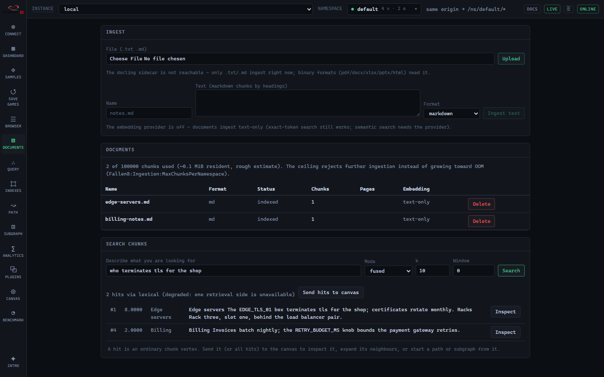

Fallen-8 can take unstructured documents (PDF, Word, Excel, PowerPoint, HTML, markdown,
plain text) and turn them into ordinary graph state: one **Document vertex**, its content
as **Chunk vertices** carrying the text and an embedding, and typed edges between them.
From there everything you already know applies, because nothing about these vertices is
special: fused search finds a chunk by describing it, and the hit is a vertex id you can
feed straight into [path finding](/fallen-8-core/path-finding/) or
[subgraphs](/fallen-8-core/subgraphs/).

The scenario this serves: you keep describing knowledge in documents. Ingest them, then
type *"the server that terminates TLS for the shop"*, land on the matching chunk, and
walk the graph from there.



## Quick start

In the [compose environment](/fallen-8-core/running/) ingestion is on by default: the
`docling` sidecar (document conversion) starts with everything else, and F8 Studio's
**Documents** screen offers upload, raw-text ingest and search. Opt out with
`F8_INGESTION=false`, which disables the capability and skips the ~4.4 GB sidecar image
in one move.

Over REST:

```bash
# Markdown/plain text ingests WITHOUT the sidecar:
curl -sf -X POST http://localhost:8080/document/text \
     -H "Content-Type: application/json" \
     -d '{ "name": "edge-notes.md", "text": "# Edge\n\nEDGE_TLS_01 terminates tls." }'

# Binary formats convert in the docling sidecar first:
curl -sf -X POST http://localhost:8080/document -F "file=@handbook.pdf"

# Manage:
curl -sf http://localhost:8080/document            # list + chunk budget
curl -sf http://localhost:8080/document/3          # one document + chunk previews
curl -sf -X DELETE "http://localhost:8080/document/3?waitForCompletion=true"
```

A bare `dotnet run` has ingestion off (`Fallen8:Ingestion:Enabled`, default `false`);
every `/document` route answers 403 until it is enabled. `GET /status` carries the whole
capability state (`ingestion`: enabled flag, accepted formats, sidecar reachability,
enforced limits), which is exactly what the Studio gates its UI on.

## The pipeline, honestly

Ingestion is parse, chunk, embed, write, and the order matters:

1. **The Document vertex is created first** with `status: processing`. Status transitions
   are ordinary committed property writes, so ingest progress rides the
   [change feed](/fallen-8-core/change-feed/) with no special machinery.
2. **Parse.** Binary formats convert in the [docling-serve](https://github.com/docling-project/docling-serve)
   sidecar (MIT), which returns structured output: heading hierarchy, intact tables and
   page numbers survive. Markdown and plain text skip this step entirely, so text
   ingestion works with the sidecar down (binary formats answer 503 with a reason).
3. **Chunk.** Sections split along headings, merge below `ChunkMinChars` (default 800),
   split above `ChunkMaxChars` (default 4,000) at paragraph boundaries. Tables stay
   intact as their own `kind: table` chunks; oversize tables split into row windows that
   repeat the header. Identifier-shaped tokens (`RETRY_BUDGET_MS`, `CheckoutService`,
   `0x1A2B`) are extracted per chunk into its `identifiers` property.
4. **Embed, before anything else is written.** Chunk texts embed through the
   [embedding provider](/fallen-8-core/vector-search/) in batches; a provider failure
   aborts with the graph untouched. With the provider off, pass `"embed": false`
   explicitly to ingest text-only; ingestion never silently skips embedding.
5. **Write.** Chunk vertices (label `Chunk`), `contains` edges from the document, `next`
   edges in reading order, the embeddings, and a mirror of each chunk's text into a
   fulltext index. A failed ingest never leaves partial chunks: it leaves exactly one
   failed Document vertex whose `error` property says why, and `DELETE /document/{id}`
   removes any document with its whole subtree.

First ingestion in a namespace also ensures two indices: a bound vector index
(`documents`) over the chunk embeddings and a fulltext index (`documents-text`) over the
chunk text. Both are ordinary indices you can inspect on the Indexes screen.

## Fused search

`POST /document/search` retrieves chunks with **two signals fused**: dense kNN over the
embeddings and lexical matching over the fulltext index, combined with reciprocal rank
fusion. The reason is honest engineering, not fashion: dense embeddings are famously weak
at exact identifiers, which is precisely the token class documents about real systems are
full of. A query like `PORT_X9_LIMIT` lands via the lexical side even when the embedding
misses it; a query like *"who terminates tls"* lands via the dense side.

```bash
curl -sf -X POST http://localhost:8080/document/search \
     -H "Content-Type: application/json" \
     -d '{ "queryText": "the server that terminates tls", "k": 5, "window": 1 }'
```

- `mode`: `fused` (default), `dense`, or `lexical`. When one side is unavailable (the
  provider is off, an index is absent) a fused request degrades and the response says so
  in `modeUsed`; nothing pretends.
- `window`: up to 5 sibling chunks each side of a hit over `next` edges, so a hit comes
  with its surrounding context in one call.
- `groupByDocument`: groups hits per document (documents by best hit, chunks in document
  order) with the document summary attached.
- Scores are mode-dependent: RRF when fused, raw kNN when dense, match counts when
  lexical.

### From a hit into the graph

A hit is a live Chunk vertex. Three ways to keep going:

- **Traverse the document**: follow `contains` (up to the Document), `next` (reading
  order), or ask for the `window` in the search call.
- **Traverse the domain graph**: when ingestion created `mentions` edges (below) or you
  drew edges yourself, `POST /path/{chunkId}/to/{target}` and
  [semantic traversal](/fallen-8-core/semantic-traversal/) work unchanged.
- **In the Studio**: "Send hits to canvas" on the Documents screen puts the chunk
  vertices on the canvas, where neighbor expansion and path seeding are one click.

## Linking chunks to your graph

Opt-in per ingest request, ingestion can connect chunks to existing domain vertices by
**exact identifier match**: every extracted token is looked up in an allowlist of your
equality-capable indices, and each hit gets a `mentions` edge from the chunk. No fuzzy
matching, no model in the loop, a hard per-chunk cap, deterministic order.

```bash
curl -sf -X POST http://localhost:8080/document/text \
     -H "Content-Type: application/json" \
     -d '{ "name": "notes.md", "text": "EDGE_TLS_01 moved racks.",
           "link": { "indexIds": ["server-names"], "maxLinksPerChunk": 8 } }'
```

That is the whole describe-find-traverse loop: the document mentions `EDGE_TLS_01`, the
chunk links to your server vertex, and a search hit is one hop from the real graph.

### A worked example

Start from a domain graph whose vertices carry identifier-shaped names and an index over
them, then ingest a dossier that describes them:

```bash
# 1. A domain vertex named like an identifier, and an index over the name.
curl -sf -X POST http://localhost:8080/index \
     -H "Content-Type: application/json" \
     -d '{ "uniqueId": "server-names", "pluginType": "DictionaryIndex" }'
curl -sf -X PUT "http://localhost:8080/vertex?waitForCompletion=true" \
     -H "Content-Type: application/json" \
     -d '{ "label": "server", "properties": [
           { "propertyId": "name", "propertyValue": "EDGE_TLS_01", "fullQualifiedTypeName": "System.String" } ] }'
# (add EDGE_TLS_01 to the index via PUT /index/server-names with that vertex id)

# 2. Ingest a dossier that mentions it, linking against the index.
curl -sf -X POST http://localhost:8080/document/text \
     -H "Content-Type: application/json" \
     -d '{ "name": "runbook.md",
           "text": "# TLS\n\nEDGE_TLS_01 terminates tls for the shop; it fronts the checkout service.",
           "link": { "indexIds": ["server-names"] } }'
# -> linksCreated: 1

# 3. Describe it, land on the chunk, and traverse the mentions edge to the server.
curl -sf -X POST http://localhost:8080/document/search \
     -H "Content-Type: application/json" \
     -d '{ "queryText": "what terminates tls for the shop", "k": 1 }'
# the hit's chunkId --mentions--> the EDGE_TLS_01 vertex; POST /path/{chunkId}/to/{serverId}
```

Linking finds a domain vertex only when an extracted token equals its indexed value
exactly, so this loop wants **identifier-shaped names** (`EDGE_TLS_01`, `CheckoutSvc`) on
the vertices you link against; prose names with spaces do not extract.

## Limits and the memory ceiling

Fallen-8 is an in-memory engine, so the ceiling is a first-class, enforced setting rather
than an OOM. Everything lives under `Fallen8:Ingestion`:

| Setting | Default | What it bounds |
| --- | --- | --- |
| `Enabled` | `false` | The capability; 403 on every `/document` route when off |
| `MaxUploadBytes` | 32 MB | Upload size, checked before parsing (413) |
| `MaxPages` | 500 | Converted page count (the ingest fails, honestly) |
| `MaxChunksPerDocument` | 2,000 | Chunks a single document may yield |
| `MaxChunksPerNamespace` | 100,000 | The namespace ceiling: further ingestion answers 507 |
| `ChunkMinChars` / `ChunkMaxChars` | 800 / 4,000 | Chunk size bounds |
| `MaxIdentifiersPerChunk` | 64 | Extracted tokens kept per chunk |
| `MaxLinksPerChunk` | 16 | Hard cap for `mentions` edges per chunk |
| `Docling:Endpoint` / `Docling:TimeoutSeconds` | empty / 120 | The sidecar |

A chunk costs roughly 25 to 30 kB resident (UTF-16 text, the vector on the element and
again in the bound index, the fulltext mirror), so the default ceiling is about 3 GB of
document state per namespace. `GET /document` reports current usage against the ceiling,
and the Studio shows the budget on the Documents screen. Duplicate uploads (same content
hash) answer 409; replace a document with `replaceDocumentId`, which ingests the new
content fully before removing the old.

Documents record which embedding model their chunks carry. After a provider model change,
`GET /document` flags stale documents (`embeddingModelStale`) and the Studio badges them;
re-embed by re-ingesting or via the bulk `/embedding/elements` endpoint with the chunk
texts.

## AI agents

The [MCP server](/fallen-8-core/mcp-server/) bridges this surface as the `f8_documents`
tool: `search`/`list`/`get` on the read tier, `ingest_text`/`delete` behind the write
capability. An agent writing its findings into the graph as searchable, linkable
documents is the natural memory loop; binary file upload stays REST-only by design
(base64 through tool calls wastes tokens).
