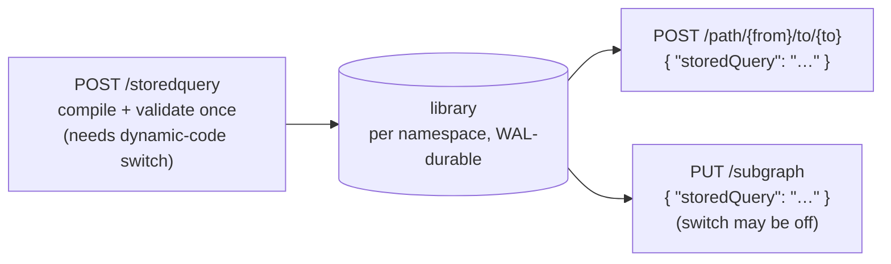

# Stored queries

Fallen-8 has no query language — queries are C# delegates ([delegates](delegates.md)). A stored query is the precompiled flavor of that: a named, compile-validated definition — either a **path** filter/cost set or a **subgraph** pattern template — registered once and afterwards invoked by name from the path and subgraph endpoints, with nothing compiled per request. Each namespace has its own library ([namespaces](namespaces.md)); like every namespace-scoped route, `/storedquery` also answers under `/ns/{ns}/…`.



## REST surface

| Route | Effect | Notable responses |
|---|---|---|
| `POST /storedquery` | Register: validate, compile once, publish | `201` summary · `400` malformed or compile failure (body carries compiler diagnostics) · `403` dynamic code disabled · `409` duplicate name or library quota · `413` body over 1 MiB · `429` rate-limited |
| `GET /storedquery` | List summaries, ordered by name | `200` |
| `GET /storedquery/{name}` | Full detail incl. the stored specification JSON (also your migration path between instances) and, for `Failed` entries, recompile diagnostics | `200` · `404` |
| `DELETE /storedquery/{name}` | Deregister (never gated by the dynamic-code switch) | `204` · `404` |

Entries are immutable: to change one, delete and re-register.

## Registration model

| Field | Required | Notes |
|---|---|---|
| `name` | yes | `^[A-Za-z0-9_-]{1,128}$`, case-sensitive, unique per namespace |
| `kind` | yes | Exactly `Path` or `SubGraph` |
| `description` | no | Free text, shown in list/detail |
| `path` | iff `kind` = `Path` | The `filter` / `cost` blocks of a [path request](path-finding.md) |
| `subGraph` | iff `kind` = `SubGraph` | The `vertexFilter` / `edgeFilter` / `patterns` of a [subgraph request](subgraphs.md) |

Exactly one of `path` / `subGraph` must be present and must match `kind`. The fragments inside are the same C# fragments the inline endpoints accept, compiled with the same bounds. Deliberately **not** stored — these stay per invocation:

- **Path:** `pathAlgorithmName`, `maxDepth`, `maxResults`, `maxPathWeight`, `semantic`
- **SubGraph:** the instance `name`, `additionalInformation`

List/detail responses report a `compileState`: `Compiled` (invocable), `Failed` (recompile on load failed — invoking returns `409`, diagnostics on the detail; delete and re-register), or `SourceOnly` (loaded without a compiler, e.g. the embedded engine).

## Invocation

Reference the entry with `"storedQuery": "<name>"` instead of inline fragments — mutually exclusive with them (`400` when mixed):

- `POST /path/{from}/to/{to}` accepts a stored query of kind `Path`; bounds and algorithm come from the request. The `semantic` block still works — stored fragments read the query vector via their `context` parameter ([semantic traversal](semantic-traversal.md)).
- `PUT /subgraph` accepts a stored query of kind `SubGraph` and instantiates the template under the request's `name`. The created subgraph is self-contained — deleting the stored query later does not affect it. `semantic` is **not** available on a stored-template invocation (`400`); inline the filters instead.

Invocation errors: `404` unknown name, `400` wrong kind, `409` not invocable (`Failed`/`SourceOnly` compile state).

### Worked example: register once, invoke by name

Register a path query that only traverses vertices with `age > 30`:

```bash
curl -X POST http://localhost:8080/storedquery \
  -H "Content-Type: application/json" \
  -d '{
    "name": "adults-shortest",
    "kind": "Path",
    "description": "age>30 vertices, weight-by-distance",
    "path": {
      "filter": { "vertexFilter": "return (v) => v.TryGetProperty(out int age, \"age\") && age > 30;" },
      "cost":   { "edgeCost": "return (e) => 1.0;" }
    }
  }'
```

```powershell
$spec = @{
  name = "adults-shortest"
  kind = "Path"
  description = "age>30 vertices, weight-by-distance"
  path = @{
    filter = @{ vertexFilter = 'return (v) => v.TryGetProperty(out int age, "age") && age > 30;' }
    cost   = @{ edgeCost = 'return (e) => 1.0;' }
  }
} | ConvertTo-Json -Depth 5
Invoke-RestMethod -Method Post -Uri http://localhost:8080/storedquery -ContentType "application/json" -Body $spec
```

Invoke it — no code in the request, so this works with dynamic code execution disabled:

```bash
curl -X POST http://localhost:8080/path/1/to/5 \
  -H "Content-Type: application/json" \
  -d '{ "storedQuery": "adults-shortest", "maxDepth": 5 }'
```

```powershell
Invoke-RestMethod -Method Post -Uri http://localhost:8080/path/1/to/5 -ContentType "application/json" `
  -Body '{ "storedQuery": "adults-shortest", "maxDepth": 5 }'
```

A subgraph invocation looks the same, with the per-instance name alongside the reference:

```json
PUT /subgraph
{ "name": "adults-2026", "storedQuery": "person-net" }
```

## Security payoff

Registration introduces code, so it requires an authenticated caller and `Fallen8:Security:EnableDynamicCodeExecution=true` — exactly like the inline code endpoints. Invocation by name is deliberately not gated: the path and subgraph endpoints check whether a request actually *carries* inline fragments, and a stored-query reference carries none. The operating model: register a vetted set while the switch is on, then run day-to-day with it off — inline fragments get `403`, stored queries keep working, and the code surface shrinks from arbitrary C# per request to a closed, operator-approved set.

Stated honestly: an invoked stored query still runs in-process with full trust. The library narrows *who can introduce* code — a provenance control, not a sandbox. The switch and the API key are documented in [security](security.md).

## Durability and limits

Registrations and removals are transactions: they survive `PUT /save` / load and crash recovery via the write-ahead log, with sources recompiled on load ([save games](save-games.md)).

| Limit | Value |
|---|---|
| Library size | 256 per namespace (`Fallen8:StoredQueries:MaxCount`); exceeding it is a `409` |
| Name length | 128 characters |
| Registration body | 1 MiB; registration is rate-limited like the other code endpoints |

## See also

- [Delegates](delegates.md) — the no-query-language philosophy, fragment shape, compilation, `/delegates/validate`
- [Security](security.md) — API key and the `EnableDynamicCodeExecution` switch
- [Path finding](path-finding.md) · [Subgraphs](subgraphs.md) — the endpoints that accept `storedQuery`
- [Semantic traversal](semantic-traversal.md) — the `semantic` block stored path queries can combine with
- [Save games](save-games.md) — checkpoints and the write-ahead log
- [Namespaces](namespaces.md) — per-namespace isolation and the `/ns/{ns}/…` route twins
- [REST API](rest-api.md) — OpenAPI document and Scalar reference
