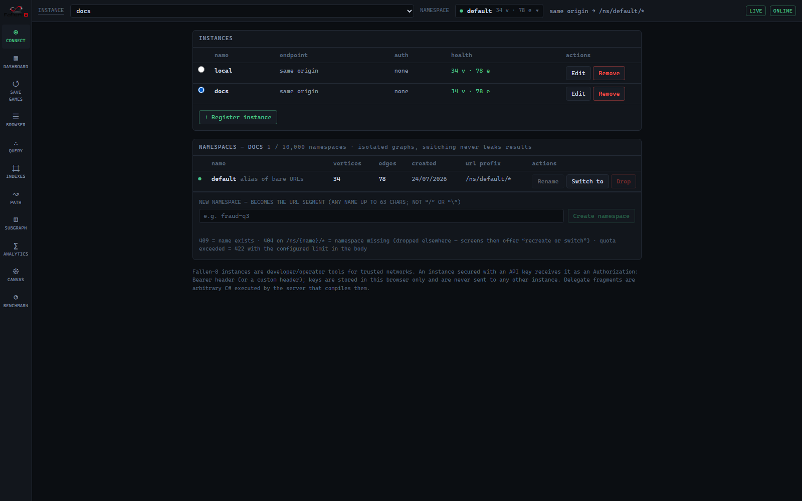
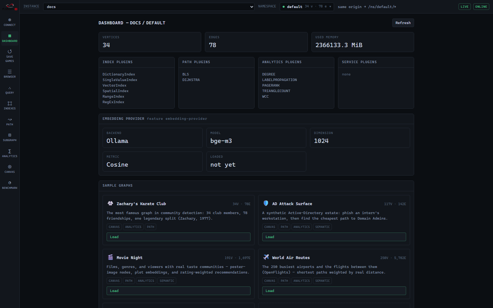
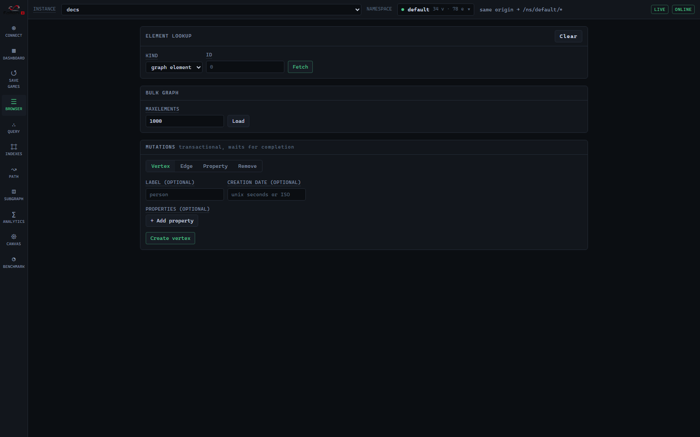
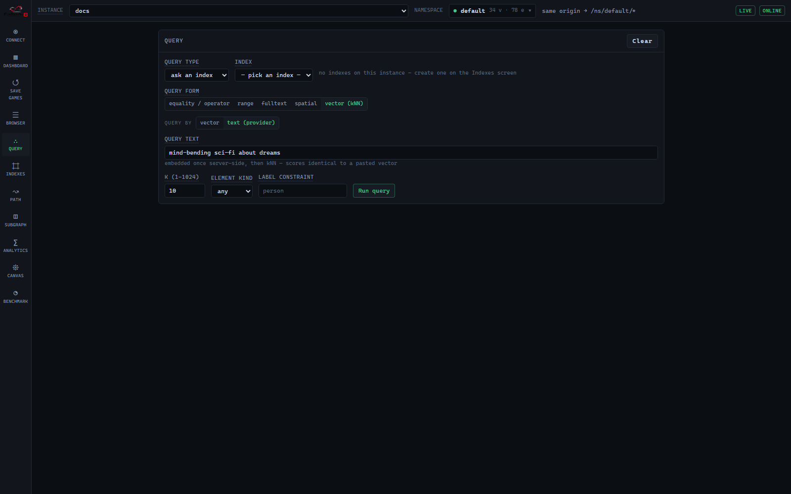
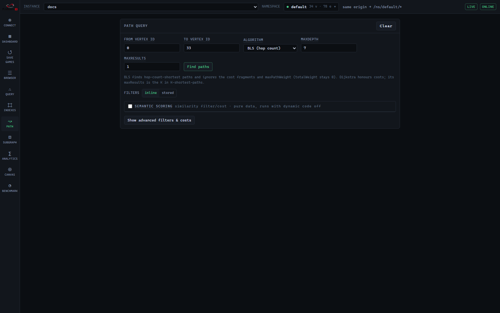
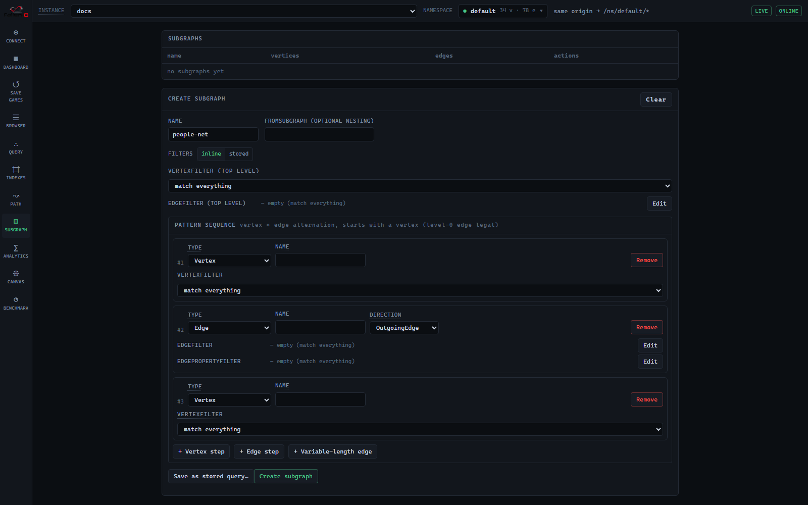
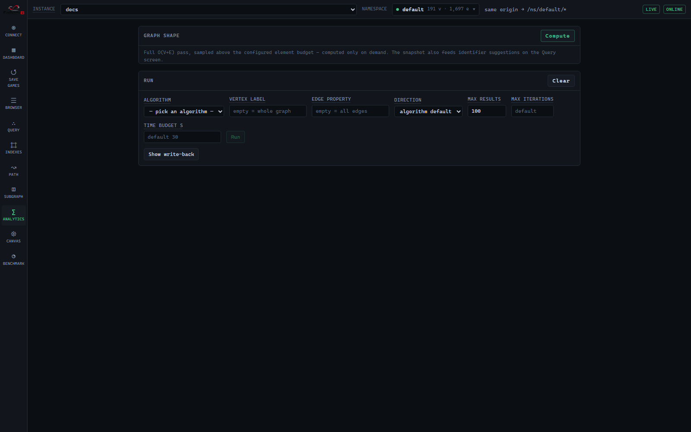
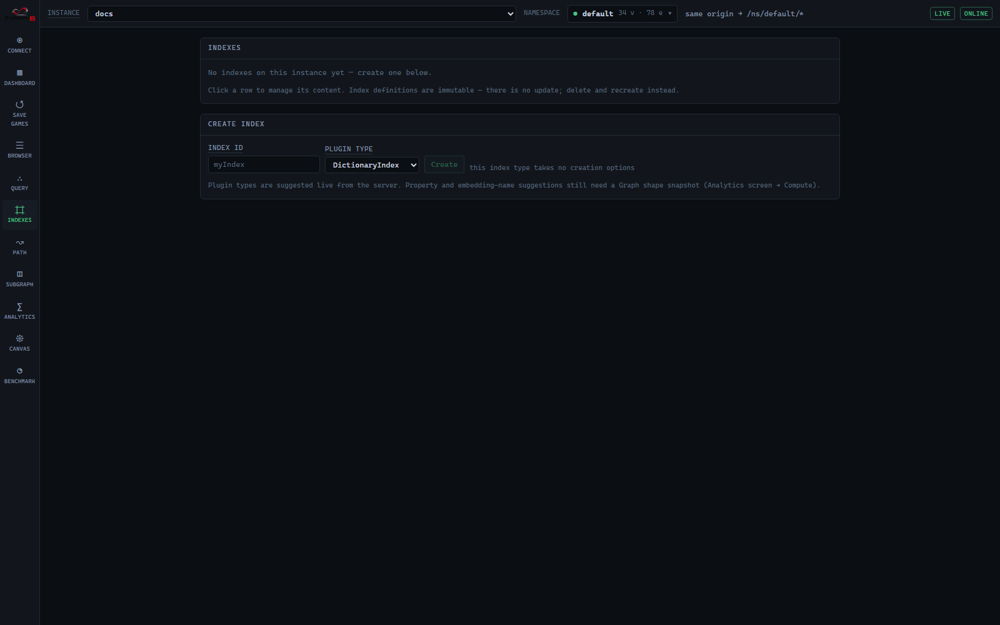
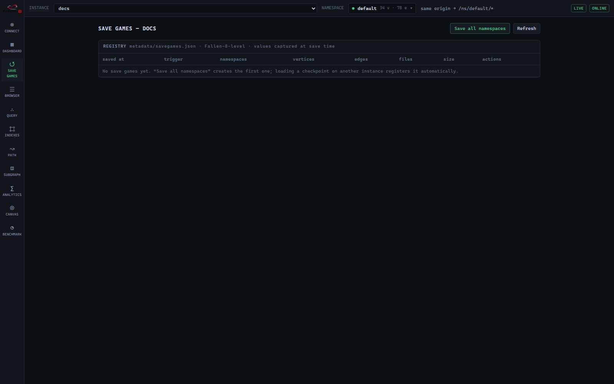
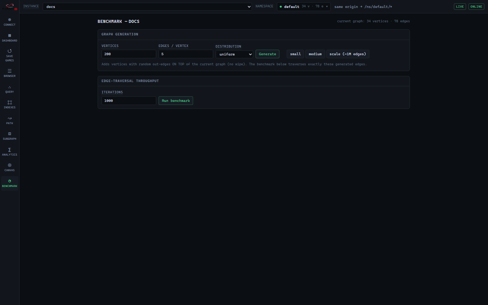

# F8 Studio

F8 Studio is the browser UI for Fallen-8: a React single-page app the API app serves from its own `wwwroot`, reachable at `http://localhost:8080` in the compose environment (build and serving are covered in [running.md](running.md)). It is a workbench over one instance's REST surface — connect to a server, inspect and mutate a graph, run queries and algorithms, visualize results — and, because Fallen-8 has no query language ([delegates.md](delegates.md)), it gives humans and code-generating agents a place to author, validate, and refine the C# delegate fragments that queries are made of.

## Layout

A fixed icon rail on the left switches screens; a top bar names the **active instance** (dropdown), the **active namespace** (dropdown), and the resulting endpoint prefix (`baseUrl → /ns/{ns}/*`), with live-feed and health chips pinned right. Every screen except Connect is locked until the active instance answers `GET /status` and the credential is authorized. Switching either instance or namespace remounts the current screen, so in-progress results never leak across contexts.

Each screen's input form and the Canvas contents are remembered per instance-and-namespace: leaving a screen and returning restores exactly what you had entered. Fetched results are re-run on demand rather than persisted. Instance registrations and API keys live only in this browser's local storage.

Connect, Save games, and Benchmark are Fallen-8-level (they can span namespaces); the rest operate on the active namespace and live under `/q/{ns}/…`.

| Screen | Scope | Purpose |
|---|---|---|
| Connect | Fallen-8 | Register instances, manage namespaces |
| Dashboard | namespace | Status, sample graphs, admin (save/load/erase, jsonl import/export), stored queries |
| Browser | namespace | Look up an element, inspect properties/embeddings, adjacency, bulk view, mutations |
| Query | namespace | Property scans and index queries (equality/range/fulltext/spatial/vector) |
| Canvas | namespace | 2D/3D visualization of whatever you send to it |
| Path | namespace | Route finding (BLS / Dijkstra) with filters, costs, semantic scoring |
| Subgraph | namespace | Subgraph lifecycle + pattern builder |
| Analytics | namespace | Graph shape + run algorithms with write-back |
| Indexes | namespace | Create and manage indexes and their content |
| Save games | Fallen-8 | Checkpoint registry: load / delete |
| Benchmark | Fallen-8 | Generate a random graph, measure edge-traversal throughput |

## Connect

Two panels. The **Instances** table lists registered servers with a radio to activate one, its endpoint and auth kind, and a live health cell (a lazy `GET /status` showing vertex/edge counts, or `unreachable` / `unauthorized`). "+ Register instance" takes a name, a base URL (empty = same origin as Studio), and an optional API key; keys are stored in this browser only and sent as a bearer/custom header ([security.md](security.md)). The **Namespaces** panel manages the active instance's namespaces — create, rename, switch to, drop, with counts and the `/ns/{name}/*` URL prefix; `default` aliases the bare routes and cannot be renamed or dropped ([namespaces.md](namespaces.md)).

## Dashboard

Vertex/edge counts, used memory, and the index/path/analytics/service plugin inventories from `GET /status` ([observability.md](observability.md), [plugins.md](plugins.md)). Cards below:

- **Embedding provider** — backend, model, dimension, metric, and load state, or a note when it is off or unreported ([semantic-traversal.md](semantic-traversal.md)).
- **Sample graphs** — one-click demo datasets plus a live "any GitHub repo" dependency card; loading into a non-empty graph erases it first behind a typed confirm ([samples.md](samples.md)).
- **Administration** — Save namespace, Save all namespaces, Trim, Load, Erase namespace, Factory reset (the destructive actions require typing the target name), plus jsonl Export (optionally filtered by label) and Import — import requires an empty graph ([bulk-import-export.md](bulk-import-export.md)).
- **Stored queries** — register and inspect named path/subgraph queries ([stored-queries.md](stored-queries.md)).

## Browser

Look up a graph element, vertex, or edge by id. The inspector shows the label, timestamps, edge endpoints, and two tabs: **Properties**, and **Embeddings** — set, replace, or remove a named embedding on the element from a pasted vector or (with the provider) from text ([semantic-traversal.md](semantic-traversal.md)). An adjacency panel lists neighbors with degrees for one-click hopping, and a bulk view loads up to `maxElements` with a truncation badge and a filter. A mutations panel creates and edits vertices, edges, and properties ([graph-model.md](graph-model.md)). "Send to canvas" is available throughout.

## Query

Two modes. A **property scan** takes a property id, a comparison operator, a typed literal, and a result type (Vertices / Edges / Both). **Ask an index** picks from the live inventory and offers only the forms the index answers: equality/operator, range, fulltext, spatial, or vector (kNN). A vector query is entered as a pasted vector or as text embedded server-side by the provider, with `k`, an element-kind filter, and a label constraint. Results report the id count, a vector metric legend (higher/lower is better), fulltext highlights, and a scored table. Index semantics live in [indexes.md](indexes.md) and [vector-search.md](vector-search.md).

## Canvas

Renders exactly what you send from the Browser, Query, Path, Subgraph, or Analytics screens — it never auto-loads the whole graph. The style panel is sectioned:

| Section | Controls |
|---|---|
| renderer & layout | 2D (Sigma, WebGL) or 3D (three.js); 2D layouts force/circular/circle-pack/grid/random, 3D force/dag-top-down/dag-radial |
| nodes | color by label or property; size fixed, by property, or by in-/out-/total degree; image or emoji from a property |
| edges | color by label or property; width fixed or by property; directed arrowheads |
| labels & effects | node and edge label toggles |

A legend (categorical or gradient) reflects the active color mode. Selecting a node or edge opens a detail panel with its properties; **Expand neighbors** merges a vertex's 1-hop neighborhood, and **Remove from view** affects only the canvas — it never deletes from the database. A path found on the Path screen arrives as a highlighted overlay.

## Path

From/to vertex ids, algorithm **BLS** (hop count) or **Dijkstra** (weighted), `maxDepth`, `maxResults` (the K for Dijkstra's K-shortest-paths), and `maxPathWeight` (Dijkstra only; BLS ignores costs). Filters and costs come from **inline fragments or a stored query**, kept mutually exclusive by a source toggle. The inline advanced tier exposes five delegate slots — `filter.vertexFilter`, `filter.edgeFilter`, `filter.edgePropertyFilter`, `cost.vertexCost`, `cost.edgeCost` — each authored in the delegate editor, and the set can be saved as a stored query. A **semantic scoring** block (query vector + `minScore` filter + `costBySimilarity`) is pure data and works even with dynamic code execution off. Results list each path's hops and total weight with "Overlay on canvas".

Because fragments are validated in the editor before the query runs, an empty result here is a genuine "no paths found" rather than a swallowed compile error. If the instance has dynamic code off, submitting inline fragments returns 403 and the screen points you at using a stored query instead. Algorithm behavior: [path-finding.md](path-finding.md); semantic scoring: [semantic-traversal.md](semantic-traversal.md).

## Subgraph

A table lists existing subgraphs (with a badge for semantic ones) offering To canvas / Recalculate / Delete. The create form takes a name and an optional `fromSubGraph` for nesting, an inline-or-stored source toggle, a top-level `vertexFilter` (fragment or semantic mode) and `edgeFilter`, and a **pattern sequence builder**: add Vertex, Edge, or Variable-length edge steps with type, name, direction, and min/max length. Vertex↔edge alternation is validated as you build. A **semantic query** section appears when any vertex slot is in semantic mode (one query per request, bound at creation), and the whole specification can be saved as a stored query. Concept and rules: [subgraphs.md](subgraphs.md).

## Analytics

**Graph shape** runs an on-demand `GET /statistics` pass — counts, top vertex/edge labels and property keys, degree percentiles, and the index list; its snapshot also feeds identifier suggestions across Studio. **Run** picks an algorithm from the live plugin list, scopes it by vertex label / edge property / direction, and sets max results, max iterations, and a time budget (PageRank adds damping and epsilon). Optional **write-back** stamps each score onto a vertex property (snapshot-durable only), which you can then color by on the Canvas to read results spatially. The result panel shows convergence, statistics, partitions with paged members, and a scored table. A run already in progress returns 429; an exhausted budget returns 408. Algorithms and semantics: [graph-analytics.md](graph-analytics.md).

## Indexes

The inventory table shows each index's id, type, query capabilities, key/value counts, and a **binding badge** when a vector index is bound to a named embedding (a self-maintained projection). Row actions are Query (jumps to the Query screen with the index preselected) and Delete (typed confirm). Create takes an id and plugin type; a VectorIndex adds dimension, metric, and an optional embedding binding and model. SpatialIndex cannot be created over REST. Per-index content management (typed-key add/remove, vector add, element remove) follows the index's capabilities — a bound vector index manages its own content and rejects manual writes. Index types and REST: [indexes.md](indexes.md).

## Save games

The persistent checkpoint registry as a Fallen-8-level table: saved-at, trigger, member namespaces, aggregate counts, file count, and size. "Save all namespaces" writes one entry spanning every namespace; **Load** restores the entire entry or a single namespace (typed confirm); **Delete** optionally removes the checkpoint files on disk. Semantics: [save-games.md](save-games.md).

## Benchmark

Fallen-8-level. **Graph generation** adds random vertices with out-edges *on top of* the current graph (no wipe), with small/medium/scale presets and uniform or preferential distribution. The **edge-traversal** benchmark times repeated passes over the edges `generate` creates (edge property `A`) and reports edges per run and average/median/stddev TPS, with a per-session history. It measures generated-edge traversal throughput only — not query latency, not analytics, and not whatever graph happens to be loaded.

## The delegate editor

Opened from every fragment slot on the Path and Subgraph screens (the Query screen uses no fragments). It is a Monaco C# editor with per-kind snippets for the five slot types — `VertexFilter`, `EdgeFilter`, `EdgePropertyFilter`, `VertexCost`, `EdgeCost`. It validates as you type against the server (`POST /delegates/validate`) and renders diagnostics inline at the returned positions; **Use fragment** is blocked until the exact text on screen has passed validation (an empty fragment means "match everything"). Validation and inline fragment execution require dynamic code execution to be enabled on the instance ([security.md](security.md)); the editor is otherwise usable for reading and snippets. The compilation model is owned by [delegates.md](delegates.md).

### NL assist

The editor's side panel drafts a fragment from a natural-language description. It calls a model backend **you run yourself, directly from the browser** — never through the Fallen-8 instance.

| Setting | Detail |
|---|---|
| backend | built-in (local Ollama) or custom |
| endpoint / api | e.g. `http://localhost:11434`; api kind `ollama` or `openai`-compatible |
| model | built-in default `phi4-f8-mini` (fine-tuned); presets for `phi4-f8` (GPU fine-tune), stock `phi4-mini` / `phi4`, OpenAI, Anthropic |

The compose stack runs the Ollama sidecar and sets `OLLAMA_ORIGINS` to the Studio origin so the browser may call it; for your own Ollama, set it yourself. The panel shows an informational reachability check for the configured backend but never blocks on it. Each draft is inserted as ordinary editable text and run through the same validation the editor uses (so it, too, needs the dynamic-code flag), never auto-submitted; on an invalid draft the editor feeds the compiler diagnostics back to the model and retries a bounded number of times before stopping. A non-loopback endpoint shows a "text leaves this machine" notice first, and drafts can be rated 👍/👎 and exported as training examples. A model that is not present on the backend makes the call 404 ([troubleshooting.md](troubleshooting.md)).

## Server capabilities Studio uses

Studio degrades gracefully when a capability is off, but these features need server-side support:

| Studio capability | Needs on the server | Docs |
|---|---|---|
| Delegate validation + inline path/subgraph filters & costs | Dynamic code execution enabled | [security.md](security.md) |
| NL assist drafting | A reachable model backend + `OLLAMA_ORIGINS`; draft validation also needs dynamic code | [security.md](security.md) |
| Text-in embedding, semantic search, text query vectors | Embedding provider enabled | [semantic-traversal.md](semantic-traversal.md) |
| Stored-query invocation (Path / Subgraph) | Nothing (only registration needs dynamic code) | [stored-queries.md](stored-queries.md) |
| Live chip and push refreshes | Change feed enabled | [change-feed.md](change-feed.md) |
| "Any GitHub repo" sample card | Internet access to GitHub's dependency graph | [samples.md](samples.md) |

## See also

- [running.md](running.md) — how Studio is built and served
- [delegates.md](delegates.md) — the delegate model Studio helps you author
- [namespaces.md](namespaces.md) · [security.md](security.md) · [rest-api.md](rest-api.md) — the model and surface behind the UI
