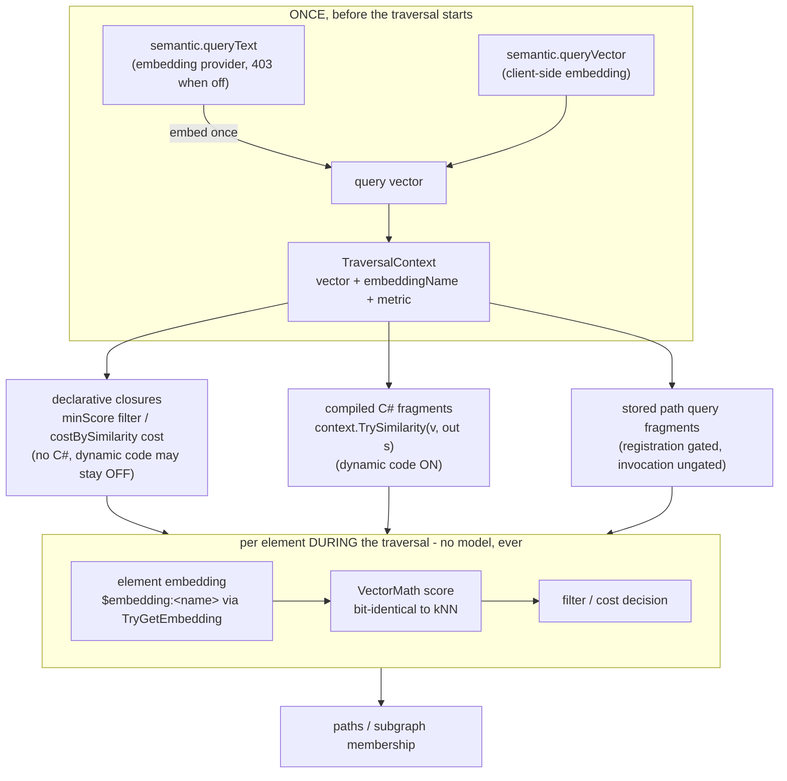

# Element Embeddings — Usage

Named embeddings as durable element state (`AGraphElementModel.TryGetEmbedding`), consumed
by traversal (semantic filters/costs) and by the `VectorIndex` as a *bound*, derived
projection. Bring-your-own-vector throughout — generation is the
[embedding-provider](../embedding-provider/README.md) companion's job and is never
required.

## Writing embeddings

One current vector per (element, name); a write replaces, `DELETE` removes. WAL-durable
like every element datum.

```bash
curl -sf -X PUT "http://localhost:5000/graphelement/42/embedding/default?waitForCompletion=true" \
     -H "Content-Type: application/json" \
     -d '{ "vector": [0.12, -0.5, 0.33] }'

curl -sf http://localhost:5000/graphelement/42/embedding/default
# { "name": "default", "vector": [...], "model": null }

curl -sf -X DELETE "http://localhost:5000/graphelement/42/embedding/default?waitForCompletion=true"
```

- Names: `[A-Za-z0-9_-]{1,64}`; different names may have different dimensions.
- 400 with reason: invalid name, empty/oversized (> 4096) vector, non-finite components,
  a dimension conflicting with a *bound* index of that name, zero-norm while a bound
  Cosine index exists. 404: unknown element.
- Bulk import/export works too: the embedding **is** the reserved `float[]` property
  `$embedding:<name>` (v1 layout — an implementation detail behind the accessor, but the
  import surface may write it directly; the engine projects those writes as well). On the
  jsonl wire it is the `System.Single[]` typed pair of format version 2 — see the
  [bulk-import-export README](../bulk-import-export/README.md).
- Embedded engine callers use `SetEmbeddingsTransaction` (batch, replace semantics).

## Bound vector indices (the projection)

Create a `VectorIndex` with `embeddingName` and it becomes a **pure derived cache** of
that embedding — no explicit adds (they answer 400), no separate durability story:

```bash
curl -sf -X POST http://localhost:5000/index \
     -H "Content-Type: application/json" \
     -d '{
           "uniqueId": "embeddings",
           "pluginType": "VectorIndex",
           "pluginOptions": {
             "dimension":     { "propertyValue": "384", "fullQualifiedTypeName": "System.Int32" },
             "metric":        { "propertyValue": "Cosine", "fullQualifiedTypeName": "System.String" },
             "embeddingName": { "propertyValue": "default", "fullQualifiedTypeName": "System.String" }
           }
         }'
```

- Membership = every live element carrying the named embedding with the index's
  dimension; maintained on the writer thread for every embedding surface (typed
  endpoint, raw reserved-key property writes, element creation, removals).
- Checkpoints persist only the index header; load rebuilds the slab from element state,
  and WAL replay re-projects replayed embedding writes — **the vector-index README's
  "store as property, re-add after crash replay" workaround is retired for bound
  indices.**
- Query exactly as before (`POST /scan/index/vector`) — a bound index is
  indistinguishable at query time.
- Unbound indices (no `embeddingName`) are unchanged: explicit adds, snapshot-persisted
  vectors, no element coupling — the right choice when you don't want the ~2× memory of
  element copy + slab copy (see below). An optional `model` creation option stores an
  opaque model-identity string for the embedding provider's consistency checks.

## Semantic traversal — how it works

This is THE reference for semantic traversal; everything else (root README, endpoint
remarks, the embedding-provider README) points here.

### The model

A semantic traversal asks the path or subgraph engine to make decisions by **vector
similarity against a query vector** instead of (or in addition to) labels and properties.



Three rules define the whole feature:

1. **The query is embedded exactly once, before the traversal starts.** You supply
   `semantic.queryVector` (client-side embedding), or — with the
   [embedding-provider](../embedding-provider/README.md) enabled — `semantic.queryText`,
   which the server embeds once on the request thread. The traversal itself never sees
   text and never calls a model: per-element work is one SIMD similarity computation.
2. **Elements score through their stored embeddings.** Each candidate vertex/edge is read
   through `TryGetEmbedding` for the block's `embeddingName` (default `"default"`) and
   scored with the block's `metric` (`Cosine` default, `DotProduct`, `L2`). An element
   without that embedding, with a different dimension, or with a non-finite score **never
   matches** — semantic decisions only ever see finite scores over comparable vectors.
3. **Scores are the kNN scores.** `VectorMath` is the single scoring implementation, so a
   similarity computed inside a traversal is bit-identical to `POST /scan/index/vector`
   for the same pair. A threshold that works for search works for traversal.

The carrier is the `semantic` block, accepted by `POST /path/{from}/to/{to}` and
`PUT /subgraph`:

```jsonc
"semantic": {
  "queryVector":      [0.1, 0.2, ...],  // exactly one of queryVector / queryText
  "queryText":        "red bicycles",   // requires the embedding provider (403 when off)
  "embeddingName":    "default",        // which named embedding to score
  "metric":           "Cosine",         // Cosine | DotProduct | L2
  "minScore":         0.7,              // optional: declarative filter threshold
  "costBySimilarity": true              // optional, path-only: declarative vertex cost
}
```

### Three ways to consume the vector

**1. Declarative (no code, works with `EnableDynamicCodeExecution=false`).** The block is
pure data and never touches the dynamic-code gate:

- `minScore` installs a vertex filter: an element passes when its embedding scores **at
  least** `minScore` (`Cosine`/`DotProduct`) or **at most** `minScore` (`L2`, where lower
  is closer). Elements without the embedding are filtered — stated, not silent.
- `costBySimilarity` installs a vertex cost for weighted algorithms (`DIJKSTRA`; the
  hop-count `BLS` ignores costs): `Cosine` → `1 − score` (range [0, 2], 0 = identical),
  `L2` → the distance itself. `DotProduct` is **rejected (400)**: it is unbounded and
  sign-indefinite, so it has no honest non-negative cost mapping. Vertices without the
  embedding are filtered (a cost is only defined over embedded vertices).

```bash
# Only semantically close vertices may appear on the path:
curl -sf -X POST http://localhost:5000/path/1/to/9 \
     -H "Content-Type: application/json" \
     -d '{ "semantic": { "queryVector": [0.1, 0.2], "minScore": 0.7 } }'

# Prefer the semantically closest route (weighted search):
curl -sf -X POST http://localhost:5000/path/1/to/9 \
     -H "Content-Type: application/json" \
     -d '{ "pathAlgorithmName": "DIJKSTRA", "maxResults": 1,
           "semantic": { "queryVector": [0.1, 0.2], "costBySimilarity": true } }'
```

**2. C# fragments (dynamic code on).** Every compiled filter/cost fragment receives the
request's context as the `context` parameter (`TraversalContext`): `HasQueryVector`,
`QueryVector`, `EmbeddingName`, `Metric`, and the one method that matters —
`context.TrySimilarity(element, out float score)`, which is the accessor plus `VectorMath`
in one call and returns `false` for a missing/incomparable embedding or a non-finite
score. Fragments that ignore `context` compile exactly as before.

```csharp
// vertexFilter: same semantics as minScore 0.5, hand-rolled.
return (v) => context.TrySimilarity(v, out var s) && s >= 0.5f;

// vertexCost: semantically close vertices are cheap, strangers cost full price.
return (v) => context.TrySimilarity(v, out var s) ? 1.0 - s : 1.0;
```

**3. Stored path queries.** A stored query's fragments may reference `context`; the
*invocation* supplies the vector through the same `semantic` block — registration stays
gated by the dynamic-code switch, invocation stays ungated. Invoking a context-using
stored query **without** a vector is not an error: every `TrySimilarity` is `false`
(the empty context), so a pure semantic filter simply matches nothing.

```bash
curl -sf -X POST http://localhost:5000/path/1/to/9 \
     -H "Content-Type: application/json" \
     -d '{ "storedQuery": "close-nodes", "semantic": { "queryVector": [0.1, 0.2] } }'
```

### Subgraphs: the vector binds at registration

`PUT /subgraph` evaluates its filters not only at creation but on every
**recalculation** (`POST /subgraph/{name}/recalculate`), which runs on the engine's write
path. The semantic block is therefore bound **once, at registration**: the compiled (or
declarative) filters close over that vector, recalculation reuses it, and no inference
ever runs on the writer thread. The block also rides the subgraph's persisted recipe —
with `queryText`, the *resolved vector* is what persists — so a semantic subgraph survives
restart and WAL replay without the provider being present.

On a subgraph, semantic decisions are **vertex membership thresholds on filter slots**
(feature subgraph-semantic-thresholds) — nothing in the result is scored or ranked:

- `semantic.minScore` fills the **top-level vertex pre-filter** slot (which vertices are
  copied into the subgraph before pattern matching).
- A vertex pattern step's `semanticMinScore` fills **that step's** filter slot — the same
  scoring rules against the same one-per-request query, so a fully declarative pattern
  ("a vertex near the query −knows→ another vertex near the query") runs with dynamic
  code execution OFF:

```jsonc
{
  "name": "close-pairs",
  "semantic": { "queryVector": [0.1, 0.2] },
  "patterns": [
    { "type": "Vertex", "semanticMinScore": 0.7 },
    { "type": "Edge" },
    { "type": "Vertex", "semanticMinScore": 0.7 }
  ]
}
```

- One owner per slot, per step: `semanticMinScore` + a `vertexFilter` fragment on the
  same step is a 400; different steps choose independently.
- `costBySimilarity` is a path concept and is rejected (400). A stored *subgraph*
  template invocation cannot carry `semantic`, and a stored template's block cannot carry
  `semanticMinScore` (both 400): the template's delegates were materialized at its own
  registration, where no query exists to bind.

A registered semantic subgraph **echoes its binding** on the summary (`GET
/subgraph/{name}` and the create/recalculate responses): effective embedding name and
metric, the vector's dimension, the registration `queryText` when one was used, and every
threshold — never the raw vector. The Studio's subgraph list renders this echo as a
`semantic` badge.

### Rules and errors

One owner per delegate slot, and everything invalid is a 400 with a reason:

| request | answer |
|---|---|
| `minScore` + an inline/stored vertex-**filter** fragment | 400 (one owner per slot) |
| `costBySimilarity` + a vertex-**cost** fragment | 400 (one owner per slot) |
| `costBySimilarity` with `metric: "DotProduct"` | 400 (no honest non-negative mapping) |
| `costBySimilarity` on `PUT /subgraph` | 400 (path concept) |
| `semantic` on a stored-**subgraph** invocation | 400 (delegates bound at registration) |
| `semanticMinScore` on an edge pattern step, without a `semantic` block, alongside the step's `vertexFilter` fragment, or non-finite | 400 (feature subgraph-semantic-thresholds) |
| `semanticMinScore` in a stored SubGraph template block | 400 at registration (a template has no query to bind) |
| `queryVector` and `queryText` together | 400 (exactly one source) |
| missing/empty vector, NaN/Infinity components, zero-norm under `Cosine`, bad name/metric | 400 |
| `queryText` with the embedding provider disabled | 403 (the provider capability) |
| inline fragments with `EnableDynamicCodeExecution=false` | 403 — the `semantic` block does **not** widen the dynamic-code gate in either direction |

## Memory math (the honest ~2×)

An element that is both embedded and in a bound index pays twice: `4·d` bytes on the
element (source of truth, WAL-covered) plus `4·d` in the slab (scan cache) plus ~64 B
bookkeeping each. d=384 → ~3.2 kB/element; 100 k ≈ 320 MB; 1 M ≈ 3.2 GB. Traversal-only
workloads (no index) and unbound-index workloads (no element copy) each pay once.

## Limits & guarantees

- Dimension ∈ [1, 4096] everywhere; every write and every semantic block validates
  finiteness; NaN never enters a ranking or a traversal decision.
- Embedding writes ride the single-writer transaction discipline; reads are lock-free
  (copy-on-write property store) — no new locks anywhere on the read path.
- The declarative semantic block carries no code and does not widen the dynamic-code
  gate; fragments and stored-query registration remain gated exactly as before.
- Pre-feature checkpoints and WALs load unchanged (new WAL entry type and index header
  are additive).
