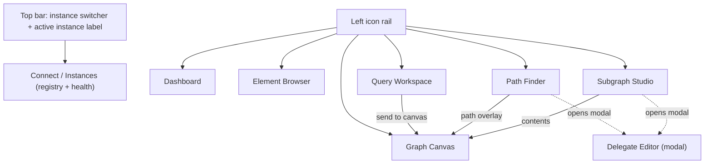

# F8 Studio: Design and Build Guide

> **Status:** Design hand-off. This document makes the decisions `spec.md` defers to
> design and defines the implementation architecture for F8 Studio.
>
> **Precedence:** `spec.md` and `openapi-v0.1.json` are the source of truth for
> *requirements* and the *API contract*. This document is the source of truth for
> *implementation approach*. Where they conflict on a requirement, the spec wins; where
> they conflict on how to build it, this document wins. FR-numbers below refer to the spec.
>
> **Visual reference:** the interactive prototype under `design/` is the visual source
> of truth for layout, chrome, and the dark/monospace aesthetic. This document does not
> re-draw screens; it defines structure, decisions, contracts, and flows.
>
> **Deliverable mapping:** this file satisfies the `design.md` deliverable (spec §11.1).
> The phased plan (spec §11.2) is split out into [plan.md](./plan.md); §9 below points
> there.

---

## 1. Tech stack decision

| Concern | Decision | Why |
|---|---|---|
| Language | TypeScript (strict) | Type-safety across the API client, state, and the delegate type model. |
| Framework | React (current stable, 19.x) | The two load-bearing dependencies (Monaco and every serious graph renderer) have first-class React bindings; deepest ecosystem for a data-dense tool. |
| Build/dev | Vite | Standard; the Monaco ecosystem is effectively Vite-first. Do **not** use Angular (the Monaco language-client stack does not support its build; not that we need the language client, but it signals the ecosystem fit). |
| Routing | TanStack Router | Type-safe routes; clean fit for the per-pane workspace. React Router v7 is an acceptable substitute if the team prefers it. |
| Server state | TanStack Query | Maps cleanly onto the REST surface (caching, mutation states, retries). Query keys are namespaced by active instance (see §2.2). |
| Client state | Zustand, via a per-instance store factory | Needed for FR-1c per-instance isolation (see §2.2). |
| Styling / components | Tailwind CSS + Radix primitives (shadcn/ui) | Matches the prototype chrome; standard for operator tools. Monospace UI font (e.g. a coding font) per the prototype. |
| Code editor | `@monaco-editor/react` + `monaco-editor` (current stable) | Baseline needs only custom providers + markers, not a full language client. See §3 and the rejected-alternative note. |
| Graph rendering | **Sigma.js v3 + graphology**, via `@react-sigma/core` | Meets FR-20 (see comparison below). |
| Layouts | `graphology-layout-forceatlas2` (FA2, Web Worker) for force; `graphology-layout` circular/circlepack as the deterministic alternative (FR-19) | FA2 in a worker keeps the UI responsive, which is exactly what FR-20's "degrade rather than freeze" demands. |
| OpenAPI types | `openapi-typescript` (types) + a thin hand-written fetch client (or `openapi-fetch`) | Types from the contract, transport bound to the active instance (see §2.3). |
| Testing | Vitest (unit/component) + React Testing Library; Playwright (e2e); MSTest for the backend endpoint | Per spec §10. |

### 1.1 Graph library comparison (FR-20: interactive at 5,000 elements, degrade gracefully)

- **Sigma.js v3 + graphology (chosen).** WebGL rendering with comfortable headroom well
  past 5,000 elements. graphology is the in-browser graph model, which pairs naturally
  with a graph DB and merges cleanly for expand-on-demand (FR-18). FA2 runs off the main
  thread in a worker. Circles-only rendering matches the prototype, so no shader work is
  required. Cost: custom node shapes would need GLSL/overlay work, which we do not need.
- **Cytoscape.js (alternative).** The richest layout/algorithm toolkit (dagre, elk, fcose
  for hierarchical path/subgraph views) and the most ergonomic styling API. Rejected as
  the default because its canvas renderer degrades right around the 5,000-element target
  and its layouts run synchronously on the main thread, which conflicts with FR-20's
  graceful-degradation requirement. **Keep in view:** if hierarchical layouts for path
  overlays (FR-14) or subgraph contents prove important, Cytoscape can be adopted for
  those specific views, or swapped in wholesale accepting the scale tradeoff. Isolate the
  canvas behind the `<GraphCanvas>` interface in §4 so this stays a one-file swap.
- **react-force-graph (force-graph option).** Easy and visually close to the prototype,
  but weaker on per-element styling and interaction at the target scale. Not chosen.

### 1.2 Rejected for baseline: C# language server (OmniSharp / LSP)

Per FR-23, a full C# language server over WebSocket "must not be the only diagnostics
path." The editing unit here is a single expression body, not a project, so a full
language server is both awkward (it expects a solution) and heavyweight. The baseline is
the hybrid in §3: static client-side IntelliSense from a generated type model, plus a
dedicated server-side validate endpoint (G-2). Document a language-server integration as
possible future work, but do not put it on the critical path.

---

## 2. Architecture

### 2.1 App shell and information architecture

App shell: a persistent left icon rail (navigation) and a top bar carrying the
always-visible instance switcher plus the active instance name and endpoint (FR-1b). The
main region hosts the active screen. The delegate editor is a modal overlay, never a
route.



Screens map 1:1 to the spec §3 inventory. Personas are the **developer** (inspect,
prototype filters/paths, copy working fragments) and the **operator** (status, save/load,
data surgery); every screen serves one or both, and nothing about the UI assumes auth
(non-goal).

### 2.2 Multi-instance model and per-instance state isolation (FR-1)

**Decision: a single global active instance with a single always-visible switcher** (not
per-tab binding). This matches the prototype's single active-endpoint label and is the
simpler correct model.

- **Instance registry (FR-1a):** `{ id, name, baseUrl }[]` in local storage, with
  add/edit/remove. The Connect screen polls `GET /status` per instance lazily to show a
  health overview (reachable + counts) so a dead endpoint is visible before selection.
- **Active instance:** exactly one at a time. The switcher is in the top bar on every
  screen. Every screen renders the active instance name prominently; the user must never
  confuse production with local.
- **Per-instance state (FR-1c):** implement a Zustand **store factory**
  `getInstanceStore(instanceId)` returning a memoized store per instance for: canvas
  contents, query-workspace inputs, path/subgraph drafts, and result sets. Switching
  swaps which store the screens read; it does not reset the app. Persist per-instance
  context in local storage keyed by `instanceId`, so it survives reload.
- **Global state:** instance registry, editor snippet library, UI preferences, and the
  NL-assist model config (§3.4). These are not instance-scoped.
- **Structural non-mixing (FR-1c):** the API client is bound to the active instance's
  base URL; **TanStack Query keys are prefixed with `instanceId`** so cached data cannot
  leak across instances; a canvas store belongs to exactly one `instanceId` and element
  ids are namespaced by it. Merging two instances into one canvas is not representable.
- **Destructive prompts (FR-1d):** name the target instance and endpoint in the
  confirmation text.

### 2.3 API client and conventions (spec §5)

Generate types with `openapi-typescript` from `openapi-v0.1.json`. Wrap transport in a
thin client constructed per active instance: `createClient(baseUrl)`. Hard rules the
client must encode:

- **Routes are root-level** (`/graph`, `/status`, `/path/{from}/to/{to}`). Do **not**
  prefix `/api/v0.1/` and do **not** "correct" paths against controller attributes.
- **camelCase JSON.** Typed literals travel as
  `{ "value" | "propertyValue": ..., "fullQualifiedTypeName": "System.*" }` (FR-9).
- **Mutations wait:** always send `?waitForCompletion=true` (FR-21) so rollbacks surface
  as 4xx/5xx rather than a fire-and-forget 202. Map the transaction failure reason.
- **Missing = empty:** several lookups return 200-with-null or 204 for missing elements.
  Treat an empty body as "not found," not as an error.
- **Truncation (FR-7):** `GET /graph?maxElements=N` truncates silently. Whenever the
  returned count equals the requested cap, show an explicit "truncated at N" indicator.
- **Ignore stale OpenAPI request samples** for fragments (they include two-parameter edge
  filters that do not compile). §6 of the spec is authoritative for fragment signatures.

### 2.4 Data-fetching and hydration

Scans return bare id lists (FR-8). Hydrate ids into elements via the element endpoints in
**capped, batched** requests with visible progress (FR-8, FR-11). Every result set
exposes "open as table" and "send to canvas." Canvas growth is **expand-on-demand**
(FR-18): fetch a selected vertex's edges via the FR-6 endpoints and merge, rather than
whole-graph loads. Manual/interval refresh only (no change stream; G-5).

---

## 3. The delegate editor (signature feature)

One reusable component used everywhere a fragment is accepted (path finder, subgraph
studio, top-level and per-step slots). It opens as a modal from a slot; there is no
standalone screen.

### 3.1 Component API

```
<DelegateEditor
  delegateKind: DelegateKind        // drives type surface, parameter snippet, validation
  contextLabel: string              // e.g. "Path finder · rachael -> esper-7"
  initialFragment: string           // "" means empty = match everything / no cost
  onValidated(fragment, result)     // fires on a passing validation
  onCommit(fragment)                // caller submits; blocked while invalid (FR-25)
  onCancel()
/>
```

`DelegateKind` and the slot-to-kind mapping (from spec §6.1) are authoritative. The
REST field name is **not** the kind; each slot passes its real kind:

| Where | Slot / REST field | `DelegateKind` | Lambda shape | Parameter type for IntelliSense |
|---|---|---|---|---|
| Path | `filter.vertexFilter` | `VertexFilter` | `(VertexModel v) => bool` | VertexModel |
| Path | `filter.edgeFilter` | `EdgeFilter` | `(EdgeModel e) => bool` | EdgeModel |
| Path | `filter.edgePropertyFilter` | `EdgePropertyFilter` | `(string p) => bool` | string |
| Path | `cost.vertexCost` | `VertexCost` | `(VertexModel v) => double` | VertexModel |
| Path | `cost.edgeCost` | `EdgeCost` | `(EdgeModel e) => double` | EdgeModel |
| Subgraph | top-level `vertexFilter`, `edgeFilter` | `GraphElementFilter` | `(AGraphElementModel ge) => bool` | AGraphElementModel |
| Subgraph | pattern `graphElementFilter` | `GraphElementFilter` | `(AGraphElementModel ge) => bool` | AGraphElementModel |
| Subgraph | pattern `vertexFilter` | `VertexFilter` | `(VertexModel v) => bool` | VertexModel |
| Subgraph | pattern `edgeFilter` | `EdgeFilter` | `(EdgeModel e) => bool` | EdgeModel |
| Subgraph | pattern `edgePropertyFilter` | `EdgePropertyFilter` | `(string p) => bool` | string |

On open, insert the per-kind parameter snippet (e.g. `return (v) => ` for a
VertexFilter, cursor placed after the arrow) and surface the snippet library (FR-22):
Property + threshold, Label match, Edge property allow-list, Weighted edge cost, mirroring
the prototype.

### 3.2 Static type model and IntelliSense (FR-22)

Check a JSON type model into the UI project (`src/delegate/type-model.json`) generated
from the classes in spec §6.2 (`AGraphElementModel`, `VertexModel`, `EdgeModel`). Document
regeneration (a small script reading the C# via reflection, or hand-maintained against the
spec; either is acceptable as long as regeneration is written down).

Use Monaco's built-in C# tokenizer for colorization, and register **custom providers**
driven by the type model:

- **CompletionItemProvider:** after `v.` / `e.` / `ge.`, offer members scoped to the
  parameter's declared type (AGraphElementModel base plus the concrete type). For an
  `EdgePropertyFilter` the parameter is a `string`, so offer string members only and no
  graph model. Also complete the parameter identifier and the snippet library.
- **HoverProvider:** member signatures and docs from the model.
- **SignatureHelpProvider:** for members like
  `TryGetProperty<T>(out T result, string propertyId) : bool`.

Available usings to reflect in completions and NL prompts: `System`, `System.Linq`,
`NoSQL.GraphDB.Core.Model`, plus `NoSQL.GraphDB.Core.Algorithms` for subgraph kinds. Teach
the canonical property idiom via a snippet:
`return (v) => v.TryGetProperty(out int age, "age") && age > 30;`

### 3.3 Validation and position mapping (G-2, FR-23/24/25)

Diagnostics come from a dedicated backend endpoint, not from client-side compilation.

**Endpoint (backend, in scope):**

```
POST /delegates/validate
Request:  { "delegateKind": "VertexFilter" | "EdgeFilter" | "EdgePropertyFilter"
                          | "VertexCost" | "EdgeCost" | "GraphElementFilter",
            "fragment": "return (v) => v.Label == \"person\";" }
Response: { "valid": true|false,
            "diagnostics": [ { "line": 1, "column": 12,
                               "endLine": 1, "endColumn": 24,
                               "id": "CS1061", "message": "...",
                               "severity": "error"|"warning"|"info" } ] }
```

Implementation: reuse `CodeGenerationHelper` to wrap the fragment in the generated class
and compile with Roslyn, collect diagnostics, and **map positions back to fragment
coordinates** by subtracting the preamble offset (`CreateSource` / `BuildProviderSource`).
Validation compiles only; it never executes and has no side effects. MSTest coverage per
spec §10 (valid per kind, syntax error with asserted position, unknown-member semantic
error, empty/oversized, unknown kind).

**Client behavior:**

- Debounced validation as the user types, plus an explicit VALIDATE action.
- Render diagnostics with `monaco.editor.setModelMarkers` at the returned line/column.
  Positions arrive already mapped to fragment coordinates, so the UI **must not map
  again** (off-by-N squiggles are a bug, FR-24).
- **Block submission** of a path query while a fragment is invalid, because `/path`
  swallows compile errors and would silently return an empty list (FR-13/FR-25). An empty
  result after a passing validation is "no paths found," never an error.
- For subgraph create, a 400 carries Roslyn diagnostics; route each back into the
  originating editor slot (FR-17/FR-25).

### 3.4 Natural-language assist (FR-26, G-6)

**Decision: browser-to-provider, no apiApp proxy.** The UI calls a user-configured,
Ollama-native or OpenAI-compatible endpoint directly. This supports a local SLM (Ollama /
llama.cpp) and hosted APIs behind one interface, and it keeps any API key off the
Fallen-8 instance entirely, which the security posture requires.

The model backend is specified in full by [nl-assist/spec.md](./nl-assist/spec.md)
(FR-26.1–FR-26.11): the MIT-only blessed model set (default: Phi-4-mini via Ollama), the
prompt contract, the validation-and-refine loop, and the privacy/key-isolation rules.
That spec is authoritative for this section; the points below summarize it.

- Config lives in global UI settings:
  `nlAssist: { endpoint, apiKind, model, apiKey?, temperature, maxRetries }` (FR-26.4),
  stored in local storage. With no backend configured, the assist affordance is hidden or
  disabled with a hint, and the editor is fully usable without it.
- The generation prompt is assembled client-side and **must** include: the slot's
  `delegateKind` and lambda shape (§6.1), the available usings, and the §6.2 type surface
  including the `TryGetProperty` idiom, so drafts target the real API rather than
  hallucinated members.
- Generated code is inserted as ordinary editable text and goes through the **same
  validation gate** (§3.3). Validation failures feed diagnostics back into a bounded
  refine/regenerate loop (FR-26.7). Nothing generated is ever sent to a query endpoint
  unvalidated.
- Where a non-loopback endpoint is configured, the UI states plainly, before the first
  send, that the prompt and its included context leave the machine (FR-26.10); loopback
  endpoints show no such notice.

```mermaid
sequenceDiagram
  actor User
  participant Editor as Delegate Editor
  participant Model as Configured model endpoint
  participant API as Fallen-8 (/delegates/validate)
  User->>Editor: open slot (kind = VertexFilter)
  Editor-->>User: parameter snippet + completions (static model)
  User->>Editor: describe intent ("only persons older than 30")
  Editor->>Model: prompt = intent + kind + usings + type surface
  Model-->>Editor: draft fragment (inserted as editable text)
  Editor->>API: POST /delegates/validate {kind, fragment}
  API-->>Editor: {valid, diagnostics[]} (fragment coords)
  alt valid
    Editor-->>User: VALID; commit enabled
  else invalid
    Editor-->>User: markers; refine/regenerate loop
  end
```

---

## 4. Graph canvas (FR-18/19/20)

Wrap the renderer behind a stable interface so the library stays swappable:

```
<GraphCanvas
  elements: CanvasGraph          // graphology instance for the active instance
  layout: "force" | "circular"   // force = FA2 in a worker; circular = deterministic
  onSelect(elementRef)           // drives the detail panel
/>
```

- **Sources (FR-18):** bulk graph, hydrated scan results, path results, subgraph
  contents. All merge into the active instance's graphology graph.
- **Expand-on-demand (FR-18):** on select, fetch the vertex's edges (FR-6) and merge new
  nodes/edges, then re-run/settle the layout incrementally. No whole-graph reloads.
- **Styling (FR-19):** stable label-to-color assignment (hash label into a fixed palette;
  keep person/ship/port consistent with the prototype). Show a legend.
- **Interaction (FR-19):** zoom/pan, node/edge selection driving the detail panel, and
  "remove from view" (view only, never a DB delete).
- **Path overlay (FR-14):** highlight path elements against their neighborhood; show
  ordered element list plus `totalWeight` alongside.
- **Scale and degradation (FR-20):** interactive at 5,000 rendered elements. Beyond that,
  degrade rather than freeze: raise Sigma's label render threshold (drop labels first),
  optionally stop rendering edge labels, and cap what a single expand can add. FA2 stays
  in the worker so layout never blocks input.

---

## 5. Screen decisions (deltas beyond the spec and prototype)

The FRs and the prototype cover each screen; the decisions the implementer still needs:

- **Connect / Instances:** local-storage registry; lazy `GET /status` health polling;
  add/edit/remove; select active. Trusted-network notice stated here (non-goal auth).
- **Dashboard:** counts, used memory, and the three plugin lists from `StatusREST`
  (FR-2); admin actions (FR-3) with typed confirmation for destructive ones (load, tabula
  rasa) naming the instance (FR-1d); surface a 500 as a real failure. Demo-data
  "playground" via `GET /generate` and `GET /benchmark` (FR-4).
- **Element browser:** vertex/edge/graphelement fetch (FR-5); one-click adjacency and
  degrees (FR-6); bulk `GET /graph?maxElements=N` with the truncation indicator (FR-7).
- **Query workspace:** all five scan types (FR-8) with the typed-literal editor (FR-9);
  index management (FR-10); id lists hydrate to tables; every result set can go to canvas
  (FR-11). Discovery of labels/property ids/index ids is derived client-side from sampled
  elements with free-form entry (G-3 fallback).
- **Path finder:** algorithm selection with the BLS-vs-Dijkstra explainer (BLS ignores
  costs and `maxPathWeight`; Dijkstra's `maxResults` is K in K-shortest); defaults
  pre-filled; five delegate slots as an advanced tier, all optional and empty-by-default;
  validate-before-submit (FR-12/13/14).
- **Subgraph studio:** full lifecycle (FR-15); pattern builder enforcing vertex-edge
  alternation starting with a vertex (a level-0 edge is legal), direction, min/max with
  max capped at 100, optional per-step slots (FR-16); status-code mapping with distinct
  actionable messages, and an empty subgraph treated as a valid 201 (FR-17).
- **Mutations:** create vertex/edge, add/update/remove property, remove element, all with
  `waitForCompletion=true` and the typed-value editor (FR-21).

---

## 6. Cross-cutting states

- **Loading:** skeletons for lists/tables; progress for batched hydration (FR-8).
- **Empty (valid, not error):** empty subgraph (FR-17), "no paths found" after a passing
  validation (FR-13), zero-count fresh instance.
- **Error surfacing:** every failed request shows the HTTP status plus the server message,
  never a silent console error (NFR). Rolled-back transactions are failures.
  Truncations are always visible (FR-7).
- **Disconnected:** stopping the API yields a clear disconnected state with a retry, never
  a blank screen (scenario 9). The active-instance health chip reflects it.
- **Destructive:** typed confirmation naming instance + endpoint (FR-1d, FR-3).

Performance budgets (NFR): dashboard interactive under 1 s locally; canvas interactive at
5,000 elements; editor validation round trip under 500 ms.

---

## 7. Backend changes in scope (this repo, `fallen-8-core-apiApp/`)

Only two, both flagged in-scope by the spec gaps:

- **G-1 hosting + CORS.** Serve the built SPA as static files from the apiApp (one
  deployable, same-origin for the "home" instance) with SPA fallback routing. Add a
  configurable CORS policy because multi-instance requires the app served by instance A to
  call B and C cross-origin. **As implemented:** the apiApp reuses the security feature's
  single default-deny CORS policy in *all* environments — cross-origin is allowed only for
  the origins in `Fallen8:Security:AllowedCorsOrigins` (never a wildcard). In development
  the SPA instead talks to its "home" instance through the Vite proxy (same-origin), so no
  CORS entry is needed for local work; add origins only for additional cross-origin
  instances.
- **G-2 `POST /delegates/validate`.** Contract and behavior in §3.3. MSTest coverage per
  spec §10.

Everything else stays a documented UI fallback (G-3 client-side discovery, G-4
expand-on-demand + truncation, G-5 manual refresh). For G-3, we additionally **propose —
but do not build** — a discovery endpoint for a later feature:
`GET /schema/summary` → `{ "labels": string[], "propertyIds": string[],
"edgePropertyIds": string[], "indexIds": string[] }`, computed by a bounded pass over the
in-memory graph plus the index factory. Until it exists, the client-side sampling
fallback above is the documented behavior.

Do **not** expand scope into
sandboxing fragment execution: the spec's security posture already states fragments are
arbitrary code executed by the server and the UI does not pretend otherwise; execution
isolation is a separate operational concern outside this feature.

---

## 8. Repository layout

```
fallen-8-web-ui/
  src/
    api/            # openapi-typescript output + thin client (instance-bound)
    app/            # shell, routing, top bar, instance switcher
    state/          # zustand store factory (per-instance) + global stores
    instances/      # registry, health, switching
    screens/        # dashboard, browser, query, path, subgraph, canvas
    canvas/         # <GraphCanvas>, graphology adapters, layouts, styling
    delegate/       # <DelegateEditor>, type-model.json, providers, snippets, NL assist
    components/     # typed-literal editor, tables, confirmations, shared UI
    lib/            # helpers (truncation detection, typed-literal conversion)
  tests/            # vitest unit/component
  e2e/              # playwright
```

Delivery (spec §11.3): all work on branch `feature/web-ui`, merged to `main` after
review. Commit messages are honest and concise and do not reference an AI assistant.

---

## 9. Phased implementation plan

Split out into [plan.md](./plan.md) per the deliverable split in spec §11. The plan's
section references (§2.2, §2.3, §3.3, …) resolve against this document.

---

## 10. Testing summary (spec §10)

- **Backend (MSTest):** `/delegates/validate` across valid-per-kind, syntax (asserted
  positions), semantic (unknown member), empty/oversized, unknown kind.
- **UI unit:** API client route/serialization vs the OpenAPI file; diagnostic-position
  mapping; typed-literal conversions; truncation detection; per-instance scoping.
- **UI component:** delegate editor (completions, markers); pattern builder validation; NL
  assist (prompt construction, insertion, disabled state) with model calls mocked.
- **E2E (live apiApp + generated data):** scenarios 1 to 8 plus disconnected (9);
  scenario 10 runs where a model backend exists, and its unconfigured half is always run.

---

## 11. Notes for the implementer

- Keep the renderer behind `<GraphCanvas>` so Cytoscape remains a one-file swap if
  hierarchical layouts for path/subgraph views become a hard requirement.
- Treat the validate endpoint as the single arbiter of fragment correctness; the static
  type model powers authoring ergonomics but is never the compile authority.
- Never re-map diagnostic positions client-side; the server returns fragment coordinates.
- Never mix instances in a canvas or a query key; ids are only unique per instance.
- First deliverables when you start: this `design.md` and [plan.md](./plan.md) (both
  done), then implement per the plan's phases.
