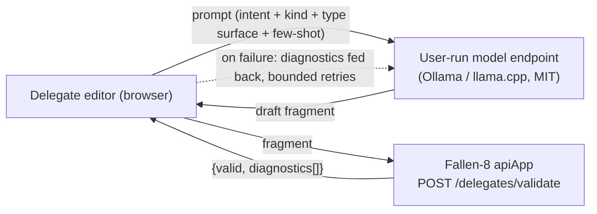

# NL Delegate Assist: Model Backend Specification

> **Status:** Draft, ready for design hand-off. Subordinate to and consistent with
> [features/web-ui/spec.md](../spec.md); this document expands **FR-26** and gap **G-6**
> of that spec into a full feature specification. Where the parent spec and this document
> overlap, this document is authoritative for the NL-assist model backend; the parent
> remains authoritative for everything else. Type surface and fragment contract are
> defined in parent spec §6.1/§6.2 and are referenced, not restated. Follow the feature
> workflow in the repository root `CLAUDE.md`.

## 1. Overview

The delegate editor (parent §3.4) lets a user describe a filter or cost in plain language
("only persons older than 30") and have a language model draft the C# fragment. This
document specifies the model backend behind that affordance: how the model is reached,
how the generation prompt is assembled from the delegate contract, how output is gated,
and which models and runtimes the project supports.

The feature is an editor convenience, never a submission path. Every generated fragment
is inserted as ordinary editable text and must clear the same compile-validation gate as
hand-written code (parent FR-23/FR-25, `POST /delegates/validate`) before it can run.
With no backend configured, the affordance is hidden or disabled and the editor is fully
usable without it.

## 2. Licensing constraint (hard requirement)

- FR-26.1 **MIT-only default and recommended set.** Every component the project ships,
  documents as the default, or tests against is MIT licensed: the model weights, the
  inference runtime, and any glue. No Apache-2.0, Llama-community, Gemma, RAIL, or
  non-production weights appear in the blessed set.
- FR-26.2 **Nothing bundled.** F8 does not redistribute model weights or a runtime. It
  calls a separately installed endpoint the user runs. Because there is no combined work
  and no redistribution of weights through F8, the model's license binds the user who
  runs it, not the F8 codebase, and F8 stays MIT regardless of what a user points the
  endpoint at. The MIT-only posture is therefore about what the project blesses, not a
  restriction on what a user may configure (FR-26.9).
- FR-26.3 **Pluggable but unopinionated past MIT.** The endpoint is user-configurable so
  no one is locked in, but the default, the in-app model hints, the docs, and the test
  matrix reference MIT models only.

## 3. Goals and non-goals

### Goals
- One model-backend path used by every delegate slot (parent §3.4), reached over an
  OpenAI-compatible or Ollama-native HTTP endpoint the user runs locally.
- A prompt contract that grounds generation in the real delegate types (parent §6.1/§6.2)
  so drafts target actual members, not hallucinated ones.
- A validation-and-refine loop that treats first-pass compile failures as normal.
- Local-first operation with no prompt text leaving the machine in the default setup.

### Non-goals
- Bundling weights or a runtime with F8 (FR-26.2).
- Fine-tuning or training any model.
- Any non-MIT weights in the default, recommended, or tested set (FR-26.1).
- A new F8 server endpoint for generation. Generation is browser to model endpoint;
  the only F8 backend involvement is the existing `POST /delegates/validate` (parent G-2).
- Telemetry, logging, or server-side storage of prompts or generated fragments.

## 4. Architecture and data flow



- The model call is browser to endpoint. F8 is not in that path.
- Validation is the only server touch and reuses the parent's G-2 endpoint.
- The generated fragment never reaches a query endpoint unvalidated (parent FR-25).

## 5. Functional requirements

- FR-26.4 **Configuration.** A single global config (parent FR-1c: global, not
  per-instance) in local storage:
```
  nlAssist: {
    endpoint:    string,               // e.g. "http://localhost:11434"
    apiKind:     "ollama" | "openai",  // native Ollama or OpenAI-compatible /v1
    model:       string,               // e.g. "phi4-mini"
    apiKey?:     string,               // local storage only; never sent to F8 (FR-26.11)
    temperature: number,               // default 0.1
    maxRetries:  number                // default 2
  }
```
  `enabled` is derived: false when no reachable endpoint is configured.
- FR-26.5 **Prompt assembly (contract).** For the active slot, the prompt includes, in
  this order: (a) an instruction to emit only a C# fragment, a method body returning a
  lambda, no prose and no markdown; (b) the exact lambda shape for the slot's
  `DelegateKind` (parent §6.1); (c) the available usings for that kind; (d) the reachable
  member list for the parameter's type from parent §6.2, including the `TryGetProperty`
  idiom; (e) two or three few-shot examples drawn from the slot's matching snippet-library
  entries (parent §3.2); (f) the user's plain-language intent. The few-shot examples carry
  the Python-to-C# gap (§7); they are required, not optional.
- FR-26.6 **Output handling.** Strip surrounding markdown fences or stray prose if the
  model emits them, then insert the fragment into the editor as editable text. Never
  auto-submit.
- FR-26.7 **Validation-and-refine loop.** After insertion, run `POST /delegates/validate`.
  On failure, issue a follow-up model turn containing the failed fragment and the returned
  diagnostics, requesting a fix, up to `maxRetries`. Every attempt stays visible and
  editable; after the retry budget, stop and leave the last draft with its markers for
  manual editing. A passing draft enables commit; it is never submitted automatically.
- FR-26.8 **Disabled state.** With no configured or reachable endpoint, the assist control
  is hidden or disabled with a one-line hint pointing at settings. The editor works
  normally without it (parent FR-26).
- FR-26.9 **User freedom preserved.** The endpoint and model fields accept any value, so a
  user may point at a non-MIT or hosted endpoint at their discretion. The project neither
  ships nor recommends such configurations (FR-26.1/FR-26.2).
- FR-26.10 **Provenance and privacy notice.** When the configured endpoint is not
  loopback (not `localhost` / `127.0.0.1` / `[::1]`), the UI states plainly, before the
  first send, that the prompt text and its included type-surface context leave the
  machine. Loopback endpoints show no such notice because nothing leaves.
- FR-26.11 **Key isolation.** Any configured `apiKey` lives in local storage and is sent
  only to the configured model endpoint. It is never included in any request to a
  Fallen-8 instance (parent security posture).

## 6. Models and runtime (MIT-only)

Runtime: **Ollama** or **llama.cpp**, both MIT. GGUF weights, `Q4_K_M` default quant.

| Model | Size | License | Role | Note |
|---|---|---|---|---|
| Phi-4-mini-instruct | 3.8B | MIT | **Default** | 128K context, function calling, ~3 GB at Q4, usable CPU-only throughput. `ollama run phi4-mini`. |
| Phi-4 | 14B | MIT | Headroom | Stronger code and better format-instruction adherence; 16K context; needs more RAM. Use when first-pass C# quality matters and hardware allows. |
| Phi-4-mini-reasoning | 3.8B | MIT | Optional | Step-by-step variant; rarely needed for one-line lambdas and slower. Consider only if the refine loop stalls. |

The recommended default is **Phi-4-mini**. In the MIT-only universe Phi is effectively the
only strong family, and that is acceptable because the feature's difficulty lives in the
prompt (grounding in the real type surface plus few-shot), not in raw model capability.

## 7. The C# gap and how it is handled

Phi's code training skews Python, and Microsoft recommends verifying non-Python output.
This is mitigated structurally, not by model choice:

- The task is a single expression-bodied lambda, not open-ended code.
- The prompt supplies the exact reachable members (parent §6.2) and the `TryGetProperty`
  idiom, so the model pattern-matches rather than inventing an API.
- Required few-shot examples (FR-26.5) are real C# from the snippet library.
- The compile-validation gate (FR-26.7) catches any miss; model quality is a UX concern,
  not a correctness or safety one, because an invalid draft never runs.

## 8. Prerequisites and gaps

| # | Item | Disposition |
|---|---|---|
| NL-G1 | Browser to local Ollama is blocked by CORS unless the origin is allowed. | **Fallback, documented.** Instruct users to set `OLLAMA_ORIGINS` to include the F8 origin. Do not add an F8 proxy by default. |
| NL-G2 | Some hosted OpenAI-compatible endpoints do not send CORS headers. | **Out of scope for default.** The default is local; a thin optional F8 forward-proxy may be proposed in the design doc but is not required and is not the default. |
| NL-G3 | Compile-checking a draft. | **Reuses parent G-2** (`POST /delegates/validate`). No new endpoint. |
| NL-G4 | No model configured. | **Graceful degradation** per FR-26.8. |

## 9. Non-functional requirements

- **Latency.** CPU-only generation of a short fragment is expected in the low-seconds
  range; the sub-500 ms budget (parent §8) applies to the validation round-trip, not to
  generation. The UI shows a cancelable generating state.
- **Determinism.** Default `temperature` 0.1 for stable, repeatable drafts.
- **Offline.** With a local endpoint, the feature works with no network access.
- **State.** Config persists in local storage (global scope, parent FR-1c).

## 10. License compliance

- Weights: Phi family, MIT. Runtime: Ollama and llama.cpp, MIT.
- Nothing is bundled (FR-26.2), so F8 remains MIT irrespective of a user's configured
  endpoint. The MIT-only rule governs what the project ships, documents, and tests.
- Phi's MIT release carries Microsoft trademark and brand guidelines governing use of the
  Microsoft or Phi names and logos; this constrains naming and endorsement, not use of the
  weights, and does not modify the MIT grant. The project does not imply Microsoft
  endorsement.
- The project neither ships nor recommends non-MIT weights (FR-26.1/FR-26.9).

## 11. Security and privacy

- Generated fragments are arbitrary code executed by the server, exactly like hand-written
  fragments, and are treated identically: validated in the editor, reviewed by the user,
  never auto-submitted (parent security posture).
- No prompt text leaves the machine in the default local setup; non-loopback endpoints
  trigger the FR-26.10 notice before the first send.
- Any model API key stays in local storage and is never sent to a Fallen-8 instance
  (FR-26.11).
- No prompts or generated fragments are logged or persisted server-side (non-goal).

## 12. Acceptance scenarios

Extends parent scenario 10.

1. With Phi-4-mini via local Ollama configured, describing "only persons older than 30" in
   a `VertexFilter` slot produces a fragment in the editor that passes validation and runs.
2. A first draft that fails validation triggers an automatic refine that then passes; the
   failed and fixed drafts are both visible in the editor history.
3. A draft still failing after `maxRetries` stops with diagnostics as markers for manual
   editing; nothing is submitted.
4. With no endpoint configured, the assist control is absent or disabled with a hint, and
   the editor works normally.
5. With the endpoint set to a non-loopback URL, the UI shows the "text leaves this machine"
   notice before the first send; a loopback endpoint shows no such notice.
6. With an API key configured, no request to any Fallen-8 instance contains that key.
7. Each delegate kind's generation prompt contains the correct lambda shape, usings,
   reachable members, and matching few-shot examples for that kind.

## 13. Testing requirements

- **UI unit:** prompt assembly per `DelegateKind` asserts inclusion of the §6.1 shape,
  §6.2 members, `TryGetProperty` idiom, usings, and matching few-shot examples; markdown-
  fence and prose stripping; key-isolation (no key in any F8-bound request).
- **UI component:** the refine loop with a mocked model returning invalid-then-valid (assert
  the diagnostics are fed back and the final draft validates); the retry-exhaustion path;
  disabled state with no endpoint; the FR-26.10 notice shown only for non-loopback
  endpoints. All model calls mocked.
- **End-to-end:** scenario 1 runs where an MIT model backend (local Ollama with Phi-4-mini)
  is available in the test environment. The unconfigured half (scenario 4) is always
  testable without a backend.

## 14. Deliverables and workflow

1. This spec plus the parent design doc's §3.4 updated to reference it.
2. Implementation in `fallen-8-web-ui/` under the delegate feature (parent §8 layout:
   `src/delegate/`), on branch `feature/web-ui` with the rest of the NL-assist work
   (parent plan phase 9 for FR-26/G-6). Commit messages are honest and concise and do
   not reference an AI assistant.

## 15. Reference files

- [features/web-ui/spec.md](../spec.md) — §6.1 (fragment model), §6.2 (type surface),
  FR-23/24/25 (validation), FR-26 and G-6 (this feature).
- [features/web-ui/design.md](../design.md) — §3.4 (delegate editor NL assist), §3.2
  (snippet library), §3.3 (validation gate).
- `fallen-8-core-apiApp/Helper/CodeGenerationHelper.cs` for the wrapping the validation
  endpoint compiles against.
