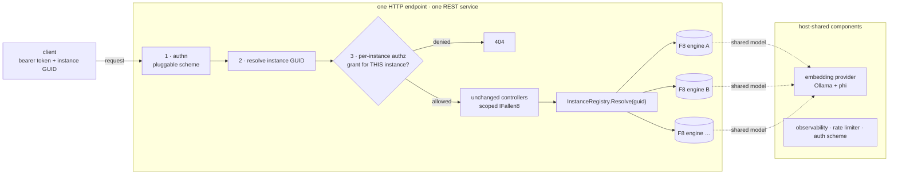
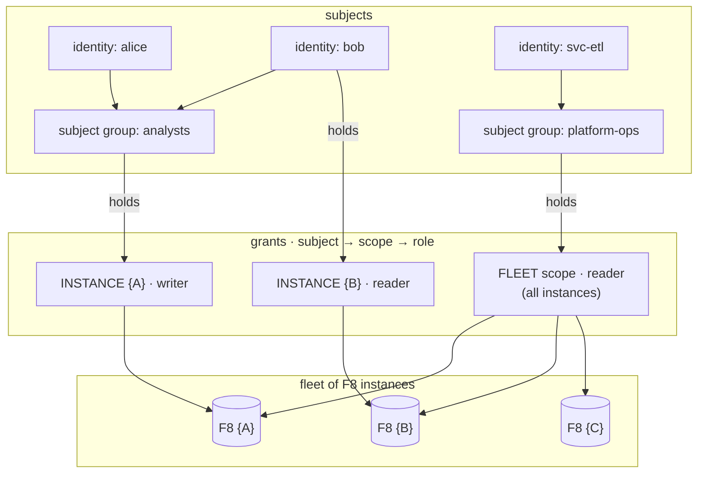
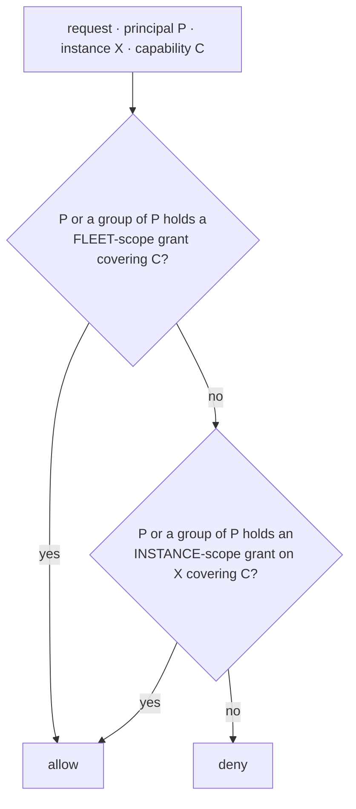
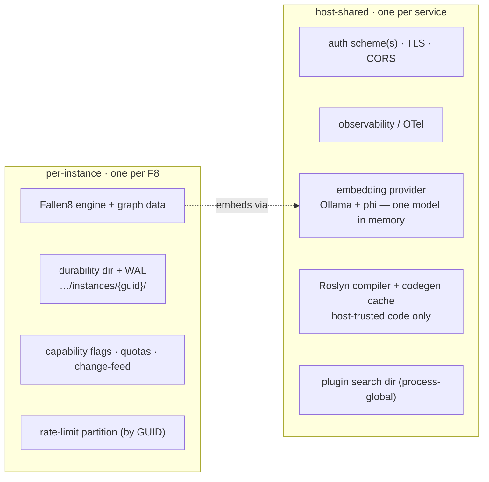

# Multi-instance host — one HTTP endpoint, many F8 instances, per-instance auth

Status: **superseded** (2026-07-23) by [graph-namespaces](../graph-namespaces/). Namespaces deliver
the hosting seam this spec designed — an engine registry, request-scoped `IFallen8` resolution, and
namespace-addressed routes — keyed by **name** instead of GUID and without the auth layer. The OIDC /
grant-store design below is kept as a historical reference only; if per-caller authorization is ever
needed it will be re-specced from scratch on top of namespaces (revisit trigger: an untrusted caller
or tenant appears). Original relations: [api-security-boundary](../../done/api-security-boundary/),
[hosted-durability-lifecycle](../../done/hosted-durability-lifecycle/), [studio-embeddable](../studio-embeddable/),
[agent-host](../agent-host/), [mcp-server](../mcp-server/).

## Vision

Turn the self-hosted single-instance server into a **SaaS host**: one HTTP service fronting **many
independent F8 instances**, each identified by a **GUID**, with **all authentication/authorization in
the REST layer** and **authorization scoped to the individual instance** (a caller is granted access
to instance A, not necessarily B). The engine and controllers stay as they are; we add **one hosting
level** above them.

> Terminology: **fleet** = the set of F8 instances on one REST service. **subject group** = a set of
> identities that grants can target. "Group" in the request maps to the *fleet* for host-level grants
> and to *subject groups* for who holds a grant.



## Decided direction (v1)

From the four decisions: **trusted / internal tenants** (Q1) who **author their own filters / cost /
stored queries** (Q2), addressed by a **path prefix `/i/{guid}/…`** (D1), authenticated via **OIDC**
with **identity + subject groups from the token and per-instance grants in an F8-side store** (Q3).
That combination lands on a **single shared process, N engines, full-trust dynamic code enabled per
instance** — the current model widened by one level, *not* process-per-tenant. The one honest cost is
**shared-fate** (a buggy tenant query can take the whole host down): accepted for internal use, and the
trigger to revisit isolation. Still open: deny semantics (Q4), instance load strategy (Q5),
provisioning (D4).

## First principle: the engine does not change

Multi-tenancy is a **hosting concern in `fallen-8-core-apiApp`**, never in `fallen-8-core` (the same
rule that keeps the embedding provider out of the engine). Each instance is an ordinary `Fallen8`
object; N instances are N objects in one process, naturally isolated by object graph. The controllers
also do not change — they inject `IFallen8` today; they keep injecting `IFallen8`, but it is now
**resolved per request** to the addressed instance instead of a process singleton.

Concretely, this feature is four additions, no rewrites:

1. an **instance registry** (replaces the single `AddSingleton<IFallen8>` factory in `Program.cs:185`),
2. **request-scoped `IFallen8` resolution** from the addressed GUID,
3. a **pluggable authn scheme + per-instance (resource-based) authz** step,
4. a small **control plane** (create / list / delete instances, manage grants).

## Architecture

### Instance registry (control of the fleet)

A singleton `IFallen8Host` owning `ConcurrentDictionary<Guid, InstanceHandle>`. An `InstanceHandle`
is `{ Guid Id; Fallen8 Engine; Fallen8InstanceOptions Options; … }`. It replaces the current single
engine factory (`Program.cs:185-221`) and centralizes per-instance construction: each instance builds
its own `Fallen8` (with its own WAL / storage directory, see below) exactly the way the factory builds
the one engine today. Instances are created/torn down through the control plane; the host also loads
the persisted set on boot and saves them on clean shutdown (a per-instance generalization of
`DurabilityLifecycleService`).

### Addressing — how a request names its instance

The instance GUID travels in the request. Options (decision D1 below); the recommended default is a
**path prefix**:

```
PUT /i/{instanceId:guid}/vertex          ← was:  PUT /vertex
POST /i/{instanceId:guid}/path/{from}/to/{to}
```

To keep **controllers and their absolute routes 100% unchanged**, a middleware peels the
`/i/{guid}` prefix, stashes the GUID in `HttpContext`, and rewrites the path so the existing absolute
routes (`[HttpPut("/vertex")]`, …) still match. The alternative — an `X-F8-Instance: {guid}` header
with unchanged paths — is even less invasive but implicit and harder to proxy/cache; see D1.

### Request-scoped engine resolution

`IFallen8` moves from `AddSingleton` to `AddScoped`, resolved from the GUID:

```csharp
builder.Services.AddScoped<IFallen8>(sp =>
{
    var ctx = sp.GetRequiredService<IHttpContextAccessor>().HttpContext;
    var id  = InstanceAddressing.ResolveId(ctx);          // from the path prefix / header
    return sp.GetRequiredService<IFallen8Host>().Resolve(id).Engine;   // 404 if unknown
});
```

Controllers are untouched (they still take `IFallen8`); they simply operate on the resolved instance.
Reads/writes/transactions all stay exactly as they are — they just run against engine A vs engine B.

### Control plane vs data plane

- **Data plane** = today's controllers, now under `/i/{guid}/…`, authorized per instance.
- **Control plane** = new, small: `POST /instances` (create → returns GUID), `GET /instances` (the
  caller's instances), `DELETE /instances/{guid}`, and grant management. Guarded by a **host-admin**
  role, distinct from per-instance access.

## Auth — pluggable authn in the REST layer, per-instance authz

This is the heart of the request and maps cleanly onto ASP.NET Core primitives the app already uses.

### Authentication (who) — OIDC scheme, host-wide

**Decision (Q3):** OIDC/JWT is the scheme, plugged in via `AddJwtBearer` alongside the existing
API-key scheme (kept for dev / service-to-service), with **no change to controllers or the engine** —
schemes are already pluggable (`Program.cs:241`). The IdP owns **identity + subject-group membership**
(delivered as token claims); it does **not** own per-instance grants — those are dynamic (tenants
create/delete instances constantly) and live in an **F8-side control-plane store** read by the authz
handler below. AuthN yields one principal + its groups; authZ turns that into per-instance access.

### Authorization (which instance) — two grant scopes, group subjects

After the principal is authenticated and the GUID resolved, a **resource-based authorization** check
answers *"may THIS principal use THIS instance, and at what capability?"* Two things make it match the
model you described:

**Two grant scopes.**
- **Fleet scope** (the "higher level"): a grant here covers **every instance on the service**,
  including instances created later. Powerful and cross-tenant — the operator / support path.
- **Instance scope**: a grant bound to one GUID — the ordinary tenant path.

**Group subjects.** A grant targets an **identity OR a subject group**; an identity's effective grants
are the union of its own and those of every group it belongs to. So "a group of identities can access
individual F8s" = a subject group holding instance-scope grants; "identities with higher-level
permission get all F8s" = an identity/group holding a fleet-scope grant.



The decision for one request (principal P, instance X, capability C):



Mechanically this is one resource-based check the existing model already supports — the *resource* is
the instance, and the handler evaluates both scopes:

```csharp
var decision = await _authz.AuthorizeAsync(User, resource: instanceId, InstancePolicy.For(capability));
if (!decision.Succeeded) return NotFound();   // 404 vs 403 is an open question — see below
```

Implemented as an `IAuthorizationHandler` reading an `IInstanceAccessPolicy` (the **grant source**,
D3), mirroring `DynamicCapabilityAuthorizationHandler` (`Program.cs:245`) — the same pattern, extended
with the fleet/instance scope split. Per-instance **roles/capabilities** (reader / writer / admin, and
whether the instance may use the embedding provider, stored queries, …) ride on the grant, so access
is capability-scoped, not just binary.

## Dynamic code / plugins under a shared process — resolved by the trust decision

`Program.cs:366-368` states the model: dynamic code execution and plugin loading run **in-process with
full trust — "a trust boundary, not a sandbox."** The tension is that a principal who can run inline
filters or load a plugin gets code execution in the shared process — reachable across **every
instance's in-memory graph** — bypassing the REST-layer authz (it is arbitrary code, not a REST call).

**Decision (Q1 = trusted/internal, Q2 = tenants author their own code):** keep the full-trust model and
**widen it across the fleet** rather than forbid tenant code. Because all tenants are trusted (one
operator / one organization), "anyone permitted to reach the code endpoints is trusted as the server
process" simply now includes the internal tenants — today's posture, one level wider. Therefore:

- Dynamic code, stored-query registration, and plugins stay available, gated by a **per-instance
  capability grant** (a tenant with the `code` capability on their instance authors filters / cost /
  stored queries). It is the same `EnableDynamicCodeExecution` switch, now per instance.
- **Accepted risk (documented, not mitigated):** trusted tenant code *can* technically reach a sibling
  instance's data and *can* crash the shared process. Acceptable **only** under the trusted-internal
  assumption — this is not a sandbox.

**What trust does NOT fix — shared-fate.** Even trusted code has bugs: a runaway filter or huge scan
can OOM or stall the one process and take down **every** instance. Rate limiting caps request *rate*,
not per-request *cost*. v1 accepts this (internal blast radius) and keeps **process-per-tenant a
first-class revisit trigger** — the moment (a) an untrusted tenant appears, or (b) a hard per-tenant
blast-radius / SLA guarantee is needed, isolation becomes required.

## Shared vs per-instance: components, config, durability, fairness

Not everything is per-instance. Heavyweight or host-level components stay **shared across the fleet**;
only what carries tenant data or tenant policy is per-instance.



- **Shared components (your point).** The embedding provider — Ollama running `phi` — is **one model
  loaded once**, used by every instance granted the embedding capability; N tenants must not mean N
  model copies. This matches today's lazy singleton (`Program.cs:299-304`): it stays a host singleton
  and each instance's vector indices bind to the same model stamp. **Caveat:** one shared generator is
  a cross-tenant **fairness point** (a tenant embedding a huge batch can starve others → it needs its
  own fair-queue/limit, separate from the graph rate limiter) and a **data-egress point** (tenant text
  reaches the shared Ollama). The Roslyn compiler + the process-wide codegen cache are likewise shared,
  which is safe **only because tenant-supplied inline code is disallowed** — the cache holds
  host-trusted delegates, never tenant data.
- **Per-instance config.** Durability path, capability flags (dynamic code OFF for tenants),
  stored-query ceiling, change-feed — today global `Fallen8:*` options (`Program.cs:108-133,233,297`) —
  become per-instance `Fallen8InstanceOptions`, defaulted by a host template, overridable at create.
- **Durability namespaced by GUID:** each instance under `…/instances/{guid}/`, so checkpoints never
  collide. (Open question Q5: eager load-all-on-boot vs lazy load-on-first-touch.)
- **Resource fairness / shared fate.** N graphs share one process: a heavy scan or huge graph affects
  all, and an OOM takes the whole host down. v1: per-instance rate-limit partition (extend the limiter,
  `Program.cs:319`, by GUID) + existing subgraph/scan quotas. Hard per-tenant memory caps need process
  isolation → revisit trigger.
- **⚠ Sharp edge — the shared plugin directory.** `PluginFactory.AddPluginSearchDirectory`
  (`Program.cs:332`) is process-global: a loaded plugin is visible to every instance. With the RCE rule
  above, plugin loading is host-operator-only; a per-tenant plugin story requires process isolation.

## Backward compatibility

- The engine (`fallen-8-core`) and all controllers are unchanged.
- **Single-instance mode stays the default deployment**: with multi-tenancy off, the host runs exactly
  one instance and requires no prefix (a "default instance" the middleware supplies when the prefix is
  absent), so the current self-hosted server and its URLs keep working byte-for-byte.
- [studio-embeddable](../studio-embeddable/) already models the client side: its `InstanceConfig`
  carries a per-instance base URL + auth. In SaaS mode a Studio embed points at
  `https://host/i/{guid}` with the tenant's token — the UI is already instance-shaped.

## Honest assessment — resolved and residual

The four decisions resolve the two biggest tensions; two remain honest costs.

1. **RESOLVED — the RCE / stored-query tension, by the trust decision.** Q1 (trusted/internal) + Q2
   (tenants author their own code) mean we do *not* forbid tenant code: the full-trust model widens
   across the fleet (see "Dynamic code … resolved by the trust decision"). Tenant-authored filters and
   stored queries stay available under a per-instance `code` capability. Residual: trusted code *can*
   reach a sibling instance — an accepted risk under trust, not a sandbox.
2. **RESIDUAL (primary) — shared-fate.** A buggy tenant filter or huge scan can OOM/stall the one
   process and take down *every* instance; rate limiting caps request *rate*, not per-request *cost*.
   Accepted for trusted/internal use, and the concrete trigger to revisit process-per-tenant isolation.
3. **DECIDED — grants in an F8-side store (Q3).** OIDC supplies identity + subject groups (claims); the
   F8-managed control-plane store owns per-instance grants (they change as instances come and go). This
   is the one genuinely new operational surface — a small stateful store the self-hosted app lacked.
4. **RESIDUAL (task) — verify "engine unchanged".** Audit that no process-global *mutable* state leaks
   across instances: the static plugin registry/caches, `GeneratedCodeCache`, intern tables. Likely
   clean by design (each `Fallen8` owns its state), but a required Phase-1 check, not an assumption.

## Decided (v1) / still open

**Decided:** Q1 trusted/internal · Q2 tenant-authored code (full trust, per-instance `code` capability)
· D1 path prefix `/i/{guid}/…` · Q3 OIDC (identity + groups) + F8-side grant store · D2 **shared-process,
N engines** (the direct consequence), with process-per-tenant as the named revisit trigger.

**Still open (lower stakes — proposed defaults, say the word to change):**
- **Q4 · Deny semantics.** Proposed **403** "not authorized for this instance" (trusted/internal —
  clarity beats hiding existence; the grant is the boundary, not knowledge of the GUID). 404 if GUIDs
  must be secret.
- **Q5 · Instance loading.** Proposed **eager load-all-on-boot** for v1 (matches today's
  `DurabilityLifecycleService`, simplest); switch to lazy load + idle-eviction when the fleet outgrows
  boot time / memory — a revisit trigger.
- **D4 · Provisioning.** Proposed **self-serve** — any authenticated principal creates instances it
  owns (becoming their instance-admin), with a per-owner quota; host-admins can also provision.

## Non-goals / revisit triggers (right-sizing)

- **No horizontal scale-out / clustering / cross-region.** One host process. *Revisit trigger:* a
  single host can no longer hold the fleet in memory, or an SLA needs failover.
- **No process/container-per-tenant isolation in v1.** Trusted tenants make shared-process acceptable.
  *Revisit trigger:* an **untrusted** tenant appears, or a hard per-tenant blast-radius / memory / CPU
  guarantee is required (shared-fate, residual #2).
- **No billing/metering, tenant lifecycle workflows, or an admin UI.** *Revisit trigger:* a commercial
  offering with usage-based pricing.
- **No new engine abstractions.** If the design starts wanting to change `fallen-8-core`, stop — that
  is the signal the concern is in the wrong layer.

## Phasing

1. **Registry + scoped resolution + default instance** — the "one more level" with a single instance
   and no auth change; the whole existing suite still green (backward-compat proof). **Includes the
   process-global-state audit** (residual #4) — the gate that confirms N engines are truly isolated.
2. **Addressing middleware** — the `/i/{guid}` prefix peel+rewrite routing to N instances; control-plane
   `POST/GET/DELETE /instances`.
3. **Per-instance config + namespaced durability + per-instance lifecycle** (eager load, Q5); keep the
   embedding provider + Roslyn a host-shared singleton.
4. **Auth**: `AddJwtBearer` (OIDC) scheme; the F8-side grant store; the resource-based per-instance
   authz handler with fleet + instance scopes and subject groups; per-instance `code` capability.
5. **Fairness**: per-instance rate-limit partition + a separate fair-queue on the shared embedding
   provider; document the shared-fate limit.

Every phase keeps single-instance mode working and the engine untouched.
