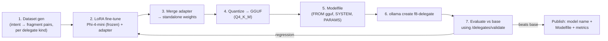

# NL-Assist Fine-Tuning Pipeline — Specification

> **Status:** Draft, spec only (no implementation yet). Subordinate to
> [features/done/web-ui/nl-assist/spec.md](../../done/web-ui/nl-assist/spec.md); this feature produces a
> **specialized model file** the NL assist can point at, without changing the browser →
> model → validate flow that spec defines. Follow the feature workflow in the repository
> root `CLAUDE.md`.
>
> **Precedence:** the parent NL-assist spec governs how the model is *used* (prompt
> contract, validation gate, key isolation, MIT-only posture). This document governs how a
> model is *produced*. Where they overlap, the parent wins on usage; this wins on training.

## 1. Overview

The NL assist drafts a C# delegate fragment from plain language, grounded by the prompt
contract (parent §5). The base model (Phi-4-mini, MIT) is a general coder; its first-pass
accuracy on Fallen-8's *specific* delegate surface (`TryGetProperty` idiom, the exact
`VertexModel`/`EdgeModel`/`AGraphElementModel` members, the "return a lambda" body shape)
is only as good as the in-context grounding makes it.

This feature establishes a **reproducible pipeline that fine-tunes Phi-4-mini with LoRA**
on a dataset of (intent → valid fragment) pairs drawn from the real delegate contract, and
publishes the result as an **Ollama model file** the operator can run locally. The goal is
a smaller prompt and a higher first-pass validation rate — not a new capability. The
feature is entirely optional: with no fine-tuned model configured, the NL assist uses the
stock base model exactly as today.

## 2. Concepts (LoRA + model files, briefly)

- **LoRA (Low-Rank Adaptation):** instead of updating all of a model's weights (expensive,
  huge output), LoRA freezes the base weights and trains a small pair of low-rank matrices
  per targeted layer. The trainable delta is a few MB, not gigabytes. Training is feasible
  on a single consumer GPU (and slowly on CPU) precisely because the parameter count is
  tiny.
- **Adapter vs merged weights:** the LoRA output is an *adapter* that layers on the base
  model. It can be kept separate (base + adapter at load time) or *merged* into a
  standalone set of weights. For distribution simplicity we merge, then quantize to GGUF.
- **Model file (Ollama `Modelfile`):** a small text manifest that tells Ollama how to
  assemble a runnable model — `FROM <base-or-gguf>`, an optional `ADAPTER <path>`, the
  `TEMPLATE`/`SYSTEM` prompt, and sampling defaults (`PARAMETER temperature 0.1`). Running
  `ollama create f8-delegate -f Modelfile` registers a named model the NL-assist config
  (parent FR-26.4 `model` field) can point at. This is the deliverable users consume.

## 3. Goals and non-goals

### Goals
- A **reproducible, scripted** pipeline: dataset → LoRA fine-tune → merge → GGUF quantize
  → `Modelfile` → `ollama create`, each step re-runnable and documented.
- A **grounded dataset** generated from the single source of truth already in the repo
  (the delegate contract + snippet library), so the training data cannot drift from the
  real API surface.
- An **evaluation gate**: the fine-tuned model must beat the base model on a held-out set,
  measured by the *same* `POST /delegates/validate` endpoint the product uses — a fragment
  counts as correct only if it compiles.
- **MIT-only, nothing bundled** (inherits parent FR-26.1/26.2): the pipeline references
  Phi-4-mini (MIT) and MIT/BSD/Apache tooling that is *not shipped in F8*; F8 ships neither
  weights nor a trainer. The produced adapter/GGUF is the user's artifact on the user's
  machine.

### Non-goals
- Training in-process or inside the apiApp. The pipeline is an offline developer/operator
  tool; the running F8 instance is never a trainer.
- A hosted/managed training service, distributed or multi-GPU training, RLHF, or full
  fine-tuning. LoRA on a single device only.
- Shipping a pre-trained adapter in the repo or the Docker image. The repo ships the
  **pipeline and dataset generator**, not weights.
- Changing the NL-assist runtime contract. The fine-tuned model is consumed through the
  existing browser → Ollama → validate flow unchanged.

## 4. Pipeline stages

- **Stage 1 — Dataset generation (in scope, scripted).** A generator emits JSONL rows
  `{ delegateKind, intent, fragment }` covering every delegate kind (parent §6.1). Sources:
  (a) the checked-in snippet library and type model (the same artifacts the prompt uses),
  expanded with templated intents ("only persons older than N", "edges labelled X",
  "weight-cost from property P"); (b) hand-authored edge cases; (c) optional
  base-model-bootstrapped candidates that are **kept only if they pass
  `/delegates/validate`** (self-cleaning — no invalid fragment enters the training set).
  Every row is validated at generation time; the dataset is a build artifact, not
  committed weights.
- **Stage 2 — LoRA fine-tune (in scope, scripted; runs on the user's hardware).** A Python
  training script (documented deps, MIT/Apache tooling such as a LoRA/PEFT trainer +
  `llama.cpp` for conversion) trains an adapter on the dataset with a fixed, recorded
  config (rank, alpha, target modules, LR, epochs). Deterministic seed; the config file is
  committed, the produced adapter is not.
- **Stage 3–4 — Merge + quantize.** Merge the adapter into the base and convert to GGUF at
  the `Q4_K_M` default quant (parent §6) so the artifact matches the runtime the NL assist
  already targets.
- **Stage 5–6 — Modelfile + register.** Emit a `Modelfile` (`FROM ./f8-delegate.gguf`, the
  NL-assist system prompt baked in as `SYSTEM`, `PARAMETER temperature 0.1`) and register
  it with `ollama create f8-delegate`. The operator then sets the NL-assist `model` to
  `f8-delegate`.
- **Stage 7 — Evaluation gate (in scope).** Run a held-out intent set through both the
  base and the fine-tuned model and score first-pass **validation** rate via
  `POST /delegates/validate` (compile = correct). The pipeline reports both rates and the
  delta; a fine-tuned model that does not strictly beat the base is a failed run
  (tune or regenerate data, do not publish).

## 5. Functional requirements

- FT-1 **Reproducible.** Every stage is a script with pinned tool versions and a recorded
  config; `make` / a top-level script runs the whole chain. Same dataset + config + seed →
  equivalent model within eval tolerance.
- FT-2 **Grounded dataset.** The generator derives from the repo's delegate contract
  artifacts; a schema-drift check fails the build if the type model changes without
  regenerating the dataset. Every emitted fragment passes `/delegates/validate` before
  inclusion.
- FT-3 **Per-kind coverage.** The dataset and the eval set both cover all six delegate
  kinds; the eval report is per-kind so a regression in one kind is visible.
- FT-4 **Validation-based metric.** Model quality is measured only by compile-validation
  pass rate on held-out intents (never self-reported model confidence), reusing the
  product's own endpoint so "good" means "the product would accept it".
- FT-5 **Artifact, not code, is the model.** The repo commits the generator, trainer
  config, Modelfile template, and eval harness. It never commits weights, adapters, GGUF,
  or the generated dataset (all `.gitignore`d, all reproducible).
- FT-6 **Opt-in consumption.** The NL assist points at the fine-tuned model only when the
  operator sets its `model` name; absent that, the stock base model is used. No runtime
  code change is required to adopt or drop a fine-tuned model.
- FT-7 **License provenance.** A generated `PROVENANCE.md` records the base model + its
  MIT license, the tool versions and their licenses, and the dataset origin — so the
  produced artifact's license position is auditable. No non-MIT base enters the blessed
  pipeline (parent FR-26.1).

## 6. Prerequisites and gaps

| # | Item | Disposition |
|---|---|---|
| FT-G1 | Training needs Python + a GPU (or patience on CPU) — heavier than the .NET/Node toolchain. | Documented prerequisite; the pipeline lives in a separate `nl-assist-finetune/` dir with its own README and is never required to build/run F8. |
| FT-G2 | Evaluation needs a running F8 with dynamic code enabled to reach `/delegates/validate`. | Reuse the same local instance the NL assist targets; the eval harness points at its base URL + key. |
| FT-G3 | GGUF conversion / Ollama adapter support versions move fast. | Pin tool versions in the config; the Modelfile path (merge → GGUF → `FROM`) avoids depending on Ollama's newer direct-adapter loading. |
| FT-G4 | Overfitting to templated intents. | Hold-out eval (FT-4) + hand-authored real-phrasing eval rows; publish only on a strict win. |

## 7. Testing requirements

- **Dataset generator (unit):** every generated row validates against
  `/delegates/validate` (mocked in unit tests, live in an integration run); per-kind
  coverage asserted; schema-drift check fails when the type model changes.
- **Eval harness (integration, gated):** runs where a model backend + a dynamic-code F8
  are available; asserts the harness computes per-kind pass rates and flags a non-improving
  run as failed. The unconfigured path (no backend) is always testable and skips cleanly.
- **No product regression:** this feature adds no code to `fallen-8-core` or the running
  apiApp beyond (optionally) a tiny eval-runner script; the existing suites must stay green.

## 8. Deliverables and workflow

1. This spec; then a `plan.md` when implementation is scheduled.
2. Implementation (later) in a top-level `nl-assist-finetune/` directory: dataset
   generator, trainer config + script, Modelfile template, eval harness, README,
   `PROVENANCE.md` generator. Branch `feature/nl-assist-finetune`, merged to `main` after
   review. Commit messages honest and concise, no AI-assistant references.

## 9. Reference files

- [features/done/web-ui/nl-assist/spec.md](../../done/web-ui/nl-assist/spec.md) — the NL-assist runtime
  contract (prompt assembly, MIT-only posture, validation gate) this pipeline feeds.
- [features/done/web-ui/spec.md](../../done/web-ui/spec.md) §6.1/§6.2 — the delegate kinds and type
  surface the dataset is grounded in.
- `fallen-8-web-ui/src/delegate/type-model.json`, `src/delegate/snippets.ts` — the
  in-repo artifacts the dataset generator derives from (drift source of truth).
- `POST /delegates/validate` (apiApp) — the compile authority used as the training filter
  and the evaluation metric.
